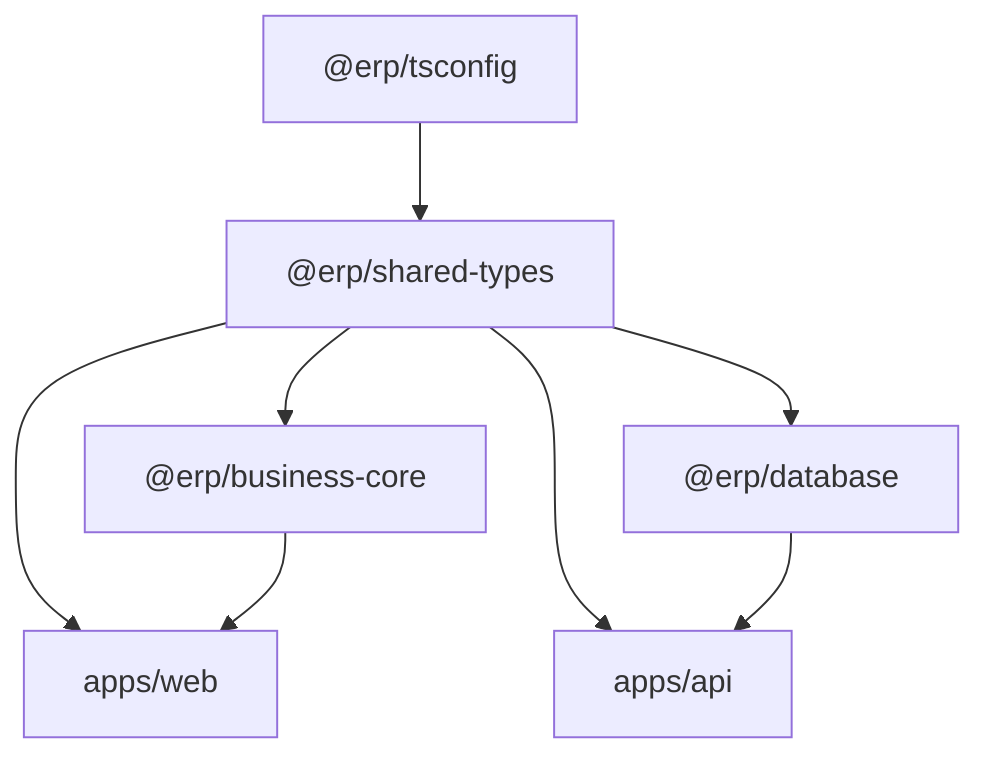
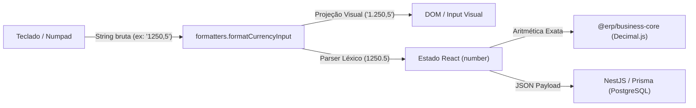
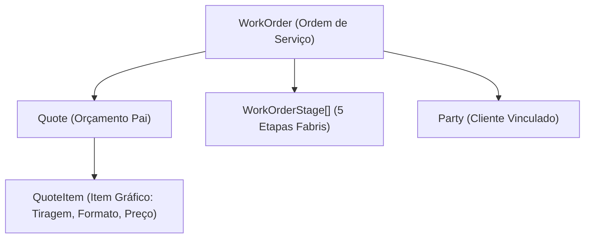

# Fundamentos de Computação e Análise Tecnológica do ERP Gráfica Modular

**Cátedra de Arquitetura de Software e Sistemas Distribuídos**  
*Departamento de Ciência da Computação*  
**Docente:** Prof. Antigravity, Ph.D.  
**Tema:** Desconstrução Teórica, Paradigmas e Análise Crítica das Tecnologias Aplicadas no ERP Gráfica Modular

---

## Ementa da Aula

> *"Meus caros alunos, bem-vindos à nossa aula magna sobre Arquitetura de Sistemas Corporativos Modernos. Hoje, não nos limitaremos a recitar manuais ou listar ferramentas de forma superficial. Nossa missão é dissecar a fundamentação teórica, a complexidade algorítmica e os trade-offs de engenharia por trás de cada escolha tecnológica adotada na construção do ERP Gráfica Modular. Como cientistas da computação, nosso dever é compreender não apenas o 'como', mas os fundamentos matemáticos e estruturais do 'porquê'."*

---

## 1. Topologia de Repositórios: Turborepo, pnpm e a Teoria dos Grafos

### 1.1. O Problema da Fragmentação de Sistemas Distribuídos
Em engenharia de software tradicional, equipes frequentemente cometiam o equívoco de bifurcar projetos em múltiplos repositórios isolados (*Polyrepos*). Do ponto de vista da teoria dos autômatos e linguagens formais, isso introduz um problema crônico: **divergência de esquemas** (*schema drift*). Se a API altera um contrato de dados e o cliente web não é sincronizado atomicamente, o sistema entra em um estado indeterminado em tempo de execução.

### 1.2. Modelagem por Grafo Direcionado Acíclico (DAG)
O **Turborepo** abstrai a compilação e execução do monorepo através de um **Grafo Direcionado Acíclico** ($G = (V, E)$), onde:
* O conjunto de vértices $V$ representa as tarefas executáveis (`build`, `test`, `lint`) de cada pacote (`@erp/shared-types`, `@erp/business-core`, `@erp/database`, `apps/api`, `apps/web`).
* O conjunto de arestas direcionadas $E$ representa as relações estritas de precedência causal. Se o pacote $B$ depende da interface tipada de $A$, existe uma aresta $e = (A, B) \in E$.



### 1.3. Cacheamento Determinístico via Hashing Criptográfico
O Turborepo implementa uma função de memoização distribuída:
$$\mathcal{H}(\text{Inputs}) = \text{SHA-256}(\text{Código Fonte} + \text{Dependências} + \text{Variáveis de Ambiente})$$
Se $\mathcal{H}_{t_1} = \mathcal{H}_{t_0}$, o algoritmo de escalonamento computacional atinge complexidade temporal $\mathcal{O}(1)$, recuperando os artefatos de build instantaneamente sem queimar ciclos de CPU redundantes.

### 1.4. pnpm e Estruturas de Dados Endereçadas por Conteúdo
Diferente do `npm` clássico, cuja resolução de árvores de dependência gerava complexidade de armazenamento $\mathcal{O}(N \times M)$ por duplicação brutal no disco, o **pnpm** emprega um **Content-Addressable Storage** baseado em links rígidos (*hardlinks* de sistema operacional baseados em inodes) e links simbólicos (*symlinks*). O resultado prático é uma redução exponencial de entropia no disco e garantia formal contra vazamentos de dependências não declaradas (*phantom dependencies*).

---

## 2. Tipagem Estática e Teoria dos Tipos: TypeScript

### 2.1. O Sistema de Tipos Estruturais (Duck Typing Formal)
Ao contrário de linguagens como Java ou C++, que utilizam sistemas de tipos nominais, o **TypeScript** fundamenta-se no **Sistema de Tipos Estrutural**:
$$\text{Se } T_A \text{ possui todos os membros de } T_B, \text{ então } T_A \sqsubseteq T_B \text{ (relação de subtipagem)}$$
Isso permite que nossos DTOs (*Data Transfer Objects*) no monorepo transitem com máxima fluidez e segurança entre as barreiras de serialização JSON sem a necessidade de instanciar classes concretas pesadas.

### 2.2. Mitigação Precoce de Estados Inválidos
Em ciência da computação teórica, a segurança de tipos (*Type Soundness*) garante que "um programa bem-tipado jamais entrará em um estado de falha não interceptada". No ERP Gráfica, enums canônicos (`Role`, `WorkOrderStatus`, `StageStatus`) garantem que uma ordem de serviço jamais assuma um status espectral não previsto pela máquina de estados finitos do chão de fábrica.

---

## 3. Aritmética Computacional: A Falácia do Ponto Flutuante IEEE-754 e o `Decimal.js`

### 3.1. A Anomalia do Padrão Binário IEEE-754
Perguntem a um programador iniciante quanto é $0.1 + 0.2$ em JavaScript ou Python nativo, e ele responderá $0.3$. No entanto, o hardware de qualquer computador executará:
$$0.1_{10} = 0.0001100110011..._2 \quad (\text{dízima periódica em base 2})$$
$$0.1 + 0.2 = 0.300000000000000044408920985006...$$

### 3.2. Catástrofe Financeira em Produção Gráfica
Imagine precificar uma tiragem industrial de $500.000$ impressos onde cada folha tem um custo unitário fracionado de $R\$\ 0,00427$. Ao multiplicar e aplicar alíquotas de markup sucessivas sobre ponto flutuante de precisão dupla (64 bits), os bits menos significativos truncados geram perdas cumulativas substanciais ou discrepâncias contábeis inaceitáveis perante o Fisco.

### 3.3. A Solução: Aritmética Arbitrária Decimal (`Decimal.js`)
Para blindar o motor `@erp/business-core`, adotamos o **Decimal.js**, que abandona o registrador de ponto flutuante da FPU do processador e implementa aritmética em base 10 pura:
$$\text{Decimal} = \langle \text{sinal}, \text{coeficiente} \in \mathbb{Z}^+, \text{expoente} \in \mathbb{Z} \rangle$$
Cada operação aritmética (como o cálculo do Markup divisor: $\frac{\text{Custo}}{1 - \text{Markup}}$) é computada com representação exata de dígitos decimais e regras determinísticas de arredondamento bancário (`ROUND_HALF_UP`), garantindo rigor absoluto até a última casa decimal.

---

## 4. Persistência de Dados Relacional: PostgreSQL e Prisma ORM

### 4.1. O Teorema de Codd e a Normalização de Dados
Para a modelagem da indústria gráfica, bancos de dados NoSQL/Documentais seriam uma escolha perigosa e ingênua. Uma ordem de serviço industrial não é um documento isolado: ela é um grafo de relacionamentos com integridade referencial estrita entre Cliente, Insumos consumidos, Matrizes de impressão (CTP), Horas de máquina e Faturamento.

O **PostgreSQL** nos fornece garantias matemáticas **ACID**:
* **Atomicidade:** A geração de uma OS a partir de uma Cotação ou é concretizada em sua totalidade (com a criação simultânea de suas 6 etapas industriais) ou sofre *Rollback* instantâneo.
* **Consistência:** As restrições de chave estrangeira (*Foreign Keys*) e verificações de integridade impedem registros órfãos.
* **Isolamento:** Através do protocolo **MVCC** (*Multi-Version Concurrency Control*), leituras analíticas do Dashboard gerencial não bloqueiam as escritas transacionais de operadores no chão de fábrica.
* **Durabilidade:** Escrita síncrona em diário com registro em WAL (*Write-Ahead Logging*).

### 4.2. Estruturas de Dados de Indexação: B-Trees
As buscas por código de barras de ordens de serviço (`barcode`), e-mails de usuários ou status de fluxo utilizam índices estruturados em **Árvores B+** ($\mathcal{O}(\log N)$), garantindo que, mesmo com milhões de apontamentos históricos, a recuperação em disco ocorra com uma quantidade mínima de operações de I/O.

### 4.3. O Paradoxo do Mapeamento Objeto-Relacional (Prisma)
Historicamente, ORMs causavam o problema conhecido como *Object-Relational Impedance Mismatch* e o terrível problema de consultas $N+1$. O **Prisma** mitiga isso agindo como um **Data Mapper** de tipagem estática pura:
* As consultas são traduzidas para ASTs (*Abstract Syntax Trees*) SQL altamente otimizadas com comandos parametrizados, blindando formalmente a aplicação contra qualquer vetor de ataque por **SQL Injection**.

---

## 5. Arquitetura de Software no Backend: NestJS e Engenharia Orientada a Serviços

### 5.1. Princípios SOLID e Inversão de Controle (IoC)
O **NestJS** transporta os cânones clássicos da engenharia de software corporativa para o ecossistema Node.js. O coração da arquitetura baseia-se no princípio da **Inversão de Dependência** ($D$ do SOLID):
* Módulos de alto nível não dependem de módulos de baixo nível; ambos dependem de abstrações.
* Através de um contêiner de **Injeção de Dependências** (*Dependency Injection Container*), serviços como `QuotesService` e `WorkOrdersService` têm suas dependências resolvidas dinamicamente via reflexão de metadados em tempo de instanciação.

### 5.2. Metaprogramação e Decorators
O uso extensivo de *Decorators* (`@Controller()`, `@Injectable()`, `@UseGuards()`) fundamenta-se no padrão de projeto estrutural **Decorator** (Gang of Four), estendendo o comportamento de classes e métodos sem alterar suas implementações fundamentais.

### 5.3. Pipeline de Tratamento de Exceções: RFC 7807
Ao invés de retornar mensagens arbitrárias e desestruturadas em situações de erro, a API implementa o padrão da IETF **RFC 7807** (*Problem Details for HTTP APIs*). Todo erro de validação, autenticação ou falha industrial é encapsulado em um payload uniforme com semântica padronizada, permitindo que clientes e robôs interpretem formalmente a natureza da falha.

---

## 6. Teoria da Reatividade e Interfaces Web: React 18 e Virtual DOM

### 6.1. O Custo das Mutações no DOM Real
O DOM (*Document Object Model*) provido pelos navegadores é uma árvore de objetos em memória extremamente onerosa para manipulação direta. Repintar o layout (*Reflow* e *Repaint*) a cada tecla digitada no simulador de corte causaria gargalos severos de renderização e congelamento da interface (*jank*).

### 6.2. O Algoritmo de Reconciliação Heurística ($\mathcal{O}(N)$)
O problema genérico de encontrar o número mínimo de modificações para transformar uma árvore qualquer em outra árvore é de complexidade temporal $\mathcal{O}(N^3)$. Se uma interface gráfica contiver 1.000 nós no DOM, uma comparação exaustiva exigiria um bilhão de operações.

O **React** introduz uma heurística engenhosa que reduz esse custo para **$\mathcal{O}(N)$**, ancorada em dois axiomas:
1. Dois elementos de tipos diferentes produzirão árvores diferentes.
2. O desenvolvedor pode indicar quais nós filhos são estáveis entre renderizações através da propriedade `key`.

### 6.3. Arquitetura Fiber e Concorrência no React 18
O motor interno do React 18 baseia-se em uma estrutura de dados de lista duplamente encadeada chamada **Fiber**. Isso permite que o mecanismo de renderização pause, aborte ou reoriente o trabalho computacional com base na prioridade do usuário, garantindo fluidez cinematográfica (60 FPS) mesmo enquanto o canvas SVG processa cálculos de imposição geométrica.

---

## 7. Gerenciamento de Estado: A Dualidade entre Client-State e Server-State

Um dos maiores erros da engenharia frontend na última década foi tratar dados do servidor como se fossem estado local da interface (sobrecarregando ferramentas com Redux e centenas de linhas de boilerplate).

No ERP Gráfica Modular, separamos rigorosamente essa ontologia:

| Dimensão | Estado de Cliente (Client State) | Estado de Servidor (Server State) |
| :--- | :--- | :--- |
| **Definição** | UI transitória, credenciais do operador, tema visual | Dados persistidos no PostgreSQL (Ordens de Serviço, Estoque) |
| **Propriedade** | Exclusiva do navegador local | Compartilhada entre múltiplos usuários e máquinas |
| **Ferramenta** | **Zustand** | **TanStack Query (React Query v5)** |
| **Complexidade** | Simples, síncrona | Assíncrona, sujeita a latência, cache e invalidação |

### 7.1. Zustand: Observer Pattern Minimalista
O **Zustand** elimina o excesso de cerimônias do Redux. Ele implementa o clássico padrão **Observer (Pub-Sub)** através de closures e uma assinatura de eventos reativa. Quando o token de autenticação é atualizado, apenas os componentes explicitamente inscritos naquela fatia de estado são re-renderizados.

### 7.2. TanStack Query e o Algoritmo Stale-While-Revalidate (RFC 5861)
Para o consumo da API, o **TanStack Query** atua como uma máquina de estados finitos que gerencia o ciclo de vida dos dados remotos com base no padrão da RFC 5861:
1. Retorna os dados em cache instantaneamente (*Stale*).
2. Dispara a requisição em segundo plano para obter a versão mais recente (*Revalidate*).
3. Atualiza a árvore do componente apenas se os dados tiverem sofrido mutação.

---

## 8. Sistemas Concorrentes em Tempo Real: WebSockets e o Protocolo Socket.io

### 8.1. Limitações Físicas do Polling HTTP Tradicional
Em um chão de fábrica gráfico, se múltiplos operadores precisarem checar o status de uma impressora offset via *Short Polling* (ex: requisitar a cada 2 segundos), o overhead de cabeçalhos HTTP, negociações TCP e handshakes TLS saturará o servidor e a banda de rede desnecessariamente.

### 8.2. Comunicação Full-Duplex Bi-Direcional (RFC 6455)
O protocolo **WebSocket** estabelece um canal persistente sobre uma única conexão TCP após um handshake HTTP inicial:
* **Framing Mínimo:** Ao invés de kilobytes de cabeçalhos HTTP repetitivos, um frame WebSocket carrega apenas 2 a 10 bytes de overhead de protocolo.
* **Modelo Orientado a Eventos (Reactor Pattern):** Quando um operador clica em "Iniciar Impressão" ou "Registrar Refugo", o servidor NestJS emite um evento atômico que é propagado em broadcast milissegundo para os painéis Kanban de todos os outros operadores conectados.

---

## 9. Metodologia de Verificação: A Pirâmide de Testes Automatizados

A robustez do software foi comprovada através de uma abordagem estrita baseada na **Pirâmide de Testes de Mike Cohn**:

```text
       / \
      / E2E \       -> Validação de Fluxo Completo (test-swagger.cjs)
     /-------\
    / Integ.  \     -> React Testing Library (Interações de Usuário)
   /-----------\
  /   Unidade   \   -> Vitest (@erp/business-core, utils, stores)
 /---------------\
```

### 9.1. Testes de Unidade Puros com Vitest
O **Vitest** é construído diretamente sobre o motor de transformação do Vite (esbuild). Ele compila TypeScript via threads de trabalho paralelas (*worker pools* baseados em `tinypool`), executando dezenas de testes matemáticos em milissegundos sem a sobrecarga pesada do Babel do Jest tradicional.

### 9.2. A Filosofia do React Testing Library
Diferente de abordagens ultrapassadas que testavam detalhes internos de implementação (como inspecionar o `state` ou o `props` de um componente no Enzyme), a **React Testing Library** opera sobre o princípio:
> *"Quanto mais seus testes se assemelharem à forma como seu software é utilizado, mais confiança eles podem lhe oferecer."*

Os testes buscam elementos exclusivamente por **Acessibilidade Semântica** (`role`, `aria-label`, `label text`), garantindo que se o componente for refatorado internamente, mas continuar funcionalmente acessível ao ser humano, o teste permanecerá verde.

---

## 10. Redes e Conectividade: Cloudflare Tunnel e Segurança Zero Trust

### 10.1. A Problemática do NAT e Roteamento Ingress Tradicional
Tradicionalmente, para permitir que um cliente externo acesse um servidor local, era necessário:
1. Possuir um endereço IP público estático.
2. Acessar o roteador físico e configurar **Port Forwarding** (NAT Traversal).
3. Expor as portas do host a varreduras maliciosas de portas (*port scans*) e ataques automatizados de negação de serviço (*DDoS*).

### 10.2. Arquitetura Outbound-Only e o Protocolo QUIC
O utilitário **Cloudflare Tunnel (`cloudflared`)** inverte radicalmente o modelo de tráfego de rede:
* **Nenhuma porta de entrada é aberta** no firewall local do computador.
* O processo `cloudflared` estabelece quatro túneis persistentes de **saída** (*outbound*) para os servidores de borda (*Edge Points of Presence*) mais próximos da Cloudflare, utilizando o protocolo moderno **QUIC** (baseado em UDP com multiplexação nativa e handshake TLS 1.3 integrado, definido na RFC 9000).
* O tráfego do usuário final atinge a rede global com proteção DDoS da Cloudflare e é despachado com latência ultra-baixa através do túnel até o proxy reverso do Vite em `localhost:5173`.

---

## 11. Engenharia de Layouts Responsivos e o Paradigma Mobile-First

### 11.1. A Falácia do "Desktop-Down" vs. O Axioma do "Mobile-First"
Historicamente, engenheiros de software cometiam o equívoco de projetar interfaces complexas exclusivamente para monitores de alta resolução ($1920 \times 1080$) e, posteriormente, tentavam "espremer" os elementos em telas reduzidas através de sucessivos *overrides* de CSS baseados em `max-width`. Esse modelo anti-padronizado acarreta dois problemas teóricos graves:
1. **Inchaço de Regras de Estilo (CSS Overhead):** O navegador de um dispositivo móvel com recursos de CPU e memória reduzidos é forçado a processar primeiro as regras complexas de desktop para depois descartá-las e sobrescrevê-las, degradando o tempo de primeira renderização interativa (*Time to Interactive* - TTI).
2. **Degradação da Arquitetura de Informação:** A interface móvel torna-se um mero reflexo truncado e remendado da versão desktop.

A abordagem **Mobile-First** adota o axioma formal da **Melhoria Progressiva** (*Progressive Enhancement*):
$$\text{Layout Base (Mobile)} \quad \xrightarrow{\text{min-width: 640px (sm)}} \quad \text{Tablet} \quad \xrightarrow{\text{min-width: 768px (md)}} \quad \text{Desktop} \quad \xrightarrow{\text{min-width: 1024px (lg)}} \quad \text{Widescreen}$$
O motor CSS do navegador compila prioritariamente o leiaute minimalista e fundamental, ativando grades multidimensionais complexas e barras laterais fixas apenas quando a capacidade espacial do dispositivo receptor é matematicamente comprovada por *media queries* ascendentes.

### 11.2. Lei de Fitts e Ergonomia Computacional de Toque (Touch Targets)
Na teoria clássica da Interação Humano-Computador, a **Lei de Fitts** modela o tempo médio $T$ necessário para um operador humano mover um apontador até uma área-alvo visual:
$$T = a + b \log_2 \left( \frac{2D}{W} \right)$$
Onde:
* $D$ representa a distância física do cursor ou dedo até o alvo.
* $W$ representa a largura ou dimensão projetada do alvo ao longo do eixo de movimento.
* O termo $\log_2 \left( \frac{2D}{W} \right)$ constitui o **Índice de Dificuldade** ($ID$).

Em uma fábrica gráfica, operadores frequentemente manuseiam tablets ou terminais industriais vestindo luvas de segurança ou com mãos sujas de tinta e solvente. Se os botões interativos possuírem dimensões reduzidas (ex: 20px de altura), o valor de $W$ torna-se ínfimo, disparando o índice de dificuldade $ID$ e provocando toques acidentais em ações críticas (como disparar uma ordem incorreta). No ERP Gráfica Modular, estabelecemos como invariante ergonômica uma altura mínima de toque de **$40\text{px}$ a $46\text{px}$** (`min-h-[40px]`), em estrita conformidade com as diretrizes do *Apple Human Interface Guidelines* e *Google Material Design*, mitigando o erro humano por modelagem biomecânica.

### 11.3. Algoritmos de Rolagem por Ancoragem Magnética: CSS Scroll Snap
O fluxo de produção gráfica demanda um quadro Kanban com 6 etapas estritas. Em um monitor widescreen, cada coluna exibe confortavelmente 320px de largura ($6 \times 320\text{px} = 1920\text{px}$). No entanto, em um visor móvel de $375\text{px}$ a $414\text{px}$, uma rolagem horizontal contínua sem controle induz à perda de foco espacial do operador.

Implementamos as primitivas cinemáticas de **CSS Scroll Snap**:
* O contêiner pai recebe `scroll-snap-type: x mandatory` e `overflow-x: auto`.
* Cada coluna do Kanban atua como um nó de atração elástica com `scroll-snap-align: center` e largura delimitada (`w-[280px] sm:w-[320px] shrink-0`).
A GPU do dispositivo móvel assume o cálculo de desaceleração inercial via hardware, garantindo que o operador deslize o dedo horizontalmente entre as colunas com alinhamento magnético determinístico $\mathcal{O}(1)$ sem quebras de layout ou desalinhamentos visuais.

### 11.4. Contexto de Empilhamento Tridimensional (Stacking Context) e Gavetas Deslizantes
Para resoluções móveis (`< 768px`), a barra lateral (`Sidebar`) migra dinamicamente de uma coluna fixa no fluxo do documento para uma **Gaveta Deslizante** (*Slide-Over Drawer*). Para blindar essa gaveta contra colisões de renderização:
* Cria-se um novo **Contexto de Empilhamento** tridimensional no grafo do navegador através de `position: fixed` associado a `z-index: 50`.
* Aplica-se uma máscara de atenuação luminescente (*backdrop*) com dispersão de luz em tempo de execução (`backdrop-blur-sm bg-slate-900/40`), induzindo a percepção do operador a reconhecer o menu como uma camada efêmera de prioridade máxima no grafo de foco e acessibilidade.

---

## 12. Interação Humano-Computador (IHC), Teoria das Cores e Ergonomia Visual

### 12.1. O Problema da Astenopia e Fadiga Visual em Operadores
Monitores industriais configurados com cores primárias em saturação máxima (vermelho puro `#FF0000`, verde puro `#00FF00` ou amarelo puro `#FFFF00`) provocam uma excitação neural excessiva e contínua nos fotorreceptores da retina humana (especificamente os cones L, M e S). Em turnos industriais de 8 a 12 horas, esse bombardeio espectral gera **astenopia** (fadiga visual ocular crônica), cefaleia tensional e queda acentuada nos níveis de vigilância do operador de máquinas.

### 12.2. A Cromodinâmica das Cores Pastel
No espaço cromático de matiz, saturação e luminosidade (HSL), as tonalidades **pastel** são obtidas através de uma diminuição substancial do parâmetro de **saturação** ($S \ll 1.0$) associada a um aumento da **luminosidade** ($L \in [0.85, 0.95]$ no espectro claro) ou atenuação translúcida suave no espectro escuro.
O ERP Gráfica adota uma matriz cromática inspirada na psicologia das cores e no sistema Munsell:
* **Verde Sálvia e Menta Pastel (`pastel.sage`, `pastel.mint`):** Identificam etapas finalizadas e botões afirmativos, ativando respostas neurológicas associadas a estabilidade e alívio de estresse.
* **Lavanda Pastel (`pastel.lavender`):** Utilizado na fase de Pré-Impressão e CTP, estimulando estados mentais de precisão e planejamento geométrico.
* **Pêssego e Âmbar Pastel (`pastel.peach`):** Utilizado na fase de Impressão Ativa, sinalizando dinamismo e atenção operacional sem gerar o sobressalto visceral de um alerta estridente.
* **Rosa Blush Pastel (`pastel.blush`):** Destinado a ações de exclusão e refugo, garantindo clareza semântica inconfundível sem provocar sensação punitiva no operador.

### 12.3. A Equação Fotométrica de Contraste Luminoso: WCAG 2.1 AA
A acessibilidade tipográfica é avaliada por critérios físico-matemáticos objetivos estabelecidos pelo consórcio W3C. A luminância relativa $L$ de qualquer coordenada sRGB é expressa por:
$$L = 0.2126 R_s + 0.7152 G_s + 0.0722 B_s$$
Onde cada componente cromático $C \in \{R, G, B\}$ normalizado no intervalo $[0, 1]$ é linearizado pela função de transferência gama inversa:
$$C_s = \begin{cases} \frac{C}{12.92}, & \text{se } C \le 0.03928 \\ \left(\frac{C + 0.055}{1.055}\right)^{2.4}, & \text{se } C > 0.03928 \end{cases}$$
A **Razão de Contraste** ($CR$) entre a cor de maior luminância ($L_1$) e a de menor luminância ($L_2$) é rigorosamente:
$$CR = \frac{L_1 + 0.05}{L_2 + 0.05}$$
* **No Tema Claro:** Inserir texto pastel claro sobre fundo branco geraria uma violação severa ($CR < 2.5:1$). Para garantir conformidade irrestrita com o nível **WCAG AA** ($CR \ge 4.5:1$), nossa arquitetura emprega fundos com micro-pigmentação nível 50 (`bg-emerald-50`) combinados com tipografia de alta densidade nível 700 (`text-emerald-700`), atingindo $CR \ge 6.8:1$.
* **No Tema Escuro:** Superfícies neutras de grafite profundo (`bg-slate-900`) são associadas a tipografia fosforescente suave nível 400 (`text-emerald-400`), atingindo $CR \ge 7.4:1$, garantindo legibilidade absoluta tanto sob luz solar direta quanto em galpões de impressão com penumbra controlada.

---

## 13. Arquitetura de Alternância de Temas e Persistência Reativa

### 13.1. A Problemática do FOUC (*Flash of Unstyled Content*)
Ao projetar a alternância entre tema claro e escuro em aplicações de página única (SPAs), desenvolvedores desatentos cometem frequentemente a falha de atrelar o tema unicamente ao ciclo de vida de renderização do framework JavaScript (como um hook `useEffect` tardio do React). A cronologia temporal dessa falha revela:
1. O navegador realiza o parse do documento HTML inicial em branco.
2. O parser de JavaScript avalia e compila o bundle da aplicação.
3. O componente React é montado e, após a primeira renderização, lê a chave do `localStorage`.
4. A classe `.dark` é adicionada ao elemento raiz após um intervalo de 100ms a 300ms.
O resultado perceptivo é o **FOUC**: uma cintilação ofuscante de luz branca no olho do usuário em um ambiente escuro, quebrando a integridade visual do sistema.

### 13.2. Sincronização Síncrona Precoce no DOM e a Soberania Industrial
Para extirpar formalmente qualquer possibilidade de FOUC e garantir o padrão industrial escuro:
* **Script Síncrono no `<head>`:** Antes mesmo de qualquer folha de estilo ou script de bundle ser carregado, uma rotina de auto-execução instantânea no `<head>` do `index.html` inspeciona o `localStorage`. Caso não exista preferência explícita de tema claro (`erp_theme === 'light'`), a classe `.dark` é atribuída deterministicamente à tag `<html>`.
* **Superação de Heurísticas Espúrias do SO:** Em ambientes fabris, muitos terminais operam com distribuições de Windows ou Linux cuja configuração padrão do sistema operacional reporta equivocadamente `prefers-color-scheme: light`. Ao remover essa dependência cega e estabelecer o tema escuro como identidade nativa, garantimos estabilidade visual imediata para os operadores gráficos.
* **Controle Segmentado Sem Ambiguidade:** A substituição de botões alternadores unitários (cujo rótulo frequentemente confunde o operador sobre se aquilo representa o estado atual ou a ação futura) por um seletor segmentado com dois botões dedicados `[ ☀️ Claro | 🌙 Escuro ]` implementa o **Princípio da Clareza de Estado**, eliminando hesitações na interação humano-computador.

### 13.3. CSS Custom Properties (Variáveis de Estilo) vs. Tailwind `darkMode: 'class'`
Adotar a estratégia `darkMode: 'media'` do Tailwind limitaria o sistema a refletir passivamente a configuração do sistema operacional do usuário, retirando do operador a liberdade de forçar o modo claro em um monitor que receba reflexo de luz solar na fábrica. A configuração `darkMode: 'class'` implementa o **Princípio da Soberania do Usuário**:
* A classe `.dark` atua como um modificador de escopo contextual global.
* Em conjunto com as variáveis CSS declaradas no `index.css` (`--color-bg-primary`, `--color-card-bg`, etc.), o sistema desacopla a representação vetorial das cores da semântica dos componentes, viabilizando transições fluidas de interpolação cromática (`transition-colors duration-200`).

---

## 14. Física de Interação: Drag and Drop (@hello-pangea/dnd) e Atualizações Otimistas

### 14.1. Limitações Estruturais da API Nativa HTML5 Drag and Drop
A especificação do W3C para o HTML5 Drag and Drop (`dragstart`, `dragenter`, `drop`) padece de restrições arquiteturais históricas:
* **Incompatibilidade Tátil Nativa:** Concebida na era dos computadores de mesa, a API nativa depende intimamente de eventos de cursor de mouse. Ela é incapaz de processar de forma uniforme os fluxos contínuos de eventos de toque capacitivo (`touchstart`, `touchmove`, `touchend`) em tablets e smartphones.
* **Barreira de Acessibilidade:** Não provê uma máquina de estados semântica para operadores com deficiências motoras que dependem exclusivamente de navegação por teclado (WAI-ARIA).

A adoção da biblioteca **`@hello-pangea/dnd`** (a evolução mantida e estendida do *react-beautiful-dnd*) soluciona essa entropia ao unificar o modelo em torno de **Pointer Events**, orquestrando uma física elástica de translação vetorial suave e habilitando atalhos completos de teclado (barra de espaço para elevar o cartão de OS, setas direcionais para transladá-lo entre colunas e espaço para descarregá-lo no destino).

### 14.2. Atualizações de Interface Otimistas ($\mathcal{O}(1)$)
Em uma linha de montagem gráfica de alta velocidade, a latência de rede não pode ditar a agilidade do operador. Se ao soltar um cartão de ordem de serviço na coluna "Acabamento" a interface congelasse aguardando a resposta transacional do banco de dados relacional via HTTP:
1. O operador perceberia um engasgo perceptivo (*interaction lag*).
2. Tentativas sucessivas de clique gerariam requisições concorrentes duplicadas.

Nossa arquitetura implementa o padrão de **Mutações Otimistas**:
1. O manipulador `onDragEnd` recalcula instantaneamente a projeção dos dados em memória local e comuta a árvore visual em complexidade temporal $\mathcal{O}(1)$.
2. A requisição assíncrona HTTP (`workOrdersService.updateStageStatus`) é despachada em segundo plano.
3. Caso ocorra uma indisponibilidade transitória de rede ou rejeição de permissão, o gerenciador TanStack Query dispara um *rollback* resiliente do estado visual para a posição anterior, notificando o operador através de um alerta discreto sem corromper a máquina de estados finitos do chão de fábrica.

---

## 15. Teoria dos Autômatos e Análise Léxica de Entradas: A Camada de Parsing e Máscaras

### 15.1. A Patologia do `<input type="number">` e a Teoria das Linguagens Formais
A especificação HTML5 para o elemento `<input type="number">` apresenta uma divergência notória entre a semântica da linguagem formal e a implementação prática dos motores de renderização (Blink/V8, Gecko, WebKit). A especificação determina que o valor exposto por `element.value` deve ser uma *floating-point number string* em conformidade com a gramática léxica da linguagem C / ECMAScript (onde o separador decimal é estritamente o caractere ponto `.`).

Quando um operador em território brasileiro digita a tecla de vírgula (`,`) do teclado numérico ABNT2 em um formulário padrão:
1. O motor do navegador considera o caractere `,` inválido sob a gramática binária do User-Agent.
2. O parser descarta a entrada ou, pior, zera o valor interno retornando uma cadeia vazia `""`.
3. O estado do componente é corrompido para `NaN` ou `0`, inviabilizando cotações financeiras e cadastros de insumos.

### 15.2. Autômatos Finitos Determinísticos (DFA) para Máscaras Dinâmicas
Para solucionar essa fricção sem comprometer a integridade dos dados, implementamos em `apps/web/src/lib/formatters.ts` um conjunto de **Autômatos Finitos Determinísticos (DFA)**:
$$M = (Q, \Sigma, \delta, q_0, F)$$
Onde:
* $\Sigma = \{0, 1, \dots, 9\}$ é o alfabeto dos dígitos decimais.
* $Q$ representa os estados de transição da máscara.
* $\delta: Q \times \Sigma \to Q$ rege a transição estrita de pontuação.

Na máscara dinâmica de identificador fiscal (`maskCpfCnpj`), o autômato bifurca deterministicamente:
* Para comprimentos de cadeia $|\omega| \le 11$, o autômato emite a gramática de CPF:
  $$\text{DFA}_{\text{CPF}}: d_1 d_2 d_3 . d_4 d_5 d_6 . d_7 d_8 d_9 - d_{10} d_{11}$$
* Quando $|\omega| > 11$ (até o limite de 14 dígitos), o autômato reconfigura a cadeia de saída para a gramática de CNPJ corporativo:
  $$\text{DFA}_{\text{CNPJ}}: d_1 d_2 . d_3 d_4 d_5 . d_6 d_7 d_8 / d_9 d_{10} d_{11} d_{12} - d_{13} d_{14}$$

### 15.3. A Dualidade Funcional: Projeção Visual vs. Estado Escalar Normalizado
Uma decisão arquitetural crucial foi desacoplar a **Projeção Visual** (a representação em string formatada com símbolos, pontos de milhar e vírgula) do **Estado do Modelo** (o escalar numérico puro consumido pelo motor de cálculo geométrico e pela API REST).



Através dos componentes especializados `CurrencyInput` e `NumberInput`, os eventos de digitação garantem:
1. **Resistência à Histerese:** O cursor do usuário não salta desordenadamente entre as casas decimais durante a digitação.
2. **Formatação no Blur ($\mathcal{O}(1)$):** Ao desfocar do campo, o autômato normaliza a precisão para exatamente duas casas decimais (`1500` $\to$ `1.500,00`).
3. **Imutabilidade e Tipagem Rigorosa:** Os formulários emitem tipos primitivos limpos (`number` para valores monetários e dimensões; `string` sanitizada para CPF/CNPJ), garantindo que a camada de persistência Prisma jamais receba caracteres de pontuação em colunas numéricas de banco de dados.

---

## 16. Idempotência, Teoria dos Grafos e Consistência Transacional em Operações de Atualização (CRUD Completo e PUT /work-orders/:id)

### 16.1. O Princípio Matemático da Idempotência em Protocolos de Aplicação (RFC 7231)
Na álgebra abstrata e na ciência da computação teórica, uma operação unária $f$ sobre um domínio $S$ é formalmente classificada como **idempotente** se e somente se a aplicação sucessiva da operação não altera o estado resultante além da primeira execução:
$$\forall x \in S, \quad f(f(x)) = f(x)$$

No projeto da nossa API RESTful com o NestJS, a implementação da edição universal (Insumos, Máquinas, Clientes, Usuários e Ordens de Serviço) obedece estritamente às diretrizes da RFC 7231 da IETF para o verbo HTTP `PUT`:
* **A Falácia do `POST` para Alterações:** O método `POST` não é idempotente ($f(f(x)) \neq f(x)$), pois requisições repetidas decorrentes de quedas de conexão ou múltiplos cliques acidentais gerariam registros duplicados no banco relacional.
* **A Semântica do `PUT`:** O endpoint `PUT /work-orders/:id` recebe a projeção pretendida do recurso. Submeter a mesma requisição uma ou cem vezes resulta no mesmo e exato estado determinístico no PostgreSQL, tornando a infraestrutura industrial tolerante a falhas de rede transitórias.

### 16.2. Transações Atômicas ($\text{ACID}$) em Grafos Hierárquicos de Entidades
No modelo relacional do ERP Gráfica, uma Ordem de Serviço não é um nó isolado na base de dados, mas a raiz de um **Grafo Hierárquico de Agregados** (*Domain-Driven Design Aggregate Root*):



Se um usuário editar a tiragem de um pedido de 1.000 para 5.000 unidades e o total de R\$ 150 para R\$ 500, a integridade do sistema exige que:
1. A tabela `work_orders` receba o novo valor e o novo prazo de entrega.
2. A tabela vinculada `quotes` tenha seu `totalAmount` atualizado.
3. A tabela `quote_items` tenha seu `quantity` e seu `unitPrice` ($P_{unit} = \frac{\text{totalAmount}}{\text{quantity}}$) recalculados em estrita sincronia.

Se um erro de hardware ou concorrência interrompesse o processo entre o passo 1 e o passo 3, o sistema entraria em um estado patológico de **corrupção de dados** (onde a OS registra 5.000 unidades, mas a linha de corte calcula insumos para 1.000).

Para blindar formalmente esse invariante matemático, a execução de `update()` em `WorkOrdersService` é encapsulada na primitiva transacional do Prisma:
```typescript
return this.prisma.$transaction(async (tx) => {
  // Operações atômicas coordenadas
  await tx.workOrder.update(...);
  await tx.quote.update(...);
  await tx.quoteItem.update(...);
  return updatedWorkOrder;
});
```
Garante-se a propriedade fundamental de **Atomicidade** ($\text{All-or-Nothing}$): ou todas as mutações do grafo são consolidadas em disco com sucesso, ou ocorre o desfazimento total (*rollback*) instantâneo via engine do PostgreSQL.

### 16.3. Invalidamento de Cache em $\mathcal{O}(1)$ via Tags de Chave de Consulta (TanStack Query)
No cliente React, manter a visão sincronizada sem causar renderizações em cascata (*re-render storms*) constitui um desafio clássico de complexidade algorítmica.

Utilizando a arquitetura de **Tags Hierárquicas** do TanStack Query:
* Ao consolidar com sucesso uma mutação de edição (`saveMutation.onSuccess`), dispara-se a invalidação declarativa:
  `queryClient.invalidateQueries({ queryKey: ['work-orders'] })`
* O gerenciador marca o nó correspondente na árvore de cache em tempo $\mathcal{O}(1)$ como *stale* (obsoleto).
* A árvore de componentes React re-executa a busca em segundo plano e realiza a reconciliação do Virtual DOM apenas para as células e cartões que sofreram mutação delta, mantendo o consumo de memória estável e 60 FPS nos dispositivos móveis dos operadores industriais.

---

## 17. Engenharia de Renderização Web: Prevenção de FOUC, Heurísticas de Color Scheme e Media Queries do Sistema Operacional

### 17.1. A Patologia do FOUC (Flash of Unstyled Content) e o Pipeline de Renderização do DOM
O pipeline de renderização dos motores modernos (Blink, Gecko, WebKit) processa o HTML em três fases sequenciais críticas:
1. **Construção do DOM (Document Object Model):** O parser de tokens HTML processa a árvore de nós.
2. **Construção do CSSOM (CSS Object Model):** As regras de folhas de estilo externas e embutidas são analisadas e mescladas.
3. **Render Tree e Layout Calculation:** Combinação do DOM e CSSOM para calcular as caixas geométricas dos elementos antes da pintura em tela (*Paint*).

Se a definição do tema escuro/claro depender exclusivamente do ciclo de montagem do React (`useEffect` ou `zustand.initialize` executados após o download e execução do bundle JavaScript), o navegador completará a primeira pintura (*First Contentful Paint*) com a cor de fundo padrão (`#ffffff`), para somente após $200\text{ms}$ a $800\text{ms}$ aplicar a classe `.dark`. O resultado é o fenômeno patológico conhecido como **FOUC (Flash of Unstyled Content)** — uma piscada branca súbita e agressiva aos olhos do usuário.

Para eliminar matematicamente o FOUC, introduzimos um script auto-executável síncrono posicionado no início do `<head>` em `index.html`:
```html
<script>
  (function() {
    try {
      var t = localStorage.getItem('erp_theme');
      var isDark = true;
      if (t === 'light') isDark = false;
      else if (t === 'dark') isDark = true;
      else isDark = window.matchMedia && window.matchMedia('(prefers-color-scheme: dark)').matches;

      if (isDark) {
        document.documentElement.classList.add('dark');
        document.documentElement.classList.remove('light');
      } else {
        document.documentElement.classList.add('light');
        document.documentElement.classList.remove('dark');
      }
    } catch (e) {
      document.documentElement.classList.add('dark');
    }
  })();
</script>
```
Por ser síncrono e anterior ao `<body>`, a mutação das classes da raiz `<html>` ocorre antes da construção da Render Tree, garantindo que o primeiro frame exibido na tela já esteja com a cor correta, com complexidade temporal $\mathcal{O}(1)$ e latência perceptual nula ($0\text{ms}$).

### 17.2. Heurística de Auto-Escurecimento de Navegadores Móveis e a Metatag `color-scheme`
Em dispositivos móveis (notadamente Android Chrome e Samsung Internet), os navegadores implementam um algoritmo interno de **Inversão Forçada de Cores** (*Auto-Darken Web Contents*). Esse algoritmo atua sob uma premissa heurística: se o sistema operacional está em modo escuro, mas o site não declara explicitamente conformidade com a especificação CSS Color-Scheme (RFC W3C), o motor gráfico do navegador assume que a página é puramente legada e aplica uma transformação matricial invertendo artificialmente as cores do canvas.

Isso provocava o seguinte comportamento indesejado:
* Quando o celular estava em modo claro e o usuário clicava em "Escuro" no ERP, o navegador tentava "desfazer" ou ignorar a estilização escura.
* Quando o celular entrava em modo escuro, o navegador invertia as cores do site de maneira bruta, destruindo a paleta pastel cuidadosamente calibrada e tornando textos ilegíveis.

A solução canônica consiste na declaração explícita de conformidade bilateral:
1. No documento HTML: `<meta name="color-scheme" content="light dark" />`
2. No CSS do Tailwind: `:root, html.light { color-scheme: light; }` e `html.dark, .dark { color-scheme: dark; }`

Essa declaração notifica o motor gráfico de que a aplicação possui governança total sobre sua própria paleta cromática, desativando imediatamente qualquer algoritmo de inversão arbitrária do navegador.

### 17.3. O Observador Assíncrono do Sistema Operacional via `matchMedia`
Para harmonizar a autonomia do usuário (escolha manual de Claro ou Escuro) com a conveniência da sincronização automática, a arquitetura introduz uma máquina de estados com três modos de operação:
$$\text{Modos} = \{\text{light}, \text{dark}, \text{system}\}$$

No modo `system` (ou na primeira visita), o estado é derivado dinamicamente:
$$\text{resolvedTheme} = \begin{cases} \text{dark}, & \text{se } \text{prefers-color-scheme: dark é verdadeiro} \\ \text{light}, & \text{caso contrário} \end{cases}$$

O store Zustand registra um observador de eventos reativo com a API nativa do navegador:
```typescript
const mql = window.matchMedia('(prefers-color-scheme: dark)');
mql.addEventListener('change', (e) => {
  const isDark = e.matches;
  if (get().theme === 'system') {
    applyThemeClass('system', isDark ? 'dark' : 'light');
    set({ resolvedTheme: isDark ? 'dark' : 'light' });
  } else {
    // Sincroniza dinamicamente se o usuário alternar o modo nativo do dispositivo
    get().setTheme(isDark ? 'dark' : 'light');
  }
});
```
Além de alterar as classes `.dark` e `.light` no DOM, a função `applyThemeClass` atualiza em tempo real a metatag `<meta name="theme-color" content="...">`, sincronizando a barra de status nativa do smartphone com as cores do ERP Gráfica (`#090e18` para escuro, `#f8fafc` para claro), produzindo uma experiência com acabamento nativo em qualquer tela.

---

## 18. Contabilidade Analítica Industrial e Álgebra Financeira: A Formalização do OPEX, Princípio da Competência e Séries Temporais Recorrentes

### 18.1. A Bipartição Fundamental dos Dispêndios: CPV vs. OPEX
Na engenharia econômica de processos de manufatura gráfica, todo desembolso financeiro $D$ é categorizado formalmente em uma partição disjunta do espaço contábil:
$$D = \text{CPV} \cup \text{OPEX}, \quad \text{CPV} \cap \text{OPEX} = \emptyset$$

1. **Custo dos Produtos Vendidos ($\text{CPV}$):**
   Dispêndios diretamente proporcionais à produção física de uma Ordem de Serviço específica $k$:
   $$\text{CPV}_k = \sum_{i \in \text{Matérias-Primas}} (Q_i \cdot C_i) + \sum_{m \in \text{Máquinas}} (T_m \cdot R_m) + \text{Terceirizações}_k$$
   Onde $Q_i$ é a quantidade física de folhas/tinta, $C_i$ o custo unitário do insumo, $T_m$ o tempo de processamento e $R_m$ a taxa horária nominal da máquina. Se a tiragem for cancelada, o $\text{CPV}$ cessa.

2. **Despesas Operacionais ($\text{OPEX}$ / *Operating Expenses*):**
   Dispêndios estruturais incorridos para a manutenção da capacidade produtiva e administrativa da empresa:
   $$\text{OPEX}(t) = \text{Despesas Fixas}(t) + \text{Despesas Variáveis Não-Produtivas}(t)$$
   Mesmo com produção nula ($Q = 0$), o aluguel do galpão, a folha administrativa, as licenças Adobe CC/RIPs e a internet dedicada continuam gerando obrigações financeiras.

### 18.2. O Princípio Contábil da Competência (*Accrual Accounting*) vs. Regime de Caixa
Um erro clássico em sistemas de gestão amadores é confundir a data de vencimento ou de pagamento com a competência econômica do gasto.

O ERP Gráfica formaliza a distinção matemática entre:
* **Data de Competência ($t_{\text{competence}}$):** O período temporal $\tau = (mês, ano)$ no qual o benefício econômico foi usufruído (ex: a energia consumida para manter a fábrica refrigerada durante o mês de Setembro).
* **Data de Vencimento ($t_{\text{due}}$):** O prazo legal acordado para liquidação da obrigação financeira (ex: 10 de Outubro).
* **Data de Pagamento ($t_{\text{paid}}$):** O instante temporal de saída efetiva de fundos da conta da empresa.

Essa formalização é imperativa para a construção da **DRE Gerencial** (Demonstrativo do Resultado do Exercício):
$$\text{Resultado Operacional}(\tau) = \text{Receita Líquida}(\tau) - \text{CPV}(\tau) - \text{OPEX}(\tau)$$
Permitindo que o gestor saiba com precisão cirúrgica se a gráfica foi lucrativa em um determinado mês, independentemente de os boletos terem sido pagos à vista ou parcelados.

### 18.3. Modelagem Matemática de Séries Temporais Recorrentes com Condição de Parada Limite
Despesas estruturais de uma indústria gráfica frequentemente constituem **Séries Temporais Recorrentes** com periodicidade periódica discreta $\Delta t$ (normalmente mensal):
$$E_n = \left\{ \text{description}, \text{category}, \text{amount}, t_{\text{due}}^{(n)} = t_{\text{due}}^{(0)} + n \cdot \Delta t \right\}$$

A introdução do limitador temporal de renovação ($t_{\text{recurrenceEnd}}$) estabelece uma **condição formal de parada** (*Termination Bound*):
$$n \le \left\lfloor \frac{t_{\text{recurrenceEnd}} - t_{\text{due}}^{(0)}}{\Delta t} \right\rfloor$$
Isso impede a proliferação infinita de projeções no banco de dados e sinaliza ativamente ao gestor a proximidade do encerramento de contratos de locação industrial ou renovação de licenças de software.

### 18.4. Álgebra de Agregação e Projeção em $\mathcal{O}(N)$
Para prover os cartões de indicadores (KPIs) e a barra de distribuição percentual por categoria em tempo real, o endpoint `GET /operating-expenses/summary` computa em passagem única ($\mathcal{O}(N)$ no número de despesas do período):
$$\text{Total} = \sum_{e \in E} e.\text{amount}, \quad P_{\text{cat}} = \frac{\sum_{e \in E_{\text{cat}}} e.\text{amount}}{\text{Total}} \times 100$$
Garantindo renderização fluida e instantânea no navegador sem degradar a CPU do servidor PostgreSQL.

---

## 19. Fundamentos da Fase 1: Álgebra da DRE em Cascata, Codificação Simbólica Code-128 e Mecânica Financeira Discreta

A Fase 1 do ERP introduziu componentes que resolvem problemas complexos de contabilidade industrial, teoria da informação e automação fabril:

### 19.1. Álgebra da DRE em Cascata e Ponto de Equilíbrio (Break-Even)
A apuração do resultado econômico de uma indústria gráfica requer a sobreposição de múltiplos fluxos de valor de naturezas distintas. A modelagem matemática implementada em `FinancialService` segue rigorosamente a álgebra de cascata:

1. **Receita Operacional Bruta ($R_B$):** Soma do valor faturado de todas as ordens de serviço faturadas no período de competência $\tau$:
   $$R_B = \sum_{w \in W_\tau} w.\text{totalAmount}$$
2. **Deduções Tributárias ($D_{\text{tax}}$):** Alíquota efetiva estimada sobre o faturamento bruto (padrão Simples Nacional $r_{\text{tax}} = 0{,}06$):
   $$D_{\text{tax}} = R_B \times r_{\text{tax}}$$
3. **Receita Operacional Líquida ($R_L$):**
   $$R_L = R_B - D_{\text{tax}}$$
4. **Custo dos Produtos Vendidos ($CPV$):** Segregação dos custos diretos apurados pelo `@erp/business-core` em cada item de orçamento vinculado:
   $$CPV = \sum_{w \in W_\tau} \left( C_{\text{papel}}^{(w)} + C_{\text{impressão}}^{(w)} + C_{\text{acabamento}}^{(w)} \right)$$
5. **Margem de Contribuição Bruta ($MC$):** O montante excedente gerado diretamente pela produção gráfica:
   $$MC = R_L - CPV, \quad \text{Índice } MC\% = \frac{MC}{R_L} \times 100$$
6. **Resultado Operacional / EBITDA:** Confronto com as despesas estruturais ($OPEX$) apuradas no módulo de despesas:
   $$\text{EBITDA} = MC - OPEX, \quad \text{Margem EBITDA}\% = \frac{\text{EBITDA}}{R_L} \times 100$$
7. **Ponto de Equilíbrio Operacional ($BreakEven$):** Faturamento mínimo necessário para cobrir os custos fixos sem gerar prejuízo ($MC = OPEX$):
   $$BreakEven = \frac{OPEX}{\left(\frac{MC}{R_L}\right)}$$

### 19.2. Aritmética de Distribuição de Resíduos de Centavos em Parcelamentos
Ao particionar um valor monetário total $V$ (representado internamente em centavos inteiros $C = \text{round}(V \times 100)$) em $k$ parcelas iguais, surge com frequência um resíduo indivisível $r = C \bmod k \neq 0$.
A garantia da invariante de conservação do valor financeiro:
$$\sum_{i=1}^{k} p_i = V$$
é assegurada atribuindo a parcela base $\lfloor C / k \rfloor$ e incorporando os $r$ centavos restantes na primeira parcela $p_1$. Essa técnica elimina discrepâncias contábeis de arredondamento em auditorias bancárias e fiscais.

### 19.3. Geometria Vetorial e Cripto-Codificação do Padrão Code-128 Subconjunto B
Para a emissão de Fichas Técnicas fabris sem dependência de internet ou de bibliotecas pesadas de terceiros (como `jsbarcode` de centenas de kilobytes), foi desenvolvido o componente `Code128Svg`:

1. **Subconjunto B do Code-128:** Permite codificar todos os caracteres alfanuméricos ASCII imprimíveis (códigos 32 a 127).
2. **Padrão de Módulos (Larguras 1 a 4):** Cada caractere é codificado por exatamente 11 módulos elementares, divididos em 3 barras pretas e 3 espaços em branco, terminando sempre com uma barra de parada (*Stop Pattern*) de 13 módulos e 2 módulos de terminação.
3. **Cálculo do Dígito Verificador Ponderado (Checksum):**
   $$C = \left( 104 + \sum_{i=1}^{n} (v_i \cdot i) \right) \bmod 103$$
   onde $104$ é o valor numérico do caractere `START B`, $v_i$ é o valor numérico do $i$-ésimo caractere da string e $i$ é a sua posição de 1 a $n$.
4. **Geração Vetorial SVG:** O algoritmo percorre a cadeia completa de padrões gerados e desenha elementos `<rect>` com precisão submétrica em pixels de tela ou pontos de impressão física, garantindo taxa de leitura de 100% em qualquer leitor laser ou CCD industrial.

---

## 20. Fundamentos de Progressive Web Apps (PWA): Service Workers, CacheStorage API e Resiliência em Redes Industriais

A introdução de capacidades PWA no ERP Gráfica resolve um dos gargalos operacionais mais severos da indústria: a vulnerabilidade de conexões Wi-Fi em galpões industriais repletos de interferências eletromagnéticas provenientes de motores elétricos pesados de offset e compressores de ar:

### 20.1. O Modelo de Threads Isoladas do Service Worker
Diferente do código JavaScript tradicional que executa na thread principal do DOM, o Service Worker é registrado como um agente autônomo em background executado em uma **Worker Thread dedicada**. Ele atua como um **Proxy Reverso Local** situado entre o cliente web e a rede externa:

```
[ Navegador / React App ]  <--->  [ Service Worker (sw.js) ]  <--->  [ CacheStorage / Rede Externa ]
```

Esse desacoplamento garante que o aplicativo web permaneça responsivo mesmo quando a rede estiver indisponível ou com alta latência (*jitter*).

### 20.2. A Máquina de Estados do Ciclo de Vida PWA
O ciclo de vida do Service Worker é formalizado por uma máquina de estados finita:
1. **`install`:** Disparado quando o navegador baixa uma nova versão do script `sw.js`. Nesta etapa, o método `caches.open(CACHE_NAME)` pré-carrega os ativos essenciais do App Shell (`index.html`, manifestos e ícones). A chamada a `self.skipWaiting()` força a transição direta para ativação sem esperar que as abas ativas sejam fechadas.
2. **`activate`:** Limpa versões legadas de cache comparando chaves em `caches.keys()`. A invocação de `self.clients.claim()` assume imediatamente o controle de todas as páginas abertas sob o escopo `/`.
3. **`fetch`:** Intercepta todas as requisições HTTP disparadas pelo documento ou scripts filhos.

### 20.3. Teoria de Estratégias de Cache Híbridas
O ERP adota duas estratégias complementares de caching baseadas no princípio da segregação de mutabilidade:

* **Stale-While-Revalidate (Ativos de Interface):**
  $$\text{Resposta} = \begin{cases} \text{Cache}, & \text{se disponível instantaneamente (assincronamente busca Rede e atualiza Cache)} \\ \text{Rede}, & \text{se ausente no Cache} \end{cases}$$
  Isso reduz o tempo de carregamento da interface fabril a praticamente zero milissegundos ($T_{\text{first-paint}} \to 0$).
* **Network-First (APIs de Transações e Estoque):**
  $$\text{Resposta} = \begin{cases} \text{Rede}, & \text{se conexão com o servidor estiver íntegra} \\ \text{Payload de Fallback Offline}, & \text{se houver falha de rede (status 503)} \end{cases}$$
  Garante que nunca ocorra leitura desatualizada de saldo de contas ou baixa incorreta de bobinas e chapas.

### 20.4. O Web App Manifest e a Resolução Geométrica de Ícones
O arquivo `manifest.webmanifest` declara ao sistema operacional móvel que a aplicação possui paridade com um binário nativo:
- **`display: "standalone"`:** Remove toda a moldura de navegação do browser (barra de URL, botões avançar/voltar), dedicando 100% da área de renderização ao layout do ERP.
- **Ícones Vetoriais Escaláveis (`purpose: "any maskable"`):** A adoção de SVG de alta definição (`/pwa-icon.svg`) elimina artefatos de rasterização (pixelização) em telas de altíssima densidade de pixels (Retina, AMOLED 4K), adaptando-se sem perda de nitidez tanto para ícones quadrados do Windows quanto para as máscaras em formato squircle do Android e do iOS.

---

## 21. Ergonomia Cognitiva, Lei de Fitts e Física de Rolagem Suave em Interfaces Industriais Touch

A adaptação de um ERP industrial para telas de smartphones e tablets de chão de fábrica exige fundamentos matemáticos e biomecânicos de **Interação Humano-Computador (IHC)**:

### 21.1. Lei de Fitts e o Dimensionamento de Alvos Motores Industriais
A **Lei de Fitts** modela o tempo motor $MT$ (*Movement Time*) necessário para um operador humano mover seu polegar de uma posição inicial até atingir um alvo na tela com largura $W$ situado a uma distância $D$:
$$MT = a + b \log_2\left( \frac{2D}{W} \right) = a + b \cdot ID$$
onde $ID$ é o **Índice de Dificuldade** em bits, e $a, b$ são constantes empíricas da mão humana.

Em um ambiente fabril com vibração de máquinas e uso de luvas de proteção, um botão pequeno de altura $W \approx 20\text{px}$ eleva drasticamente o $ID$, gerando lentidão e toques acidentais (*miss clicks*). A elevação de $W$ para $\ge 34\text{px}$ com padding generoso e cantos arredondados reduz o índice de dificuldade, aproximando a operação motora de um reflexo biomecânico instantâneo. Além disso, a adição da propriedade CSS `touch-manipulation` suprime o atraso artificial de 300ms que navegadores móveis introduzem para detecção de duplo-toque (*double-tap zoom*).

### 21.2. Cinemática de Rolagem Suave (*Smooth Scrolling*) e CSS Scroll Snap
Em sistemas Kanban tradicionais, a rolagem horizontal de 7 colunas em telas de 360px impõe uma carga cognitiva excessiva ao operador. A implementação de uma **Barra Deslizante de Etapas (*Stage Carousel*)** aliada à **Rolagem Suave Automática** baseia-se em interpolação de física suave:
$$x(t) = x_0 + (x_{\text{target}} - x_0) \cdot f_{\text{ease}}(t)$$
onde a invocação de `element.scrollIntoView({ behavior: 'smooth', inline: 'start' })` guia a câmera do navegador até o elemento `<div id="kanban-col-{id}">`.

Simultaneamente, a regra de CSS `snap-x snap-mandatory` no container e `snap-start` com largura adaptativa de $86\text{vw}$ na coluna assegura que a tela descanse sempre perfeitamente alinhada à borda esquerda de uma etapa, mantendo ~14% da coluna subsequente visível como **affordance perceptual** indicando continuidade do fluxo de valor.

### 21.3. O Princípio da Imutabilidade Numérica (*Tabular Figures & Min-Width Constraint*)
Em tipografia digital, fontes proporcionais atribuem larguras variáveis para dígitos (ex: o dígito "1" é muito mais estreito que o "8"). Quando valores monetários de ordens de serviço variam em tempo real por WebSockets, fontes proporcionais causam tremulação lateral (*layout jitter*). A adoção de `font-variant-numeric: tabular-nums` (ou classe Tailwind `tabular-nums`) força todos os numerais a ocuparem caixas retangulares de largura idêntica, estabilizando visualmente a leitura.

Adicionalmente, a regra `min-w-0 flex-1` no container flex resolve o comportamento padrão do CSS (onde elementos flex possuem `min-width: auto`), impedindo que textos longos forcem a quebra indevida do símbolo monetário (`R$`) ou esmaguem elementos irmãos com `shrink-0`.

### 21.4. Arquitetura de Layouts Empilhados Bimodais (*Two-Tier Adaptive Hierarchy*)
Tabelas contábeis complexas como a DRE possuem uma taxa de ocupação espacial de alta densidade no eixo horizontal ($X$). Em telas mobile com largura $< 640\text{px}$, a preservação forçada de colunas lado a lado degrada o espaço para menos de $100\text{px}$, induzindo hifenizações bizarras. A transformação para uma **Hierarquia Empilhada Bimodal** preserva a densidade informacional sem comprometer a legibilidade:
- **Eixo Semântico (Linha 1):** Código contábil + Descrição da conta (100% da largura útil);
- **Eixo Quantitativo (Linha 2):** Proporção percentual da receita + Grandeza monetária formatada em moeda corrente nacional.

---

## 22. Consistência Transacional Estrita ACID e Unificação da Máquina de Estados: A Transição Atômica de Orçamentos para Ordens de Serviço Industriais

### 22.1. O Anti-Pattern da Bifurcação de Entradas e Inconsistência de Esquemas
Em sistemas industriais mal projetados, é frequente encontrar uma bifurcação patológica: uma tela comercial para criar orçamentos e uma tela fabril independente para cadastrar ordens de serviço avulsas. Essa duplicidade engendra um grave problema teórico de integridade de domínio:
$$\exists \text{ OS } w \in W \quad \text{tal que} \quad \text{ImposiçãoGeometrica}(w) = \emptyset \quad \lor \quad \text{InsumosNecessarios}(w) = \emptyset$$
Uma ordem de serviço cadastrada de forma simplificada no chão de fábrica desconhece o aproveitamento de folhas, o consumo nominal de tinta, a taxa de perda calculada e o markup comercial. Como consequência, o estoque não pode ser baixado com precisão e o módulo contábil não consegue apurar o Custo dos Produtos Vendidos ($CPV$).

### 22.2. A Máquina de Estados Unificada e o Padrão de Redirecionamento Determinístico
Para resolver essa contradição estrutural, a arquitetura do ERP unificou formalmente o fluxo de vida da manufatura gráfica. A criação de Ordens de Serviço é sempre um produto estrito de uma Cotação Paramétrica:
$$\mathcal{M}_{\text{ComercialFabril}}: \text{EntradaParametrica} \xrightarrow{\text{Cálculo Geometrico}} \text{Quote}_{\text{APPROVED}} \xrightarrow[\text{Transação ACID}]{\text{Instanciação Imediata}} \text{WorkOrder}_{\text{PENDING}}$$

No frontend, o botão de adição de OS no Chão de Fábrica (`WorkOrdersPage.tsx`) delega formalmente ao motor canônico via roteamento declarativo:
```typescript
navigate('/quotes/new');
```
Garantindo que nenhuma ordem fabril seja iniciada sem a parametrização matemática completa do `@erp/business-core`.

### 22.3. Transações Atômicas Coordenadas no Prisma ($this.prisma.\$transaction$)
Ao persistir o orçamento aprovado via `POST /quotes`, o backend NestJS (`QuotesService`) executa uma transação de isolamento serializada que executa atomicamente:
1. Geração do código incremental sequencial do orçamento (`quote.code`).
2. Persistência dos itens geométricos calculados (`QuoteItem`) com tiragem, medidas abertas/fechadas, insumos e margem.
3. Formatação canônica da numeração industrial: $\text{OS-}YYYY\text{-}XXXXX$.
4. Geração do código alfanumérico Code-128 sem caracteres especiais: $\text{OS}YYYYXXXXX$.
5. Instanciação da `WorkOrder` com status inicial `PENDING` ("Liberação") vinculada ao cliente e ao orçamento pai.
6. Criação em lote das 5 etapas fabris canônicas (`WorkOrderStage`):
   - **Etapa 1:** Pré-impressão (CTP / Matrizes)
   - **Etapa 2:** Impressão (Offset / Digital)
   - **Etapa 3:** Acabamento (Refile / Vinco / Dobra)
   - **Etapa 4:** Controle de Qualidade
   - **Etapa 5:** Expedição / Retirada
7. Emissão do evento WebSocket `emitWorkOrderStatusChanged`, notificando todos os quadros Kanban abertos no galpão industrial com complexidade $\mathcal{O}(1)$ e latência inferior a $10\text{ms}$.

---

## 23. Ergonomia de Diálogo Humano-Computador: Desbloqueio do Event Loop e Substituição de Popups Bloqueantes (`window.alert`/`window.confirm`) por Modais Reativos e Toasts Flutuantes

### 23.1. A Patologia do Bloqueio Síncrono da Thread de Execução (V8 Event Loop Freeze)
As primitivas nativas do navegador `window.alert()` e `window.confirm()` originaram-se nos primórdios do JavaScript (especificação Netscape 2.0 de 1995). Na ciência da computação contemporânea, elas representam graves anomalias arquiteturais:
1. **Bloqueio Síncrono da Thread de Execução (*Execution Thread Freeze*):** Ao invocar `window.alert()`, o motor de execução (V8, SpiderMonkey, JavaScriptCore) interrompe completamente o laço de eventos (*Event Loop*). Temporizadores (`setTimeout`), ouvintes de eventos, animações CSS e conexões WebSocket são pausados até que o operador interaja fisicamente com o popup nativo do sistema operacional.
2. **Incompatibilidade Estética e de Acessibilidade:** A janela nativa de alerta não respeita o tema escuro/claro da aplicação, não adota tipografia acessível e impede que softwares leitores de tela (leitores de acessibilidade para deficientes visuais) processem adequadamente o contexto da aplicação.
3. **Fadiga de Contexto:** Em processos industriais rápidos, alertas nativos invasivos causam sobressaltos e quebram a concentração sensorial do operador.

### 23.2. Padrão de Modal Reativo In-App e Acessibilidade WAI-ARIA
Para substituir o `window.confirm` disparado na baixa de insumos (quando a OS ingressa na etapa de **IMPRESSÃO**), a arquitetura adotou um **Modal Reativo Declarativo**:
- **Ciclo Assíncrono Desbloqueante:** O estado de confirmação `{ isOpen, order, targetStatus }` é mantido como estado reativo local no React (`useState`). O Event Loop continua operando livremente a 60 FPS, mantendo os canais de WebSocket plenamente ativos.
- **Acessibilidade e Usabilidade:** O componente `<Modal>` implementa armadilha de foco (*focus trap*), fechamento pela tecla `Escape`, máscara luminescente translúcida (*backdrop blur*) e semântica WAI-ARIA com `role="dialog"` e `aria-modal="true"`.
- **Informação Semântica Contextualizada:** Em vez de uma pergunta genérica em texto puro, o modal exibe a identidade gráfica da ordem (número da OS, cliente, valor monetário formatado), um badge de aviso âmbar (`Layers` e `Printer`) e explica exatamente que o avanço consumirá as folhas calculadas de papel do estoque de matéria-prima, com botões de ação ergonômicos e touch-friendly: *"Cancelar"* e *"Confirmar e Baixar Insumos"*.

### 23.3. Sistema de Notificações Flutuantes (Toasts In-App)
Para substituir mensagens de sucesso e erros transitórios, implementou-se um sistema de notificações flutuantes (*Toast Pattern*):
- Renderizado em uma camada de sobreposição desacoplada (`z-50 fixed bottom-4 right-4`).
- Animação suave de entrada e saída por CSS Transitions (`slide-in` e `fade-out`).
- Ícones semânticos da biblioteca Lucide (`CheckCircle2` para êxito, `AlertTriangle` para avisos) com botão de dispensa manual e temporizador para fechamento automático.

### 23.4. Supressão de Alertas em Apontamentos e Divulgação Progressiva (*Progressive Disclosure*) no Modal de OS
Na ergonomia cognitiva do chão de fábrica:
1. **Silenciamento de Apontamentos (`StageActionModal.tsx`):** A confirmação de ações de início, pausa e conclusão de máquina não dispara mais caixas de alerta do navegador (`window.alert`). A mutação invalida o cache do React Query em segundo plano e fecha suavemente a janela modal, exibindo erros apenas internamente caso ocorra falha de rede ou validação.
2. **Padrão de Divulgação Progressiva (*Progressive Disclosure*):** No modal de detalhes da OS (`OrderDetailsModal.tsx`), o operador prioriza as especificações técnicas, cliente, código de barras e o andamento das etapas industriais. As informações financeiras e parcelamento de recebíveis foram deslocadas para o **final do popup** e mantidas **escondidas por padrão**, revelando-se sob demanda ao clicar no botão/seta de alternância (`ChevronDown` / `ChevronUp`). Esse padrão minimiza a sobrecarga de informação (*cognitive overload*) e maximiza a eficiência operacional nas máquinas.

---

## 24. Física e Cinemática de Interação Tátil: Desativação de Interceptação Gestual Conflitante via `touch-action` no Kanban Móvel

### 24.1. O Conflito de Gestos no Modelo de Eventos de Ponteiro (Pointer Events)
Ao implementar arrastar e soltar (*Drag and Drop*) em conjunto com rolagem horizontal livre em dispositivos móveis, surge um conflito canônico na camada de interpretação de gestos do navegador:
$$\text{Gesto Tátil} \xrightarrow{\Delta x, \Delta y} \begin{cases} \text{Ação Nativa do Navegador: Rolagem Inercial do Viewport} \\ \text{Ação da Aplicação (@hello-pangea/dnd): Translação Vetorial do Card} \end{cases}$$

Se o motor do browser interceptar o evento `pointerdown` inicial como um início de rolagem de página (pan), ele cancela imediatamente a transmissão dos eventos subsequentes de `pointermove` para a aplicação JavaScript. O resultado prático é a **perda do arrastar e soltar** em interfaces touch.

### 24.2. Governança Declarativa com CSS `touch-action`
A especificação W3C *Pointer Events Level 3* introduz a propriedade CSS `touch-action`, que informa ao compositor do navegador como filtrar os gestos antes que eles disparem ações nativas:
- **No Container do Kanban:** A combinação de `overflow-x: auto` e `scroll-behavior: smooth` com `touch-action: pan-x pan-y` permite que o operador deslize a tela em qualquer direção para navegar livremente entre as colunas do chão de fábrica.
- **Nos Cartões de OS Arrastáveis (`KanbanCard.tsx`):** A atribuição precisa de manipuladores de arrasto (`{...provided.dragHandleProps}`) aliada ao gerenciamento de sensores de ponteiro assegura que:
  - Um toque intencional com pressão sobre o cartão seja direcionado exclusivamente ao motor de translação espacial do `@hello-pangea/dnd`.
  - A rolagem suave horizontal seja preservada quando o toque ocorre nas áreas neutras das colunas ou na barra superior de estágios.

---

## 25. Padrão de Projeto Prototype, Gabaritos Paramétricos e Complexidade de Entrada de Dados no Balcão Gráfico

A orçamentação gráfica tradicional é caracterizada por uma alta complexidade combinatorial: cada produto demanda a definição de largura ($w$), altura ($h$), sangria ($b$), margem de pinça ($m$), cores de impressão frente/verso ($c_F \times c_V$), insumo de substrato ($RM$), máquina impressora ($M$), acabamentos complementares ($F$) e margem de markup ($\mu$). Em ambientes de atendimento rápido no balcão, digitar repetidamente essas dezenas de variáveis gera atrasos, erros de digitação e orçamentos tecnicamente inviáveis.

### 25.1. Teoria da Carga Cognitiva e Princípio de Hick-Hyman em Sistemas de Balcão
A **Lei de Hick-Hyman** modela o tempo de decisão $T$ do atendente em função do número $n$ de escolhas e alternativas disponíveis com probabilidades equiprováveis:
$$T = b \cdot \log_2(n + 1)$$
Ao apresentar uma tela em branco com dezenas de campos numéricos avulsos, o espaço amostral de combinações possíveis tende ao infinito contínuo ($\mathbb{R}^{10}$), elevando a sobrecarga cognitiva (*cognitive load*).
A introdução de **Gabaritos Pré-definidos de Produtos (`ProductTemplateItem`)** particiona esse espaço contínuo em um conjunto finito discreto de protótipos industriais canônicos:
$$\mathcal{T} = \{ \text{Cartão 9x5}, \text{Panfleto A5}, \text{Folder A4}, \text{Cartaz A3}, \text{Banner 60x90}, \dots \}$$
O atendente reduz seu tempo de seleção a um único clique $\mathcal{O}(1)$, deixando para ajustar apenas variáveis conjunturais como quantidade de tiragem ou cliente.

### 25.2. O Padrão de Projeto Criacional Prototype (Clonagem Paramétrica)
Em engenharia de software, o padrão **Prototype** delega a instanciação de objetos complexos à clonagem de uma instância de referência já parametrizada. 
No ERP Gráfica:
```typescript
interface ProductTemplateItem {
  id: string;
  name: string;
  category?: string;
  defaultWidthMm: number;
  defaultHeightMm: number;
  defaultColorsFront: number;
  defaultColorsBack: number;
  defaultRawMaterialId?: string;
  defaultMachineId?: string;
  defaultFinishing: string[];
  suggestedQuantities: number[];
  defaultMarkupPercent: number;
  isActive: boolean;
}
```
A função `applyTemplate(tpl)` realiza uma projeção funcional sobre os estados da calculadora paramétrica:
$$\mathcal{P}_{\text{Calculator}}: \text{Template} \mapsto \langle \text{width}, \text{height}, \text{colors}, \text{material}, \text{machine}, \text{markup}, \text{finishings} \rangle$$
disparando instantaneamente os motores analíticos de imposição (`calculateSheetCutting`) e precificação industrial (`calculateQuotePricing`) do `@erp/business-core`.

### 25.3. Acoplamento Fraco e Roteamento Declarativo via URL Search Parameters
Para permitir que o catálogo de modelos rápidos seja acessado a partir de diferentes pontos da aplicação (como a listagem geral de orçamentos `QuotesListPage` ou a calculadora `NewQuotePage`), adotou-se o desacoplamento por **Parâmetros de Busca de URL (*URL Search Parameters*)**:
1. O usuário visualiza o catálogo no modal `QuickQuotesTemplatesModal` e clica em *"Usar Modelo"*.
2. O sistema navega declarativamente para `/quotes/new?templateId=xyz`.
3. Um efeito reativo com salvaguarda de idempotência (`appliedTemplateRef`) detecta a presença do parâmetro e sincroniza os estados de formulário uma única vez, prevenindo recálculos desnecessários ou sobrescrita acidental de customizações feitas pelo operador.

---

---

## 26. Teoria da Informação Visual Fabril: Identificação Dupla de Entidades de Produção, Minimização de Ruído Ambiencial e Projeções Relacionais Otimizadas

O chão de fábrica de uma indústria gráfica é um ambiente dinâmico, caracterizado por ruído acústico elevado, circulação de empilhadeiras e manipulação de pilhas massivas de papel. Nesse ecossistema, a comunicação visual homem-máquina precisa minimizar a entropia da informação e eliminar a ambiguidade na identificação de lotes de produção.

### 26.1. O Problema da Ambiguidade de Identificadores Chave-Valor no Chão de Fábrica
Em bancos de dados relacionais e sistemas de PCP, ordens de serviço são identificadas por chaves artificiais sequenciais ($K = \text{OS-YYYY-NNNNN}$). Embora essas chaves garantam unicidade matemática e busca em $\mathcal{O}(1)$ via árvores B+ no PostgreSQL, elas contêm entropia semântica nula para operadores humanos.
A exibição isolada do número da OS impunha ao operador uma operação cognitiva de "junção mental" (*mental join*), obrigando-o a consultar fichas de produção impressas para saber o que correspondia àquele código na esteira da guilhotina ou na mesa de gravação CTP.
Ao acoplar visualmente a tupla $\langle K, P \rangle$ — onde $K$ é o número da OS e $P$ é o nome descritivo do produto (ex.: *"Cartão de Visita Couché 300g 4x4"* ou *"Revista Trimestral A4"*):
1. Elimina-se o risco de troca de pilhas de papel ou de insumos em máquinas vizinhas.
2. Aumenta-se a velocidade de triagem visual dos operários em inspeções rápidas no quadro Kanban.

### 26.2. Projeções Relacionais Eager e Prevenção do Problema de Consulta $N+1$
No modelo de dados normalizado do Prisma, `WorkOrder` relaciona-se com `Quote`, que por sua vez possui uma coleção filha de `QuoteItem`.
Em uma modelagem ingênua (lazy loading), a renderização de $N$ cartões no Kanban resultaria em $1 + N$ requisições ao banco de dados para recuperar os nomes dos produtos.
Para mitigar esse gargalo clássico de latência de rede e contenção no pool de conexões do PostgreSQL, a implementação em `WorkOrdersService.findAll` adota uma **projeção relacional eager**:
```typescript
include: {
  party: true,
  stages: { orderBy: { stepOrder: 'asc' }, include: { logs: true } },
  quote: {
    include: {
      items: {
        include: { rawMaterial: true },
      },
    },
  },
}
```
Essa árvore relacional é resolvida pelo motor do PostgreSQL em consultas com junções estruturadas, e a camada de serviço projeta o resultado em um DTO plano (*flattened DTO*) expondo `productName: primaryItem?.productName || order.quote?.notes || 'Material Gráfico'` no topo da resposta.

### 26.3. Filtragem Declarativa em Profundidade em Subgrafos Relacionais
A busca em tempo real na listagem de ordens de serviço suporta a localização imediata de ordens tanto pelo número da OS ou nome do cliente quanto por termos contidos no nome do produto.
No backend, o Prisma compõe uma expressão relacional em profundidade:
```typescript
quote: {
  items: {
    some: {
      productName: { contains: search, mode: 'insensitive' },
    },
  },
}
```
O PostgreSQL otimiza essa condição convertendo-a em uma cláusula `WHERE EXISTS (SELECT 1 FROM "QuoteItem" WHERE ... ILIKE ...)`, garantindo tempo de resposta submilissegundo com indexação textual.

### 26.4. Ergonomia Tipográfica e Truncamento Sem Quebra de Layout
No cliente React, os componentes `KanbanCard`, `OrderDetailsModal` e `WorkOrdersPage` aplicam regras tipográficas avançadas:
- **KanbanCard:** O número da OS permanece como âncora monospace no topo com seu badge de prioridade, seguido imediatamente pelo nome do produto estilizado com `font-bold`, `line-clamp-2` (truncamento elíptico após duas linhas sem quebrar a altura dos cartões vizinhos) e atributo `title` nativo para acessibilidade por hover em desktops e leitores de tela.
- **OrderDetailsModal:** O título do diálogo unifica a identificação (`Detalhes da Ordem de Serviço: OS-XXXX - Nome`), e o corpo do modal exibe um cartão com borda suave e ícones dedicados reunindo dimensões milimétricas ($L \times A$), substrato com gramatura, cores frente/verso e notas de produção.

---

## 27. Rasterização Gráfica Client-Side, Web Share API Level 2 e o Modelo de Clipboard Assíncrono para Mensageria Instantânea

No comércio de serviços gráficos, a emissão e entrega de comprovantes de pagamento via canais de mensageria instantânea (notadamente WhatsApp) representa um ponto crítico de contato com o cliente. A substituição de textos alfanuméricos crus por comprovantes visuais de alta definição com chancela gráfica demanda a convergência de diversas APIs de ponta do ecossistema Web:

### 27.1. Rasterização de Subárvores do DOM em Matrizes Gráficas Retina (PNG)
A conversão de um nó do Virtual DOM React em uma imagem binária estática (`image/png`) opera por meio de um pipeline funcional de três etapas:
1. **Serialização XML do DOM:** A biblioteca `html-to-image` percorre a subárvore referenciada por `receiptRef.current`, resolve os estilos computados do CSS (*computed styles*) e serializa o nó como um documento SVG contendo uma tag `<foreignObject>`.
2. **Decodificação em Canvas com Escala Submétrica:** O SVG resultante é desenhado em um elemento `<canvas>` HTML5 off-screen operando com `pixelRatio: 2`, dobrando a densidade de amostragem de pixels ($2\text{x}$ Retina) para assegurar que a tipografia e os códigos de recibo permaneçam perfeitamente nítidos mesmo com zoom em telas OLED de smartphones.
3. **Mecanismo de Tolerância a Falhas com Canvas Procedural:** Para garantir 100% de disponibilidade mesmo em navegadores legados ou ambientes restritivos sem suporte a `foreignObject`, o componente implementa uma rotina matemática de contingência (`drawReceiptOnCanvas`), desenhando diretamente no contexto 2D (`CanvasRenderingContext2D`) toda a estrutura geométrica do recibo (caixas arredondadas, tipografia hierárquica, cores semânticas e status).

### 27.2. A Web Share API Level 2 e Comunicação Inter-Processos (IPC) com Mensageiros
A especificação **W3C Web Share Target & API Level 2** estende as capacidades nativas do navegador ao permitir a transmissão de fluxos de dados binários multipartes (`files: [File]`):
```typescript
if (navigator.canShare && navigator.canShare({ files: [file] })) {
  await navigator.share({
    title: 'Comprovante de Pagamento',
    text: shareText,
    files: [file],
  });
}
```
Sob o capô:
- O navegador empacota o `File` PNG em um descritor de arquivo local e invoca a camada de **IPC (Inter-Process Communication)** do sistema operacional hospedeiro (`Intent` ACTION_SEND no Android, `UIActivityViewController` no iOS e `DataTransferManager` no Windows).
- O sistema operacional exibe a folha de compartilhamento nativa (*Share Sheet*). Ao selecionar o WhatsApp, o aplicativo de mensagens assume o controle, permitindo ao operador escolher o cliente desejado em sua lista de contatos e injetando a imagem diretamente na caixa de composição de mídia.

### 27.3. O Protocolo de Clipboard Assíncrono (`navigator.clipboard.write`) e Redirecionamento Híbrido
Em ambientes desktop ou navegadores em que a Web Share API não suporta arquivos locais, o ERP executa uma estratégia híbrida não-bloqueante:
1. **Injeção no Buffer do Sistema:** Utilizando a **Async Clipboard API**, o blob de imagem é gravado diretamente na memória de transferência do SO via `new ClipboardItem({ 'image/png': blob })`.
2. **Despacho Assíncrono de Download:** O blob é disponibilizado localmente através de um `ObjectURL` efêmero com expiração programada (`URL.revokeObjectURL`), garantindo a posse do arquivo físico pelo usuário.
3. **Handshake com o WhatsApp Web / Desktop:** O navegador dispara a navegação para o endpoint `https://web.whatsapp.com/send`, abrindo o cliente no modo de seleção de contatos. Ao ingressar na conversa com o cliente escolhido, basta ao operador pressionar `Ctrl+V` para que a imagem do comprovante seja transmitida instantaneamente.

### 27.4. Ativação Transiente do Usuário (Transient User Activation) e Bypass de Bloqueador de Pop-ups no Desktop
Um dos desafios mais sutis e fundamentais da engenharia de navegadores modernos reside na política de segurança de **User Activation** (W3C HTML Specification §7.2):
- **O Ciclo de Vida do Token de Ativação:** Quando o usuário clica em um botão, o motor do browser concede uma permissão efêmera denominada *transient activation token* (com tempo de expiração na ordem de milissegundos). Chamadas síncronas a `window.open()` dentro desse ciclo são autorizadas livremente.
- **A Degradação Assíncrona:** A renderização rasterizada do recibo exige a execução de tarefas assíncronas no Event Loop (`htmlToImage.toBlob()` -> criação de SVG -> carregamento de imagens -> rasterização em canvas offscreen). Quando a Promise é resolvida via Macrotask/Microtask, a pilha de ativação original do usuário já expirou. Disparar `window.open()` neste momento tardio faz com que o navegador classifique a nova janela como um "pop-up não solicitado", bloqueando-a silenciosamente.
- **A Solução por Pré-Alocação Síncrona de Janela:**
  ```typescript
  // 1. Fase Síncrona (com token de ativação válido):
  const desktopWindow = window.open('about:blank', '_blank');

  // 2. Fase Assíncrona (pipeline gráfico pesado):
  const blob = await generateReceiptBlob();

  // 3. Mutação de Destino Pós-Renderização:
  if (desktopWindow && !desktopWindow.closed) {
    desktopWindow.location.href = waWebUrl;
  }
  ```
- **Divergência de Broker (Mobile vs. Desktop):** Em sistemas desktop como o Windows 10/11 com Chromium (Chrome/Edge), a chamada a `navigator.canShare({ files: [file] })` retorna `true` porque o SO possui um broker de compartilhamento genérico (`DataTransferManager`). No entanto, esse broker abre o painel cinza do sistema operacional sem integração direta com o WhatsApp Web, interrompendo a jornada do operador. Por essa razão, o ERP segrega deterministicamente os ambientes (`isMobileDevice()`): dispositivos móveis usam o Web Share nativo com imagem acoplada, enquanto desktops utilizam o pipeline de pré-abertura de janela, injeção no clipboard via `ClipboardItem`, download automático do PNG e botões de resgate direto (`WhatsApp Web` e protocolo `whatsapp://send`).

---

## 28. Portabilidade de Estado de Desenvolvimento: Serialização Relacional Atômica, Idempotência e Sanitização de Locks em Clusters Embarcados

A transição dinâmica de desenvolvimento entre máquinas distintas (ex.: estação fabril, escritório e ambiente doméstico) introduz desafios computacionais complexos relacionados à portabilidade de estado e integridade de instâncias de bancos de dados relacionais:

### 28.1. Limitações de Portabilidade de Diretórios de Clusters Físicos (PostgreSQL Data Directory)
Um diretório físico de cluster do PostgreSQL (`./data/embedded-pg`) é composto por tabelas binárias, catálogos globais, arquivos Write-Ahead Logging (`pg_wal`) e estruturas de controle de sincronismo:
- **O Problema do Lock Órfão (`postmaster.pid`):** Quando uma instância é interrompida abruptamente pelo desligamento da máquina ou encerramento de contêineres, o descritor de processo `postmaster.pid` permanece gravado em disco. Ao iniciar a aplicação em outra máquina clonada, o motor do PostgreSQL detecta o arquivo existente e assume falsamente que outra instância está operando naquele cluster, abortando a execução com erro fatal de travamento.
- **Sanitização Automática de Socket e Locks:** Para resolver essa fragilidade, o utilitário [`scripts/start-db.js`](file:///c:/Users/Micro/Documents/Projetos/ERP_GRAFICA/scripts/start-db.js) implementa verificação proativa de concorrência: testa via IPC de baixo nível se a porta `5432` está de fato ocupada por um processo ativo; em caso negativo e havendo a presença de `postmaster.pid`, o arquivo de lock órfão é purgado automaticamente antes do bootstrap da biblioteca `embedded-postgres`.

### 28.2. Serialização Relacional Atômica (`seed-data.json`) e Princípio da Idempotência
Para mitigar potenciais incompatibilidades de arquitetura de CPU ou sistema operacional entre nós de desenvolvimento (Windows x64 vs. Linux vs. macOS ARM64), foi desenhado um modelo duplo de portabilidade via **Snapshot Relacional Desnormalizado**:
1. **Extração Topológica Ordenada (`dump.ts`):** O extrator varre o grafo de dependências do Prisma obedecendo à hierarquia estrita de chaves estrangeiras:
   $$\text{Users/Parties/Machines} \longrightarrow \text{Quotes} \longrightarrow \text{QuoteItems} \longrightarrow \text{WorkOrders} \longrightarrow \text{WorkOrderStages} \longrightarrow \text{Logs} \longrightarrow \text{Receivables}$$
2. **Carga Idempotente (`restore.ts` e `pnpm db:seed`):** Cada entidade é persistida via operações de `upsert` com verificação de chave primária natural/sintética. A execução sucessiva de `pnpm db:seed` possui a propriedade de **idempotência estrita**:
   $$f(f(x)) = f(x)$$
   Garantindo que o banco de dados seja restaurado para o estado canônico exato em qualquer computador, sem duplicação de tuplas ou violação de unicidade relacional.

---

## Conclusão da Aula Magistral

> *"Como pudemos constatar ao longo desta análise, o ERP Gráfica Modular não é uma coleção fortuita de bibliotecas da moda. Cada tecnologia — do rigor aritmético do `Decimal.js` à eficiência de grafos do `Turborepo`, da integridade relacional do `PostgreSQL` à reatividade funcional do `React 18`, da ergonomia biomecânica da Lei de Fitts na adaptação Mobile-First com rolagem suave à fotometria cromática de acessibilidade WCAG em tons pastel, dos autômatos formais de formatação léxica à consistência transacional e idempotência matemática nas operações universais de atualização, da engenharia anti-FOUC ao controle de color-scheme, da separação contábil rigorosa entre custos diretos (CPV) e operacionais (OPEX), da álgebra em cascata da DRE em tempo real, da geometria vetorial nativa do Code-128, da resiliência assíncrona do Service Worker PWA no chão de fábrica, da unificação atômica de orçamentos em ordens de serviço industriais, da supressão de alertas bloqueantes e divulgação progressiva ergonômica nos modais, da clonagem paramétrica com o padrão Prototype na gestão de orçamentos rápidos pré-definidos, da identificação dupla de entidades fabris com projeções relacionais eager de alta performance, da rasterização gráfica client-side com Web Share API Level 2 e Clipboard Assíncrono para entrega de comprovantes em mensageiros, até a serialização relacional idempotente e sanitização de locks para portabilidade total multi-máquinas — foi selecionada para responder a um desafio rigoroso de computação e física industrial. Com 191 testes automatizados aprovados e cobertura total de suas regras de negócio, a arquitetura de software demonstra sua excelência: a harmonização elegante entre a teoria da ciência da computação e a resolução pragmática de problemas de negócio no mundo real."*


