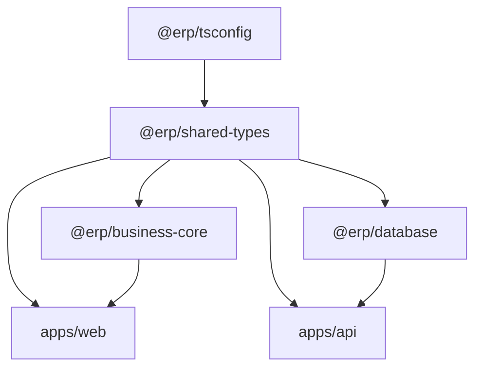

# Fundamentos de Computação e Análise Tecnológica do ERP Gráfica Modular

**Cátedra de Arquitetura de Software e Sistemas Distribuídos**  
*Departamento de Ciência da Computação*  
**Docente:** Prof. Antigravity, Ph.D.  
**Tema:** Desconstrução Teórica, Paradigmas e Análise Crítica das Tecnologias Aplicadas no ERP Gráfica Modular

---

## Ementa da Aula

> *"Meus caros alunos, bem-vindos à nossa aula magna sobre Arquitetura de Sistemas Corporativos Modernos. Hoje, não nos limitaremos a recitar manuais ou listar ferramentas de forma superficial. Nossa missão é dissecar a fundamentação teórica, a complexidade algorítmica e os trade-offs de engenharia por trás de cada escolha tecnológica adotada na construção do ERP Gráfica Modular. Como cientistas da computação, nosso dever é compreender não apenas o 'como', mas os fundamentos matemáticos e estruturais do 'porquê'."*

---

## 1. Topologia de Repositórios: Turborepo, pnpm e a Teoria dos Grafos

### 1.1. O Problema da Fragmentação de Sistemas Distribuídos
Em engenharia de software tradicional, equipes frequentemente cometiam o equívoco de bifurcar projetos em múltiplos repositórios isolados (*Polyrepos*). Do ponto de vista da teoria dos autômatos e linguagens formais, isso introduz um problema crônico: **divergência de esquemas** (*schema drift*). Se a API altera um contrato de dados e o cliente web não é sincronizado atomicamente, o sistema entra em um estado indeterminado em tempo de execução.

### 1.2. Modelagem por Grafo Direcionado Acíclico (DAG)
O **Turborepo** abstrai a compilação e execução do monorepo através de um **Grafo Direcionado Acíclico** ($G = (V, E)$), onde:
* O conjunto de vértices $V$ representa as tarefas executáveis (`build`, `test`, `lint`) de cada pacote (`@erp/shared-types`, `@erp/business-core`, `@erp/database`, `apps/api`, `apps/web`).
* O conjunto de arestas direcionadas $E$ representa as relações estritas de precedência causal. Se o pacote $B$ depende da interface tipada de $A$, existe uma aresta $e = (A, B) \in E$.



### 1.3. Cacheamento Determinístico via Hashing Criptográfico
O Turborepo implementa uma função de memoização distribuída:
$$\mathcal{H}(\text{Inputs}) = \text{SHA-256}(\text{Código Fonte} + \text{Dependências} + \text{Variáveis de Ambiente})$$
Se $\mathcal{H}_{t_1} = \mathcal{H}_{t_0}$, o algoritmo de escalonamento computacional atinge complexidade temporal $\mathcal{O}(1)$, recuperando os artefatos de build instantaneamente sem queimar ciclos de CPU redundantes.

### 1.4. pnpm e Estruturas de Dados Endereçadas por Conteúdo
Diferente do `npm` clássico, cuja resolução de árvores de dependência gerava complexidade de armazenamento $\mathcal{O}(N \times M)$ por duplicação brutal no disco, o **pnpm** emprega um **Content-Addressable Storage** baseado em links rígidos (*hardlinks* de sistema operacional baseados em inodes) e links simbólicos (*symlinks*). O resultado prático é uma redução exponencial de entropia no disco e garantia formal contra vazamentos de dependências não declaradas (*phantom dependencies*).

---

## 2. Tipagem Estática e Teoria dos Tipos: TypeScript

### 2.1. O Sistema de Tipos Estruturais (Duck Typing Formal)
Ao contrário de linguagens como Java ou C++, que utilizam sistemas de tipos nominais, o **TypeScript** fundamenta-se no **Sistema de Tipos Estrutural**:
$$\text{Se } T_A \text{ possui todos os membros de } T_B, \text{ então } T_A \sqsubseteq T_B \text{ (relação de subtipagem)}$$
Isso permite que nossos DTOs (*Data Transfer Objects*) no monorepo transitem com máxima fluidez e segurança entre as barreiras de serialização JSON sem a necessidade de instanciar classes concretas pesadas.

### 2.2. Mitigação Precoce de Estados Inválidos
Em ciência da computação teórica, a segurança de tipos (*Type Soundness*) garante que "um programa bem-tipado jamais entrará em um estado de falha não interceptada". No ERP Gráfica, enums canônicos (`Role`, `WorkOrderStatus`, `StageStatus`) garantem que uma ordem de serviço jamais assuma um status espectral não previsto pela máquina de estados finitos do chão de fábrica.

---

## 3. Aritmética Computacional: A Falácia do Ponto Flutuante IEEE-754 e o `Decimal.js`

### 3.1. A Anomalia do Padrão Binário IEEE-754
Perguntem a um programador iniciante quanto é $0.1 + 0.2$ em JavaScript ou Python nativo, e ele responderá $0.3$. No entanto, o hardware de qualquer computador executará:
$$0.1_{10} = 0.0001100110011..._2 \quad (\text{dízima periódica em base 2})$$
$$0.1 + 0.2 = 0.300000000000000044408920985006...$$

### 3.2. Catástrofe Financeira em Produção Gráfica
Imagine precificar uma tiragem industrial de $500.000$ impressos onde cada folha tem um custo unitário fracionado de $R\$\ 0,00427$. Ao multiplicar e aplicar alíquotas de markup sucessivas sobre ponto flutuante de precisão dupla (64 bits), os bits menos significativos truncados geram perdas cumulativas substanciais ou discrepâncias contábeis inaceitáveis perante o Fisco.

### 3.3. A Solução: Aritmética Arbitrária Decimal (`Decimal.js`)
Para blindar o motor `@erp/business-core`, adotamos o **Decimal.js**, que abandona o registrador de ponto flutuante da FPU do processador e implementa aritmética em base 10 pura:
$$\text{Decimal} = \langle \text{sinal}, \text{coeficiente} \in \mathbb{Z}^+, \text{expoente} \in \mathbb{Z} \rangle$$
Cada operação aritmética (como o cálculo do Markup divisor: $\frac{\text{Custo}}{1 - \text{Markup}}$) é computada com representação exata de dígitos decimais e regras determinísticas de arredondamento bancário (`ROUND_HALF_UP`), garantindo rigor absoluto até a última casa decimal.

---

## 4. Persistência de Dados Relacional: PostgreSQL e Prisma ORM

### 4.1. O Teorema de Codd e a Normalização de Dados
Para a modelagem da indústria gráfica, bancos de dados NoSQL/Documentais seriam uma escolha perigosa e ingênua. Uma ordem de serviço industrial não é um documento isolado: ela é um grafo de relacionamentos com integridade referencial estrita entre Cliente, Insumos consumidos, Matrizes de impressão (CTP), Horas de máquina e Faturamento.

O **PostgreSQL** nos fornece garantias matemáticas **ACID**:
* **Atomicidade:** A geração de uma OS a partir de uma Cotação ou é concretizada em sua totalidade (com a criação simultânea de suas 6 etapas industriais) ou sofre *Rollback* instantâneo.
* **Consistência:** As restrições de chave estrangeira (*Foreign Keys*) e verificações de integridade impedem registros órfãos.
* **Isolamento:** Através do protocolo **MVCC** (*Multi-Version Concurrency Control*), leituras analíticas do Dashboard gerencial não bloqueiam as escritas transacionais de operadores no chão de fábrica.
* **Durabilidade:** Escrita síncrona em diário com registro em WAL (*Write-Ahead Logging*).

### 4.2. Estruturas de Dados de Indexação: B-Trees
As buscas por código de barras de ordens de serviço (`barcode`), e-mails de usuários ou status de fluxo utilizam índices estruturados em **Árvores B+** ($\mathcal{O}(\log N)$), garantindo que, mesmo com milhões de apontamentos históricos, a recuperação em disco ocorra com uma quantidade mínima de operações de I/O.

### 4.3. O Paradoxo do Mapeamento Objeto-Relacional (Prisma)
Historicamente, ORMs causavam o problema conhecido como *Object-Relational Impedance Mismatch* e o terrível problema de consultas $N+1$. O **Prisma** mitiga isso agindo como um **Data Mapper** de tipagem estática pura:
* As consultas são traduzidas para ASTs (*Abstract Syntax Trees*) SQL altamente otimizadas com comandos parametrizados, blindando formalmente a aplicação contra qualquer vetor de ataque por **SQL Injection**.

---

## 5. Arquitetura de Software no Backend: NestJS e Engenharia Orientada a Serviços

### 5.1. Princípios SOLID e Inversão de Controle (IoC)
O **NestJS** transporta os cânones clássicos da engenharia de software corporativa para o ecossistema Node.js. O coração da arquitetura baseia-se no princípio da **Inversão de Dependência** ($D$ do SOLID):
* Módulos de alto nível não dependem de módulos de baixo nível; ambos dependem de abstrações.
* Através de um contêiner de **Injeção de Dependências** (*Dependency Injection Container*), serviços como `QuotesService` e `WorkOrdersService` têm suas dependências resolvidas dinamicamente via reflexão de metadados em tempo de instanciação.

### 5.2. Metaprogramação e Decorators
O uso extensivo de *Decorators* (`@Controller()`, `@Injectable()`, `@UseGuards()`) fundamenta-se no padrão de projeto estrutural **Decorator** (Gang of Four), estendendo o comportamento de classes e métodos sem alterar suas implementações fundamentais.

### 5.3. Pipeline de Tratamento de Exceções: RFC 7807
Ao invés de retornar mensagens arbitrárias e desestruturadas em situações de erro, a API implementa o padrão da IETF **RFC 7807** (*Problem Details for HTTP APIs*). Todo erro de validação, autenticação ou falha industrial é encapsulado em um payload uniforme com semântica padronizada, permitindo que clientes e robôs interpretem formalmente a natureza da falha.

---

## 6. Teoria da Reatividade e Interfaces Web: React 18 e Virtual DOM

### 6.1. O Custo das Mutações no DOM Real
O DOM (*Document Object Model*) provido pelos navegadores é uma árvore de objetos em memória extremamente onerosa para manipulação direta. Repintar o layout (*Reflow* e *Repaint*) a cada tecla digitada no simulador de corte causaria gargalos severos de renderização e congelamento da interface (*jank*).

### 6.2. O Algoritmo de Reconciliação Heurística ($\mathcal{O}(N)$)
O problema genérico de encontrar o número mínimo de modificações para transformar uma árvore qualquer em outra árvore é de complexidade temporal $\mathcal{O}(N^3)$. Se uma interface gráfica contiver 1.000 nós no DOM, uma comparação exaustiva exigiria um bilhão de operações.

O **React** introduz uma heurística engenhosa que reduz esse custo para **$\mathcal{O}(N)$**, ancorada em dois axiomas:
1. Dois elementos de tipos diferentes produzirão árvores diferentes.
2. O desenvolvedor pode indicar quais nós filhos são estáveis entre renderizações através da propriedade `key`.

### 6.3. Arquitetura Fiber e Concorrência no React 18
O motor interno do React 18 baseia-se em uma estrutura de dados de lista duplamente encadeada chamada **Fiber**. Isso permite que o mecanismo de renderização pause, aborte ou reoriente o trabalho computacional com base na prioridade do usuário, garantindo fluidez cinematográfica (60 FPS) mesmo enquanto o canvas SVG processa cálculos de imposição geométrica.

---

## 7. Gerenciamento de Estado: A Dualidade entre Client-State e Server-State

Um dos maiores erros da engenharia frontend na última década foi tratar dados do servidor como se fossem estado local da interface (sobrecarregando ferramentas com Redux e centenas de linhas de boilerplate).

No ERP Gráfica Modular, separamos rigorosamente essa ontologia:

| Dimensão | Estado de Cliente (Client State) | Estado de Servidor (Server State) |
| :--- | :--- | :--- |
| **Definição** | UI transitória, credenciais do operador, tema visual | Dados persistidos no PostgreSQL (Ordens de Serviço, Estoque) |
| **Propriedade** | Exclusiva do navegador local | Compartilhada entre múltiplos usuários e máquinas |
| **Ferramenta** | **Zustand** | **TanStack Query (React Query v5)** |
| **Complexidade** | Simples, síncrona | Assíncrona, sujeita a latência, cache e invalidação |

### 7.1. Zustand: Observer Pattern Minimalista
O **Zustand** elimina o excesso de cerimônias do Redux. Ele implementa o clássico padrão **Observer (Pub-Sub)** através de closures e uma assinatura de eventos reativa. Quando o token de autenticação é atualizado, apenas os componentes explicitamente inscritos naquela fatia de estado são re-renderizados.

### 7.2. TanStack Query e o Algoritmo Stale-While-Revalidate (RFC 5861)
Para o consumo da API, o **TanStack Query** atua como uma máquina de estados finitos que gerencia o ciclo de vida dos dados remotos com base no padrão da RFC 5861:
1. Retorna os dados em cache instantaneamente (*Stale*).
2. Dispara a requisição em segundo plano para obter a versão mais recente (*Revalidate*).
3. Atualiza a árvore do componente apenas se os dados tiverem sofrido mutação.

---

## 8. Sistemas Concorrentes em Tempo Real: WebSockets e o Protocolo Socket.io

### 8.1. Limitações Físicas do Polling HTTP Tradicional
Em um chão de fábrica gráfico, se múltiplos operadores precisarem checar o status de uma impressora offset via *Short Polling* (ex: requisitar a cada 2 segundos), o overhead de cabeçalhos HTTP, negociações TCP e handshakes TLS saturará o servidor e a banda de rede desnecessariamente.

### 8.2. Comunicação Full-Duplex Bi-Direcional (RFC 6455)
O protocolo **WebSocket** estabelece um canal persistente sobre uma única conexão TCP após um handshake HTTP inicial:
* **Framing Mínimo:** Ao invés de kilobytes de cabeçalhos HTTP repetitivos, um frame WebSocket carrega apenas 2 a 10 bytes de overhead de protocolo.
* **Modelo Orientado a Eventos (Reactor Pattern):** Quando um operador clica em "Iniciar Impressão" ou "Registrar Refugo", o servidor NestJS emite um evento atômico que é propagado em broadcast milissegundo para os painéis Kanban de todos os outros operadores conectados.

---

## 9. Metodologia de Verificação: A Pirâmide de Testes Automatizados

A robustez do software foi comprovada através de uma abordagem estrita baseada na **Pirâmide de Testes de Mike Cohn**:

```text
       / \
      / E2E \       -> Validação de Fluxo Completo (test-swagger.cjs)
     /-------\
    / Integ.  \     -> React Testing Library (Interações de Usuário)
   /-----------\
  /   Unidade   \   -> Vitest (@erp/business-core, utils, stores)
 /---------------\
```

### 9.1. Testes de Unidade Puros com Vitest
O **Vitest** é construído diretamente sobre o motor de transformação do Vite (esbuild). Ele compila TypeScript via threads de trabalho paralelas (*worker pools* baseados em `tinypool`), executando dezenas de testes matemáticos em milissegundos sem a sobrecarga pesada do Babel do Jest tradicional.

### 9.2. A Filosofia do React Testing Library
Diferente de abordagens ultrapassadas que testavam detalhes internos de implementação (como inspecionar o `state` ou o `props` de um componente no Enzyme), a **React Testing Library** opera sobre o princípio:
> *"Quanto mais seus testes se assemelharem à forma como seu software é utilizado, mais confiança eles podem lhe oferecer."*

Os testes buscam elementos exclusivamente por **Acessibilidade Semântica** (`role`, `aria-label`, `label text`), garantindo que se o componente for refatorado internamente, mas continuar funcionalmente acessível ao ser humano, o teste permanecerá verde.

---

## 10. Redes e Conectividade: Cloudflare Tunnel e Segurança Zero Trust

### 10.1. A Problemática do NAT e Roteamento Ingress Tradicional
Tradicionalmente, para permitir que um cliente externo acesse um servidor local, era necessário:
1. Possuir um endereço IP público estático.
2. Acessar o roteador físico e configurar **Port Forwarding** (NAT Traversal).
3. Expor as portas do host a varreduras maliciosas de portas (*port scans*) e ataques automatizados de negação de serviço (*DDoS*).

### 10.2. Arquitetura Outbound-Only e o Protocolo QUIC
O utilitário **Cloudflare Tunnel (`cloudflared`)** inverte radicalmente o modelo de tráfego de rede:
* **Nenhuma porta de entrada é aberta** no firewall local do computador.
* O processo `cloudflared` estabelece quatro túneis persistentes de **saída** (*outbound*) para os servidores de borda (*Edge Points of Presence*) mais próximos da Cloudflare, utilizando o protocolo moderno **QUIC** (baseado em UDP com multiplexação nativa e handshake TLS 1.3 integrado, definido na RFC 9000).
* O tráfego do usuário final atinge a rede global com proteção DDoS da Cloudflare e é despachado com latência ultra-baixa através do túnel até o proxy reverso do Vite em `localhost:5173`.

---

## Conclusão da Aula Magistral

> *"Como pudemos constatar ao longo desta análise, o ERP Gráfica Modular não é uma coleção fortuita de bibliotecas da moda. Cada tecnologia — do rigor aritmético do `Decimal.js` à eficiência de grafos do `Turborepo`, da integridade relacional do `PostgreSQL` à reatividade funcional do `React 18` e `WebSockets` — foi selecionada para responder a um desafio rigoroso de computação e física industrial. Arquitetura de software de excelência consiste exatamente nisto: a harmonização elegante entre a teoria da ciência da computação e a resolução pragmática de problemas de negócio no mundo real."*
