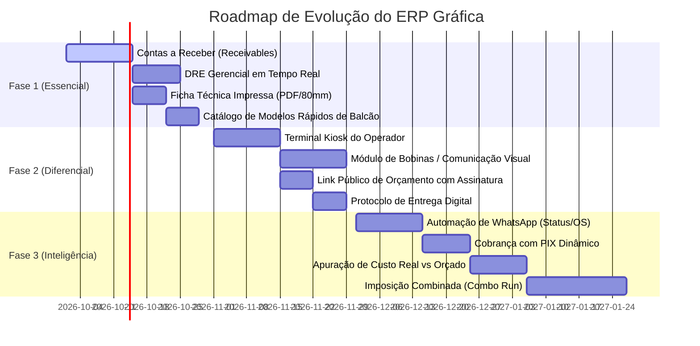

# Plano Estratégico de Melhorias e Evolução do ERP Gráfica Modular

> **Documento:** Plano de Engenharia e Inovação de Produto  
> **Sistema:** ERP Gráfica Modular (Turborepo, NestJS, Prisma, PostgreSQL, React 18, Vite, Tailwind CSS)  
> **Data:** Setembro de 2026  
> **Status:** Proposta Técnica e Funcional para Planejamento de Sprints  

---

## 1. Sumário Executivo & Diagnóstico do Sistema Atual

O **ERP Gráfica Modular** já possui uma fundação arquitetural e de engenharia de software de altíssimo padrão, superando sistemas legados do mercado gráfico em termos de tecnologia e desempenho:
* **Monorepo Turborepo** com separação nítida de responsabilidades (`apps/api`, `apps/web`, `packages/database`, `packages/business-core`, `packages/shared-types`);
* **Cálculo Técnico de Precisão:** Aritmética arbitrária com `Decimal.js`, eliminando erros de ponto flutuante na orçamentação e na formação de preços;
* **Otimizador de Corte Guillotine:** Algoritmo 2D com visualização vetorial em tempo real no Canvas SVG (`SheetCuttingCanvas`);
* **Chão de Fábrica Dinâmico:** Quadro Kanban com arrastar-e-soltar, logs detalhados de execução por operador/máquina e sincronização bi-direcional via WebSockets;
* **Design System Responsivo:** Suporte nativo e unificado a temas Claro, Escuro e Sistema, com máscaras monetárias BRL e cards mobile;
* **Módulo de OPEX Recém-Entregue:** Gestão de despesas operacionais fixas e variáveis, suporte a contas recorrentes com renovação e credores avulsos.

### Diagnóstico de Oportunidades & Gargalos no Negócio Gráfico
Embora o núcleo técnico esteja sólido, a operação diária de uma gráfica (rápida, offset comercial ou comunicação visual) exige fluxos específicos que conectam o balcão comercial, a fábrica física e o controle de liquidez da tesouraria. Identificamos os seguintes pontos de evolução:
1. **Financeiro Desbalanceado:** Possuímos a gestão de saídas (OPEX), mas falta a gestão ativa de **Contas a Receber** (sinais de 50%, parcelamento no cartão/boleto, faturamento mensal de agências), **Fluxo de Caixa Projetado** e a consolidação do **DRE Gerencial** (CPV vs OPEX).
2. **Desconexão Físico-Digital no Chão de Fábrica:** As ordens de serviço existem na tela, mas na fábrica real o operador precisa de uma **Ficha Técnica Impressa (Job Ticket)** física com código de barras/QR Code que acompanhe a pilha de papel até a expedição, e de um **Terminal Touch Simplificado** para apontamento de refugo e tempo de máquina.
3. **Limitação a Substratos Planos:** O otimizador atual calcula folhas planas de papel. Falta suporte à **Comunicação Visual em Bobinas/Rolos** (lonas, vinis adesivos, tecidos) por metro quadrado ($m^2$) e metro linear ($ML$), com cálculos de acabamentos típicos (ilhoses, solda vulcanizada, corte em plotter).
4. **Agilidade Comercial no Balcão:** Cada orçamento hoje exige preencher formato, máquina e insumos. Falta um **Catálogo de Modelos Pré-Configurados (Tabelados)** para orçar os produtos mais vendidos em 1 clique.
5. **Comunicação com o Cliente:** Falta automação para envio de propostas e aviso de "Pedido Pronto para Retirada" via **WhatsApp**, além de link público para **aprovação digital de orçamentos**.

---

## 2. Matriz de Priorização (Esforço vs. Impacto — Método RICE)

A tabela abaixo organiza as melhorias recomendadas com base em **Alcance (Reach)**, **Impacto no Negócio (Impact)**, **Confiança Técnica (Confidence)** e **Esforço de Implementação (Effort)**:

| ID | Melhoria Proposta | Pilar | Impacto | Esforço | Prioridade |
| :--- | :--- | :--- | :---: | :---: | :---: |
| **FIN-01** | Contas a Receber (Receivables) com Sinal e Parcelas de OS | Financeiro | 🟢 Altíssimo | 🟡 Médio | **Fase 1** |
| **FIN-02** | DRE Gerencial em Tempo Real (CPV x OPEX x EBITDA) | Financeiro | 🟢 Altíssimo | 🟡 Médio | **Fase 1** |
| **FIN-03** | Fluxo de Caixa Diário e Projetado | Financeiro | 🟢 Alto | 🟡 Médio | **Fase 1** |
| **IND-01** | Emissão de Ficha Técnica / Job Ticket em PDF (A4 e Térmica 80mm) | Indústria | 🟢 Altíssimo | 🟢 Baixo | **Fase 1** |
| **COM-01** | Catálogo de Produtos Tabelados / Modelos Rápidos de Balcão | Comercial | 🟢 Alto | 🟢 Baixo | **Fase 1** |
| **IND-02** | Terminal Kiosk do Operador (Apontamento por Código de Barras) | Indústria | 🟢 Alto | 🟡 Médio | **Fase 2** |
| **ENG-01** | Módulo de Comunicação Visual para Bobinas/Rolos ($m^2$ e $ML$) | Engenharia | 🟢 Alto | 🟡 Médio | **Fase 2** |
| **COM-02** | Link Público de Orçamento com Aprovação Digital pelo Cliente | Comercial | 🟡 Médio | 🟢 Baixo | **Fase 2** |
| **NOT-01** | Notificações Automáticas no WhatsApp (OS Pronta / Orçamento) | Comunicação | 🟢 Alto | 🟡 Médio | **Fase 2** |
| **LOG-01** | Protocolo de Entrega Digital com Assinatura no Vidro (Touch) | Logística | 🟡 Médio | 🟢 Baixo | **Fase 2** |
| **FIN-04** | Cobrança PIX Dinâmico com QR Code na Aprovação da OS | Financeiro | 🟢 Alto | 🟡 Médio | **Fase 3** |
| **ENG-02** | Imposição Combinada / Multi-Item Nesting (Combo Run) | Engenharia | 🟢 Alto | 🔴 Alto | **Fase 3** |
| **IND-03** | Apuração de Custo Real vs Orçado (Pós-Cálculo de Refugo) | Indústria | 🟢 Alto | 🟡 Médio | **Fase 3** |
| **DEV-01** | Suporte a PWA (Instalação como App Mobile no Balcão/Fábrica) | Tecnologia | 🟡 Médio | 🟢 Baixo | **Fase 3** |

---

## 3. Detalhamento dos Pilares de Melhoria

```
┌─────────────────────────────────────────────────────────────────────────────┐
│                       ARQUITETURA DE VALOR DO SISTEMA                       │
└─────────────────────────────────────────────────────────────────────────────┘
          │                                 │                              │
          ▼                                 ▼                              ▼
  [ 1. GESTÃO FINANCEIRA ]         [ 2. CHÃO DE FÁBRICA ]        [ 3. COMERCIAL & CRM ]
  • Contas a Receber (OS)          • Ficha Técnica / Barcode     • Catálogo Balcão 1-Clique
  • Fluxo de Caixa Projetado       • Terminal Kiosk Operador     • Proposta PDF com Assinatura
  • DRE Gerencial em Tempo Real    • Apuração de Custo Real      • WhatsApp Notificações
  • PIX Dinâmico & OFX             • OEE e Refugo de Máquinas    • Tabela Revenda vs Balcão
          │                                 │                              │
          └─────────────────┬───────────────┴──────────────────────────────┘
                            │
                            ▼
              [ 4. ENGENHARIA DE MATERIAIS & CORTE ]
              • Otimizador de Bobinas ($m^2$ e $ML$)
              • Imposição Mista (Combo Run)
              • Direção da Fibra do Papel (Grain)
              • Controle de Retalhos e Sobras Úteis
```

---

### Pilar 1: Módulo Financeiro Integrado & DRE Gerencial

O módulo recém-implementado de **Despesas Operacionais (OPEX)** estabeleceu a estrutura contábil de saídas. Para transformar o ERP Gráfica em um centro de inteligência financeira completa, sugerimos a criação da **Tríade Financeira**:

#### 1.1 Contas a Receber (Receivables) Integrado às Ordens de Serviço
* **Problema:** Atualmente, a tabela `WorkOrder` possui apenas o campo escalar `paymentStatus`. No mundo real, gráficos raramente recebem à vista integral no ato:
  * 50% de sinal no pedido (PIX/Cartão) para autorizar a compra do papel;
  * 50% na retirada do material impresso no balcão;
  * Ou faturamento parcelado em 3x (30/60/90 dias) para clientes corporativos e agências.
* **Solução:**
  * Criar o modelo `Receivable` vinculado a `WorkOrder` e `Party`:
    * `installmentNumber`, `totalInstallments`, `amount`, `dueDate`, `paidAt`, `status`, `paymentMethod`.
  * Na tela de detalhes da OS e no balcão, permitir gerar o cronograma de parcelas com 1 clique e dar baixa rápida em cada parcela recebida.

#### 1.2 DRE Gerencial em Tempo Real (Demonstrativo do Resultado do Exercício)
* **Estrutura Contábil Automatizada:**
  $$\begin{aligned}
  & (+) \text{ Receita Bruta de Vendas (OS faturadas no período)} \\
  & (-) \text{ Deduções e Impostos sobre Vendas} \\
  & (=) \mathbf{\text{Receita Líquida}} \\
  & (-) \mathbf{\text{CPV (Custo dos Produtos Vendidos)}} \quad \text{[Papel, Chapa, Tinta, Acabamento, Mão de Obra Direta]} \\
  & (=) \mathbf{\text{Lucro Bruto (Margem de Contribuição Total)}} \\
  & (-) \mathbf{\text{OPEX (Despesas Operacionais)}} \quad \text{[Aluguel, Luz, Softwares, Administrativo, Manutenção]} \\
  & (=) \mathbf{\text{EBITDA (Lucro Operacional Antes de Juros e Impostos)}} \\
  & (-) \text{ Despesas Financeiras e Depreciação} \\
  & (=) \mathbf{\text{Lucro Líquido do Período}}
  \end{aligned}$$
* **Visualização:** Uma página dedicada `/financial/dre` com filtros por mês/ano, comparativo percentual vertical (% sobre a receita) e gráfico de cascata (*waterfall chart*).

#### 1.3 Fluxo de Caixa Diário e Projetado
* **Gráfico de Liquidez:** Linha do tempo exibindo entradas previstas (parcelas a receber) contra saídas previstas (despesas operacionais e compras de matéria-prima).
* **Alerta de Inadimplência:** Painel evidenciando recebíveis vencidos com botão de disparo de cobrança amigável via WhatsApp/E-mail.

#### 1.4 Conciliação Bancária via Importação OFX
* Upload de extrato bancário `.ofx` gerado pelo internet banking do cliente.
* Algoritmo de cruzamento automático entre lançamentos bancários e contas cadastradas por data e valor aproximado ($\pm 2\%$).

---

### Pilar 2: Chão de Fábrica Inteligente, Rastreabilidade e Ficha Técnica

#### 2.1 Emissão de Ficha Técnica / Ordem de Produção (Job Ticket)
* **Problema:** A produção gráfica não ocorre na frente do computador administrativo; ocorre na guilhotina, na impressora CTP, na offset ou no plotter de recorte. Sem uma ordem física que viaje com o papel, ocorrem erros crassos (imprimir na gramatura errada, cortar sem sangria ou aplicar laminação errada).
* **Solução:**
  * Botão **"Imprimir Ficha Técnica"** no Kanban ou na tabela de OS.
  * Geração de documento padronizado em **PDF A4** e formato compacto para **Impressora Térmica de Bobina (80mm)** contendo:
    * Cabeçalho com Número da OS e Código de Barras Code-128 / QR Code para leitura rápida;
    * Identificação do Cliente, Data e Horário Prometido de Entrega;
    * Especificações Técnicas de Tiragem, Papel/Substrato (nome, formato da folha, gramatura), Cores (4x0, 4x4, 1x0);
    * **Miniatura visual do plano de corte** gerado pelo motor de corte;
    * Lista de acabamentos sequenciais (1º Corte Inicial $\rightarrow$ 2º Impressão $\rightarrow$ 3º Laminação Fosca $\rightarrow$ 4º Vinco $\rightarrow$ 5º Refile Final $\rightarrow$ 6º Embalagem);
    * Campos para visto/assinatura manual do operador em cada etapa.

#### 2.2 Terminal Kiosk do Operador (Apontamento Chão de Fábrica Touch)
* Rota dedicada e simplificada para tablets ou monitores touch localizados ao lado das máquinas (`/kiosk` ou `/shop-floor`).
* **Fluxo de Trabalho em 3 Toques:**
  1. O operador "bipa" o código de barras da OS com um leitor USB/Bluetooth (ou digita o número);
  2. A tela exibe os dados imediatos da etapa atual daquela máquina e um grande botão verde **"Iniciar Produção"**;
  3. Ao terminar a tiragem, o operador clica em **"Finalizar Etapa"**, informa a quantidade de folhas perdidas no acerto (refugo) e o sistema atualiza o Kanban e os tempos de máquina automaticamente via WebSocket.

#### 2.3 Apuração do Custo Real vs. Orçado (Pós-Cálculo de Produção)
* Confrontar o que foi planejado no orçamento com o que foi executado na fábrica:
  * *Folhas de papel estimadas:* 1.100 folhas (1.000 úteis + 10% perda) $\rightarrow$ *Consumo real:* 1.250 folhas (perda de 25%);
  * *Tempo de máquina estimado:* 25 minutos $\rightarrow$ *Tempo real de máquina:* 52 minutos (problema no alimentador).
* O sistema calcula a **Margem Real Efetiva** da OS e exibe um alerta nos relatórios de faturamento se a margem de lucro foi corroída.

---

### Pilar 3: Engenharia de Produção & Inteligência de Corte

#### 3.1 Módulo de Comunicação Visual para Bobinas / Rolo (Plotters e Lonas)
* **Cenário:** O mercado gráfico contemporâneo é híbrido. Praticamente toda gráfica comercial e rápida também opera comunicação visual (banners, faixas em lona vinílica, adesivos para vitrine, placas em ACM, tecidos sublimáticos).
* **Evolução do Algoritmo de Cálculo:**
  * Parâmetros de bobina: Largura nominal fixa do rolo (ex: 1.00m, 1.20m, 1.50m, 3.20m) e comprimento contínuo.
  * Unidades de precificação: Metro Quadrado ($m^2$) e Metro Linear ($ML$).
  * Cálculo de acabamentos específicos de comunicação visual:
    * Bainha reforçada e solda térmica/vulcanizada por perímetro linear;
    * Ilhoses metálicos por espaçamento (ex: a cada 20cm ou 30cm no perímetro);
    * Madeira redonda superior/inferior, ponteiras plásticas e cordinha de nylon para banners;
    * Máscara de transferência e meio-corte eletrônico para adesivos.

#### 3.2 Imposição Combinada / Multi-Item Nesting (Combo Run)
* **Conceito:** Combinar pedidos distintos de clientes diferentes na mesma folha gráfica pai (66x96cm ou 72x102cm) para ratear o custo de matriz/chapa CTP e horas de máquina.
* **Exemplo Clássico:** Imprimir 8 pedidos diferentes de 1.000 cartões de visita juntos na mesma chapa de máquina plana, dividindo o custo de setup por 8.
* **Recurso de Software:** Agrupador de itens com o mesmo tipo de papel e gramatura na fila de pré-impressão.

#### 3.3 Direção da Fibra do Papel (Grain Direction)
* A dobra do papel paralela à fibra não quebra as fibras da celulose nem racha o verniz/tinta; a dobra perpendicular à fibra causa estrias e acabamento rústico.
* Adicionar indicador de sentido da fibra no cadastro de papel e no cálculo de aproveitamento para catálogos, capas de livros e embalagens.

#### 3.4 Gestão de Retalhos e Sobras Úteis (Offcuts)
* No corte de folhas grandes (ex: 66x96cm para formato A4), costuma sobrar uma "tira" ou refugo limpo aproveitável.
* Permitir cadastrar a sobra útil no estoque como insumo secundário com custo proporcional, viabilizando o uso em pequenos blocos de rascunho, marcadores de página ou etiquetas, gerando lucro sobre o que iria para a lixeira.

---

### Pilar 4: Agilidade Comercial, CRM Gráfico & Notificações Omnichannel

#### 4.1 Catálogo de Produtos Pré-Configurados (Modelos Tabelados / 1-Clique)
* **Problema:** No balcão de uma gráfica rápida, o cliente não quer esperar o vendedor calcular diâmetro de pinça e rotação de folha para saber o preço de 1.000 cartões de visita ou 100 panfletos.
* **Solução:**
  * Tabela de produtos padronizados (Cartão 300g 4x4, Panfleto A5 Couchê 115g, Banner 1x0.80m, Pasta com Bolsa).
  * O vendedor seleciona o produto, digita a quantidade ou escolhe uma tiragem da grade (500, 1.000, 2.000, 5.000) e o sistema preenche imediatamente todos os insumos e custos em milissegundos.

#### 4.2 Proposta Comercial em PDF & Link Público com Aprovação Digital
* Geração de proposta comercial com layout profissional contendo logotipo da gráfica, dados do cliente, simulação técnica, opções de acabamento e condições de pagamento.
* **Link de Autoatendimento:** O vendedor envia um link único (`/proposta/token123`) via WhatsApp. O cliente abre no smartphone, visualiza o orçamento, faz o download do PDF e clica em **"Aprovar Orçamento"**. A aprovação dispara automaticamente a criação da Ordem de Serviço no Kanban e notifica a equipe de vendas.

#### 4.3 Integração e Automação com WhatsApp
* Disparo de mensagens transacionais automáticas via gateway de mensageria:
  1. *Ao emitir orçamento:* "Olá {nome}, seu orçamento #{codigo} no valor de {valor} está pronto! Veja aqui: {link}";
  2. *Ao iniciar produção:* "Seu material gráfico entrou em processo de impressão e acabamento.";
  3. *Ao ficar pronto:* "🎉 Seu pedido #{os} está embalado e pronto para retirada em nosso balcão! Nosso endereço: {endereco}."

#### 4.4 Tabelas de Preço Diferenciadas (Balcão vs. Revendedor Gráfico)
* Gráficas frequentemente atendem tanto o cliente final (preço cheio com margem alta) quanto **Revendedores Gráficos e Agências de Publicidade** (preço atacado com margem reduzida para fidelização e alto volume).
* Criação de regras de precificação por categoria de cliente no modelo `Party`.

---

### Pilar 5: Logística, Expedição & Balcão de Retirada

#### 5.1 Protocolo de Entrega Digital com Assinatura na Tela (Touch Signature)
* **Cenário:** O cliente retira o material no balcão ou o motoboy entrega na empresa do cliente.
* **Recurso:**
  * O expedidor abre o pedido no celular/tablet, o cliente confere os volumes e assina com o dedo diretamente na tela (Canvas Touch).
  * O sistema armazena a imagem da assinatura vetorial e muda a OS para `DELIVERED`, registrando: data, hora exata, nome legível do recebedor e documento (RG/CPF).
  * Isso elimina 100% dos extravios e questionamentos do tipo "meu material não foi entregue".

#### 5.2 Portal Público de Rastreamento de Pedido
* Página pública e limpa `/rastreio/:orderNumber` (sem necessidade de login do cliente).
* Linha do tempo visual em 5 passos: *Pedido Confirmado $\rightarrow$ Pré-Impressão/Arte $\rightarrow$ Impressão & Acabamento $\rightarrow$ Pronto para Retirada $\rightarrow$ Entregue*.

---

### Pilar 6: Segurança, Confiabilidade Técnica e Arquitetura de Software

#### 6.1 Repositório de Arquivos de Arte & Validação Pré-Flight Básica
* Associação de arquivos digitais à Ordem de Serviço (PDF de alta, TIFF, CDR, AI).
* Checagem prévia automatizada no upload (validação de formato PDF/X-1a, aviso se o tamanho do arquivo não corresponder às dimensões do orçamento em milímetros).

#### 6.2 Trilha de Auditoria (Audit Trail / Activity Log)
* Registro imutável de eventos críticos no sistema:
  * Quem alterou o preço ou concedeu desconto em um orçamento;
  * Quem excluiu uma ordem de serviço ou estornou um pagamento;
  * Quem ajustou manualmente a quantidade em estoque de insumos.

#### 6.3 PWA (Progressive Web App) para Uso Mobile na Fábrica
* Configuração do manifesto PWA e Service Worker no Vite.
* Permite que operadores de máquina e vendedores instalem o ERP como um aplicativo nativo nos seus smartphones Android e iOS sem precisar passar pelas lojas de aplicativos.

#### 6.4 Exportação Analítica em Planilhas (Excel / CSV)
* Botão nativo de exportação em todas as tabelas (Despesas Operacionais, Ordens de Serviço, Orçamentos, Estoque e Relatórios).

---

## 4. Roteiro Sugerido de Implementação (Roadmap por Fases)



### Detalhamento dos Entregáveis por Fase

#### 🎯 Fase 1: Fechamento Contábil e Agilidade Imediata (Duração: ~3 a 4 semanas)
1. **Contas a Receber (Receivables):**
   * Tabela `receivables` com vinculação à OS e cliente, controle de parcelas (sinal + saldo), baixa rápida e relatórios de inadimplência.
2. **DRE Gerencial Automático:**
   * Apuração automática de CPV (materiais + mão de obra direta de OS) vs. OPEX (despesas operacionais) com cálculo de Margem de Contribuição e EBITDA.
3. **Emissão de Ficha Técnica (Job Ticket):**
   * Geração de PDF e comprovante térmico com código de barras/QR Code para acompanhar o papel no chão de fábrica.
4. **Catálogo de Modelos Rápidos:**
   * Criação de orçamentos em 1 clique para os produtos mais vendidos de balcão.

#### 🚀 Fase 2: Eficiência Fabril & Experiência do Cliente (Duração: ~4 semanas)
1. **Terminal Kiosk do Operador:**
   * Apontamento de início/fim e refugo por leitor de código de barras nas máquinas.
2. **Comunicação Visual em Bobinas ($m^2$ e $ML$):**
   * Precificação de lonas, vinis e banners com ilhós, solda e tubetes.
3. **Link Público de Orçamento com Aprovação Digital:**
   * O cliente aprova a proposta direto pelo celular.
4. **Protocolo de Entrega Digital:**
   * Assinatura na tela do smartphone no ato do recebimento da encomenda.

#### 🌟 Fase 3: Automação, Integrações e Otimização Avançada (Duração: ~4 a 6 semanas)
1. **Disparo de Mensagens WhatsApp:**
   * Notificação automática de pedido pronto e envio de orçamentos.
2. **PIX Dinâmico Integrado:**
   * QR Code para pagamento imediato do sinal.
3. **Apuração de Custo Real vs. Estimado:**
   * Confronto real do consumo de papel e horas de máquina para cálculo de lucro líquido real por OS.
4. **Imposição Combinada (Combo Run):**
   * Agrupamento inteligente de múltiplos serviços na mesma folha gráfica.

---

## 5. Conclusão e Próximos Passos

O **ERP Gráfica Modular** já possui o que há de mais moderno em engenharia de software full-stack. A execução das melhorias sugeridas neste plano elevará a solução ao patamar dos sistemas de liderança industrial gráfica (como EFI Pace e Holdprint), combinando:
1. **Precisão matemática** no custo industrial e aproveitamento de papel;
2. **Agilidade no balcão** para fechamento rápido de vendas;
3. **Rastreabilidade total** da fábrica com códigos de barras e telas simplificadas;
4. **Visão executiva transparente** através da DRE gerencial e fluxo de caixa.

**Recomendação de Início:**  
Sugerimos iniciar pela **Fase 1**, focando no módulo de **Contas a Receber + DRE Gerencial** e na **Emissão de Ficha Técnica Impressa**, aproveitando a estrutura recém-criada de Despesas Operacionais e garantindo o ciclo financeiro completo da gráfica.
