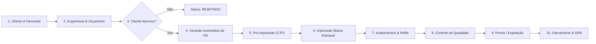

# 🚀 01. Visão Geral e Guia de Início Rápido

## 1. O que é o ERP Gráfica Modular?

O **ERP Gráfica Modular** é uma plataforma integrada de gestão desenvolvida sob medida para a dinâmica específica de empresas da indústria gráfica (gráficas offset comerciais, rápidas/digitais, editoriais e convertedoras de embalagens).

Diferente de sistemas genéricos de comércio ou serviços, o ERP Gráfica foi projetado considerando as particularidades da física e da matemática da produção gráfica:
- **Cálculo automatizado de imposição e corte**: O sistema calcula como os produtos (cartões, folders, cartazes, folhetos) se encaixam nas folhas inteiras de papel compradas de distribuidores (ex.: formatos 660x960 mm, 640x880 mm), respeitando sangrias de corte e margens de pinça da máquina.
- **Formação técnica de preço**: Não existe "adivinhar" o preço. O sistema soma o custo real do papel consumido, o tempo de acerto (setup) e tiragem de máquina, o custo de chapas CTP, tintas CMYK e acabamentos terceirizados antes de aplicar o markup.
- **Rastreabilidade e chão de fábrica**: Acompanhamento visual da esteira produtiva via painel Kanban e apontamento de produção por operador via tablet ou computador na máquina.
- **Saúde financeira em tempo real**: Atualização imediata do DRE gerencial, margem de contribuição e fluxo de caixa conforme as ordens avançam e as despesas ocorrem.

---

## 2. O Fluxo de Vida do Pedido Gráfico

O diagrama abaixo ilustra o caminho completo percorrido por um trabalho dentro da gráfica:

1. **Cliente solicita orçamento**: O vendedor registra o cliente e cadastra as especificações técnicas (formato aberto, cores frente/verso, tiragem, papel desejado e acabamentos).
2. **Cálculo da Engenharia Gráfica**: Em segundos, o sistema calcula quantas peças cabem por folha inteira, quantas folhas serão necessárias, o custo de insumos, o custo de máquina e sugere o preço de venda com base no markup.
3. **Aprovação**: Com o clique de um botão, o orçamento aprovado gera uma **Ordem de Serviço (OS)** com número rastreável e etapas sequenciais pré-configuradas.
4. **Entrada na Linha de Produção**:
   - A equipe de pré-impressão grava as chapas CTP e fecha os arquivos.
   - Ao iniciar a **Impressão**, o ERP **baixa automaticamente** a quantidade calculada de folhas de papel do estoque da empresa.
   - Os operadores de impressão e acabamento registram suas atividades no sistema.
5. **Finalização e Entrega**: Após passar pelo controle de qualidade, o produto é empacotado para retirada ou envio.
6. **Faturamento**: O sistema gera as parcelas a receber (à vista, 50/50 ou parcelado) e atualiza o DRE do mês.

---

## 3. Perfis de Usuário e Níveis de Permissão (RBAC)

Para garantir segurança, integridade dos dados e evitar fraudes ou alterações indevidas, o ERP Gráfica possui 4 perfis de acesso bem definidos:

| Perfil | Sigla | O que PODE fazer | O que NÃO pode fazer |
| :--- | :--- | :--- | :--- |
| **Administrador** | `ADMIN` | Acesso total irrestrito: cadastrar e demitir usuários, alterar salários de colaboradores, cadastrar máquinas e custos/hora, excluir registros, emitir relatórios de DRE e fluxo de caixa. | Nenhuma restrição. |
| **Comercial** | `COMMERCIAL` | Cadastrar clientes e fornecedores, criar orçamentos técnicos, aprovar propostas para gerar OSs, cadastrar insumos e consultar o painel de produção. | Não visualiza salários de funcionários, nem dados sensíveis de DRE e custos fixos da empresa. |
| **Financeiro** | `FINANCIAL` | Acesso a contas a receber, baixa e quitação de recebíveis, lançamento e pagamento de despesas operacionais (OPEX), DRE gerencial completo e fluxo de caixa. | Não altera parâmetros de máquinas nem exclui operadores. |
| **Operador de Produção** | `OPERATOR` | Consultar o quadro Kanban de ordens de serviço, avançar status de OS e realizar apontamentos em tempo real nas etapas de produção (`START`, `PAUSE`, `COMPLETE`). | Não visualiza custos financeiros, lucros da empresa ou salários. |

---

## 4. Primeiro Acesso e Login no Sistema

### Credenciais Padrão (Ambiente de Demonstração / Instalação)
Quando o sistema é iniciado pela primeira vez com os dados padrão (seed), o usuário administrador possui o seguinte acesso:
- **E-mail**: `admin@erpgrafica.com`
- **Senha**: `admin123`
- **Perfil**: `ADMIN`

### Como Fazer Login
1. Acesse o ERP pelo navegador no endereço configurado para a sua gráfica (ex.: `http://localhost:5173` ou o link interno da sua rede).
2. Na tela de identificação:
   - Digite o seu **E-mail cadastrado**.
   - Digite a sua **Senha**.
3. Clique em **Entrar**.
4. O sistema irá autenticar com segurança, emitir um token criptografado (JWT) e redirecioná-lo automaticamente para o seu painel de trabalho (Dashboard).

---

## 5. Boas Práticas para o seu Dia a Dia

> [!IMPORTANT]
> **Nunca compartilhe sua senha**: Cada vendedor e operador deve possuir seu próprio usuário. Os apontamentos de máquina e a aprovação de orçamentos gravam o ID do usuário responsável, permitindo auditoria clara em caso de não conformidades.

> [!TIP]
> **Mantenha o cadastro de papéis sempre atualizado**: Como o preço da celulose e das chapas varia com frequência no mercado gráfico, atualizar o custo unitário do papel no menu *Insumos* garante que todos os orçamentos futuros sejam calculados com a margem correta de lucro.
