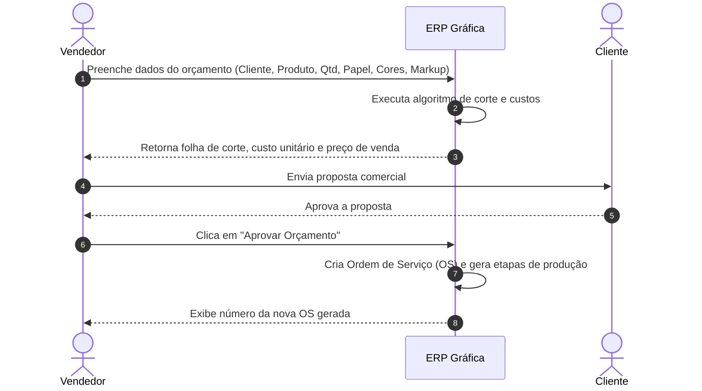

# 💼 02. Manual Comercial e Engenharia de Orçamentos

O módulo comercial do **ERP Gráfica Modular** une o atendimento ao cliente à engenharia técnica gráfica. Com ele, o vendedor não precisa fazer contas manuais em rascunhos para saber quantas folhas de papel serão gastas ou quanto cobrar por um trabalho.

---

## 1. Cadastro de Clientes e Fornecedores (Parceiros)

Antes de emitir uma proposta, é necessário registrar o cliente no sistema. O cadastro é unificado em **Parceiros**, permitindo gerenciar tanto clientes quanto fornecedores.

### Tipos de Pessoa
- **Pessoa Física (`INDIVIDUAL`)**: Exige nome completo, CPF válido, e-mail e telefone de contato.
- **Pessoa Jurídica (`COMPANY`)**: Exige Razão Social, Nome Fantasia, CNPJ válido, Inscrição Estadual (se houver), telefone, e-mail do setor de compras e endereço completo para entrega.

> [!TIP]
> **Dica**: O ERP possui validação de unicidade de documento. Você nunca terá clientes duplicados com o mesmo CPF ou CNPJ.

---

## 2. A Engenharia Gráfica e o Cálculo Técnico de Corte

Quando um cliente pede *"1.000 folders A4 coloridos"*, a gráfica não compra "papel A4 pequeno". A gráfica compra **folhas inteiras** de papel em grande formato (geralmente nos formatos padrão **BB: 660 x 960 mm** ou **AA: 640 x 880 mm**) e imprime várias páginas na mesma folha para depois cortá-las na guilhotina.

### 2.1 Formato Aberto vs. Formato Fechado
- **Formato Aberto**: É a medida do papel esticado antes de dobrar. É esta medida que deve ser inserida no orçamento!
  - *Exemplo 1*: Um cartão de visita comum mede **90 x 50 mm**. O formato aberto é 90 x 50 mm.
  - *Exemplo 2*: Um folder institucional A4 com 1 dobra central. Fechado ele mede A5 (148 x 210 mm), mas **aberto ele mede A4 (210 x 297 mm)**.
  - *Exemplo 3*: Uma revista com miolo A4 tem suas páginas duplas abertas no formato A3 (**420 x 297 mm**).

### 2.2 Margem de Sangria (Bleed) e Margem de Pinça (Gripper Margin)
O algoritmo de corte do ERP Gráfica leva em consideração os seguintes fatores físicos da indústria:
1. **Sangria (Bleed)**: Adiciona 3 mm em cada lateral do produto para que, na guilhotina, o corte não deixe "filetes brancos".
2. **Margem de Pinça da Máquina**: A impressora offset precisa de uma faixa de cerca de 10 mm a 15 mm na borda da folha para as "garras de metal" puxarem o papel para dentro dos cilindros de impressão. Nessa área, nada pode ser impresso.

### 2.3 Como o Algoritmo Calcula o Rendimento por Folha (`itemsPerSheet`)
O sistema testa virtualmente duas disposições de corte para encontrar a melhor combinação:
1. Disposição padrão (produtos na mesma orientação da folha).
2. Disposição rotacionada (produtos girados a 90 graus).

Suponha um cartão de 90 x 50 mm em uma folha inteira 660 x 960 mm:
- O sistema calcula quantas repetições cabem na largura e na altura.
- O resultado é o **Rendimento por Folha** (ex.: 108 cartões por folha).

### 2.4 Folhas Necessárias e Margem de Perda Técnica (`sheetsRequired`)
Nenhuma gráfica imprime 1.000 cartões rodando exatamente as folhas necessárias. Há uma perda técnica natural (conhecida como **maculatura** ou acerto de máquina) usada para calibrar as cores e o registro das tintas:
- Se a tiragem for de 1.000 unidades e cabem 10 cartões por folha, a conta matemática pura seria: $1000 \div 10 = 100$ folhas.
- O ERP adiciona a margem de acerto de máquina (ex.: +10% a 15% para acerto), totalizando 110 a 115 folhas.
- Esse número exato de folhas é o que será reservado e baixado no estoque!

---

## 3. Cores, Chapas CTP e Acabamentos

### Escala de Cores
- **4x4**: Colorido frente e colorido verso (escala CMYK: Ciano, Magenta, Amarelo e Preto em ambos os lados).
- **4x0**: Colorido na frente e verso em branco.
- **1x1**: Preto e branco (monocromático) frente e verso.
- **1x0**: Preto e branco apenas na frente.

### Acabamentos Disponíveis
Você pode selecionar acabamentos que agregam valor e custo ao produto:
- `DOBRA` (Dobra mecânica simples ou sanfona).
- `VINCO` (Vinco para papéis de alta gramatura acima de 200g, evitando que a fibra quebre).
- `LAMINACAO_FOSCA` / `LAMINACAO_BRILHO` (Película plástica BOPP aplicada a quente).
- `VERNIZ_LOCALIZADO` (Verniz UV com brilho em áreas específicas).
- `CORTE_VINCO` (Faca especial para envelopes, caixas e formatos personalizados).

---

## 4. Formação do Preço: Markup e Margem de Lucro Real

Muitos orçamentistas cometem o erro clássico de somar o percentual de lucro diretamente sobre o custo. No ERP Gráfica, utilizamos o método consagrado da contabilidade de custos: o **Markup Divisor**.

### A Fórmula do Preço de Venda
$$
\text{Preço de Venda} = \frac{\text{Custo Total}}{(1 - \text{Markup})}
$$

Onde:
- **Custo Total**: Soma do custo do papel gasto + tintas + chapas CTP + custo horário da impressora + acabamentos.
- **Markup**: Percentual desejado de margem bruta (expresso em decimal, ex.: 0.35 para 35%).

### Exemplo Prático Comparativo:
Imagine um trabalho cujo Custo Total apurado foi de **R$ 1.000,00** e a diretoria estipulou margem de **35%**:

| Método | Cálculo | Preço de Venda | Margem Real Obtida |
| :--- | :--- | :--- | :--- |
| **Erro Comum (Soma Simples)** | $1000 + 35\%$ | R$ 1.350,00 | $350 \div 1350 = \mathbf{25,9\%}$ *(Perda de lucro!)* |
| **Método Correto do ERP** | $1000 \div (1 - 0.35)$ | **R$ 1.538,46** | $538,46 \div 1538,46 = \mathbf{35,0\%}$ *(Margem garantida!)* |

---

## 5. Passo a Passo: Criando e Aprovando um Orçamento

1. **Acesse o Menu**: No menu lateral, clique em **Orçamentos** e depois no botão **Novo Orçamento**.
2. **Identifique o Cliente**: Selecione o cliente na lista suspensa de parceiros cadastrados.
3. **Defina a Margem**: Informe o Markup aplicado (ex.: `0.35` para 35%).
4. **Adicione os Itens do Trabalho**:
   - Digite o nome do produto (ex.: *Folder Institucional 4x4*).
   - Selecione a matéria-prima desejada (ex.: *Couchê Brilho 150g formato 660x960mm*).
   - Digite a quantidade desejada (ex.: `1000`).
   - Informe as dimensões abertas em milímetros: Largura (ex.: `210`) e Altura (ex.: `297`).
   - Indique as cores da frente (`4`) e do verso (`4`).
   - Selecione os acabamentos (ex.: `DOBRA`).
5. **Confira a Engenharia**: O sistema exibirá instantaneamente:
   - Rendimento por folha inteira.
   - Folhas de papel necessárias.
   - Custo total de matéria-prima e custo total de máquinas.
   - Preço de venda sugerido.
6. **Salvar Proposta**: Clique em **Salvar Orçamento**. Ele ficará gravado com status `DRAFT` (Rascunho) ou `SENT` (Enviado).
7. **Aprovação**: Quando o cliente der o aceite, localize o orçamento na lista e clique no botão verde **Aprovar**.
   - O ERP irá transformar o orçamento em uma **Ordem de Serviço (OS)** oficial.
   - A OS já nasce com as etapas de Pré-Impressão, Impressão e Acabamento na esteira fabril!
