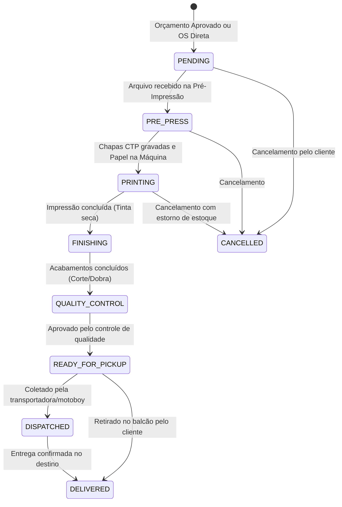

# 🏭 03. Manual de Produção, PCP e Chão de Fábrica

O coração operacional de uma gráfica é a sua fábrica. O módulo de produção do **ERP Gráfica Modular** foi concebido para dar visibilidade total ao Planejamento e Controle da Produção (PCP), garantindo que prazos de entrega sejam cumpridos e que nenhuma folha de papel seja consumida sem o devido registro contábil.

---

## 1. O Painel Kanban e a Visão em Lista

No menu **Ordens de Serviço**, você tem acesso a duas formas de visualização:

1. **Visão Kanban (Padrão)**: Quadro visual dividido em colunas correspondentes às fases da fábrica. Permite arrastar cards de ordens ou avançar seu status de forma rápida e intuitiva.
2. **Visão em Lista**: Tabela detalhada com filtros avançados por número da OS, cliente, data de entrega prometida, nível de prioridade e status atual.

### Cores e Níveis de Prioridade
Cada card de OS no quadro exibe um indicador visual de prioridade:
- 🟢 **Prioridade 1 (Baixa)**: Trabalhos com prazos elásticos (ex.: estoques internos, propostas de longo prazo).
- 🔵 **Prioridade 2 (Normal)**: Prazos comerciais padrão de 3 a 7 dias úteis.
- 🟡 **Prioridade 3 (Alta)**: Trabalhos com prazo curto ou clientes prioritários.
- 🔴 **Prioridade 4 (Urgente / "Para Ontem")**: Trabalhos com entrega no mesmo dia ou no dia seguinte. Devem ter prioridade na fila de acerto das máquinas!

---

## 2. A Máquina de Estados Finitos da Produção

Para evitar fraudes, erros operacionais e descompassos no estoque de papel, o ERP implementa uma **Máquina de Estados Estrita**. Uma Ordem de Serviço não pode "pular no tempo". Ela deve seguir o fluxo físico real da fábrica:

### Regras das Transições e Bloqueios de Segurança
- **Por que o sistema impede saltar direto de `PENDING` para `DELIVERED`?**
  Se fosse permitido pular etapas, o sistema não saberia em qual máquina o trabalho rodou, quanto tempo durou, qual operador trabalhou e, o mais grave: **o papel não seria baixado do almoxarifado**, gerando "furos" de estoque e distorcendo o DRE contábil da gráfica.
- Caso alguém tente forçar uma transição inválida (ex.: tentar marcar uma OS como entregue antes de ter sido impressa), a API responderá com `400 Bad Request` explicando o motivo do bloqueio.

---

## 3. O Momento da Baixa Automática de Estoque de Papel

A gestão do estoque de papel é automática e integrada ao ritmo das impressoras:

> [!IMPORTANT]
> **Momento do Disparo da Baixa**:
> A dedução das folhas de papel no estoque ocorre **no exato momento em que a OS muda de `PRE_PRESS` para `PRINTING`**.

### O que Acontece nos Bastidores:
1. O sistema verifica a quantidade de folhas calculadas na engenharia da OS (`sheetsRequired`).
2. Verifica se há saldo suficiente daquele papel no estoque da empresa:
   - Se houver saldo: efetua a baixa automática, registra o log de movimentação de saída com a referência da OS e libera a impressão.
   - Se **NÃO** houver saldo suficiente: o sistema bloqueia a transição e avisa o operador que o almoxarifado precisa ser abastecido com urgência!
3. **E se a Ordem de Serviço for cancelada?**
   Se uma OS for cancelada após já ter entrado em `PRINTING`, o ERP executa uma rotina automática de **estorno de estoque**, devolvendo exatamente a mesma quantidade de folhas para o saldo disponível do papel.

---

## 4. Guia do Operador: Apontamento de Chão de Fábrica

Nas máquinas gráficas (impressoras offset, digitais, guilhotinas trilaterais, dobradeiras), os operadores utilizam o módulo de **Apontamento de Etapa** para registrar o andamento em tempo real.

### As 3 Ações de Apontamento

| Ação | Quando Usar | Efeito no Sistema |
| :--- | :--- | :--- |
| **`START` (Iniciar)** | Ao começar o acerto (setup) da máquina ou a rodagem da tiragem. | Registra a hora de início, vincula a máquina utilizada e o crachá/ID do operador. A etapa passa para `IN_PROGRESS`. |
| **`PAUSE` (Pausar)** | Parada para troca de formato, problema mecânico, troca de tinta, falta de luz ou intervalo de refeição. | Congela a contagem de tempo produtivo e registra o motivo da parada nas observações. A etapa fica `PAUSED`. |
| **`COMPLETE` (Finalizar)** | Ao terminar a última folha da tiragem e liberar a pilha para o próximo setor. | Finaliza a contagem, calcula o tempo total consumido e solicita o registro de perdas técnicas (`wasteQuantity`). A etapa passa para `COMPLETED`. |

### Como Fazer o Apontamento na Prática:
1. Localize a Ordem de Serviço pelo número (ex.: `OS-2026-00042`).
2. Na aba **Etapas da Ordem**, clique na etapa correspondente ao seu setor (ex.: *Impressão 4 Cores Offset*).
3. Selecione o seu nome de **Operador** e a **Máquina** em que o trabalho está montado.
4. Clique em **Iniciar Etapa (`START`)**.
5. Ao concluir o serviço, clique em **Concluir Etapa (`COMPLETE`)**:
   - Uma janela solicitará a **Quantidade de Refugo/Perda (`wasteQuantity`)** em folhas.
   - Digite quantas folhas foram gastas no acerto (ex.: `25`).
   - Se houve alguma anomalia (ex.: "empastamento na chapa de preto", "papel com corte irregular"), descreva no campo de notas.
   - Clique em **Confirmar**. A próxima etapa da esteira fabril (ex.: Dobra ou Verniz) fica automaticamente liberada!
