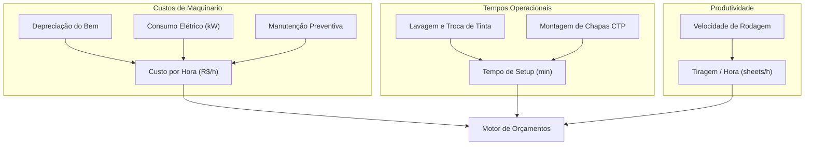

# 📦 04. Manual de Estoque, Insumos e Máquinas

O sucesso operacional e financeiro de uma gráfica depende de duas coisas fundamentais: **não deixar faltar papel** no almoxarifado e **conhecer o custo real da hora de funcionamento de cada máquina**. Este manual explica como parametrizar insumos e equipamentos no ERP Gráfica Modular.

---

## 1. Cadastro e Gestão de Matérias-Primas e Insumos

No menu **Insumos**, você gerencia todos os suprimentos necessários para a produção gráfica. Cada insumo pertence a uma categoria técnica padronizada:

| Categoria | Identificador | Exemplos Típicos na Gráfica | Unidade de Controle |
| :--- | :--- | :--- | :--- |
| **Papéis Planos** | `PAPER` | Couchê Brilho 150g (660x960 mm), Offset 75g (640x880 mm), Triplex 300g (770x1120 mm). | Folha inteira (`FOLHA`) |
| **Vinil & Bobinas** | `VINYL` | Vinil Adesivo Branco Brilho 0.10, Vinil Perfurado, Lona 440g Frontlight. | Metro linear ou m² |
| **Tintas de Impressão** | `INK` | Tinta Escala CMYK (Ciano, Magenta, Amarelo, Preto), Tintas Especiais Pantone. | Quilo (`KG`) ou Lata |
| **Chapas de Alumínio** | `PLATE` | Chapas Térmicas CTP para Offset (ex.: formato 510x400 mm ou 1030x790 mm). | Unidade (`UN`) |
| **Acabamentos** | `FINISHING` | Bobina BOPP Fosco/Brilho, Verniz UV, Cola Hotmelt, Arame para Grampo Canoa. | Bobina, Kg ou Metro |
| **Consumíveis Gerais** | `CONSUMABLE` | Solução de fonte, álcool isopropílico, pó anti-decalque, lavador de blanqueta. | Litro ou Pacote |

### 1.1 Entendendo Dimensões e Gramatura de Papel
No cadastro de um papel, dois campos são vitais para o motor de cálculo de corte:
- **Largura (`widthMm`) e Altura (`heightMm`)**: Sempre informadas em **milímetros**.
  - *Exemplo*: Um papel no formato standard BB tem **960 mm** de largura por **660 mm** de altura.
- **Gramatura (`grammage`)**: Representa o peso em gramas por metro quadrado ($g/m^2$).
  - Folha de sulfite comum de escritório: $75g/m^2$.
  - Miolo de folheto/panfleto promocional: $90g/m^2$ a $115g/m^2$.
  - Folder de apresentação corporativa: $150g/m^2$ ou $170g/m^2$.
  - Capa de catálogo ou cartão de visita: $250g/m^2$, $300g/m^2$ ou $350g/m^2$.

### 1.2 Estoque Mínimo e Ponto de Reposição
Para cada insumo, defina o **Estoque Mínimo (`minStock`)**:
- Quando o saldo disponível no almoxarifado atingir ou ficar abaixo desse número, o ERP emite um alerta visual na tela de estoque.
- O comprador ou gerente fabril pode imediatamente acionar o fornecedor de papel, evitando que uma impressora fique parada por falta de papel em dia de entrega urgente.

### 1.3 Histórico de Movimentações
Toda saída por Ordem de Serviço, entrada por compra com nota fiscal ou ajuste de inventário gera uma linha auditável no histórico do material, contendo:
- Data e hora exatas.
- Quantidade movimentada (+ para entradas, - para baixas).
- Ordem de Serviço relacionada (quando aplicável).
- Saldo resultante após a operação.

---

## 2. Cadastro e Calibração de Máquinas e Equipamentos

No menu **Máquinas**, o gestor cadastra o maquinário que compõe o parque gráfico. Esses dados alimentam diretamente a fórmula de custos do módulo de orçamentos.

### 2.1 Os 3 Parâmetros Fundamentais de Cada Máquina

1. **Custo por Hora (`hourlyRate`) em R$**:
   - É quanto custa manter aquela máquina ligada durante 60 minutos.
   - *Como calcular*: Some a depreciação mensal do equipamento, o consumo médio de energia elétrica industrial (em kW/h) e as despesas com troca de rolaria, óleo e manutenção preventiva anual divididas pelas horas trabalhadas no mês.
   - *Exemplo*: Uma impressora Offset 4 cores média costuma ter um custo-hora entre **R$ 120,00 e R$ 250,00/hora**.
2. **Tempo de Setup (`setupTimeMinutes`) em Minutos**:
   - É o tempo que o operador gasta antes de imprimir a primeira folha boa.
   - Inclui: colocação das chapas de alumínio nos cilindros, lavagem de blanquetas, regulagem de esquadro, acerto de tinteiro e ajuste da pressão dos cilindros.
   - *Exemplo*: Para uma máquina offset 4 cores, o tempo de setup típico varia de **15 a 30 minutos** por trabalho. Para uma impressora digital laser, o setup é praticamente nulo (**1 a 3 minutos**).
3. **Velocidade Nominal (`speedPerHour`) em Folhas/Hora**:
   - Quantas folhas inteiras a máquina consegue rodar por hora de trabalho contínuo.
   - *Exemplo*: Uma máquina offset pode rodar entre **6.000 e 10.000 folhas/hora**. Já uma guilhotina hidráulica linear opera por batidas de corte.

---

## 3. Boas Práticas de Calibração

> [!TIP]
> **Dica do Especialista Gráfico**:
> Nunca cadastre a velocidade da máquina com base no folheto do fabricante (velocidade teórica máxima). Use sempre a **velocidade real média** obtida pelo histórico de chão de fábrica da sua equipe (geralmente de 60% a 75% da velocidade máxima de catálogo). Isso evita orçar um tempo de produção menor do que o mundo real exige!
