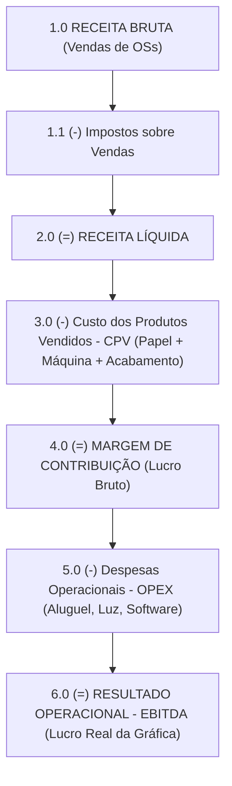

# 💰 05. Manual Financeiro, Contas a Receber e DRE Gerencial

O módulo financeiro do **ERP Gráfica Modular** foi construído sob os princípios da contabilidade gerencial moderna. Ele elimina a velha confusão entre "dinheiro no caixa" e "lucro real do negócio", permitindo aos proprietários e analistas financeiros enxergar exatamente a rentabilidade da gráfica mês a mês.

---

## 1. Contas a Receber (Receivables)

O faturamento no setor gráfico costuma seguir práticas comerciais tradicionais para garantir o fluxo de caixa durante a produção.

### 1.1 Planos de Parcelamento Automático de OS
Ao finalizar ou aprovar uma Ordem de Serviço, o financeiro pode gerar o parcelamento com um único clique, escolhendo entre 3 planos:

1. **`FULL_ADVANCE` (Pagamento Integral à Vista)**:
   - Gera um único título no valor total da OS, com vencimento imediato ou data combinada.
2. **`HALF_DOWN_HALF_PICKUP` (50% de Sinal + 50% na Retirada)**:
   - Gera duas parcelas de valores iguais:
     - 1ª Parcela: Vencimento na data do pedido (sinal para compra do papel).
     - 2ª Parcela: Vencimento na data prevista de entrega da mercadoria.
3. **`CUSTOM_INSTALLMENTS` (Parcelamento Personalizado em até 12x)**:
   - Permite parcelar o pedido em até 12 vezes (ex.: 30, 60 e 90 dias).
   - Você define o percentual de entrada opcional, a data do primeiro vencimento e o intervalo em dias entre as parcelas (padrão: 30 dias).

### 1.2 Como Fazer a Baixa de um Título (Liquidação)
Quando o cliente efetuar o pagamento:
1. Acesse o menu **Contas a Receber**.
2. Localize a parcela do cliente pelo nome, número da OS ou mês de vencimento.
3. Clique no botão de ação **Baixar Título**.
4. No formulário de quitação:
   - Confirme a **Data do Pagamento**.
   - Selecione a **Forma de Pagamento**: `PIX`, `BOLETO`, `CREDIT_CARD`, `DEBIT_CARD`, `BANK_TRANSFER` ou `CASH`.
   - Se aplicável, informe eventuais descontos concedidos ou acréscimos por atraso/juros.
   - Anote o comprovante ou autenticação bancária nas observações.
5. Clique em **Confirmar Recebimento**. O título muda para `PAID` e entra imediatamente no Fluxo de Caixa realizado!

---

## 2. Despesas Operacionais (OPEX)

No menu **Despesas**, você controla todas as saídas financeiras da gráfica que não são matérias-primas diretas do trabalho:

### Categorias de Despesas
- `RENT_FACILITIES`: Aluguel do galpão, condomínio e IPTU industrial.
- `UTILITIES`: Energia elétrica (força para motores trifásicos), água e gás.
- `SOFTWARE_LICENSES`: Assinaturas Adobe Creative Cloud, softwares de imposição e RIP de CTP.
- `OFFICE_ADMINISTRATIVE`: Material de escritório, contabilidade, limpeza e copa.
- `COMMERCIAL_MARKETING`: Anúncios no Google, redes sociais, comissões de vendedores e amostras.
- `MAINTENANCE_PREDIAL`: Reformas, compressores de ar e instalações prediais.
- `FINANCIAL_TAXES`: Tarifas bancárias, juros de empréstimos e taxas municipais.

### Duplicação Automática para o Próximo Mês
Para economizar tempo, o ERP possui a função **Duplicar para o Próximo Mês (`duplicateNextMonth`)**:
- Com apenas um clique, o sistema clona todas as suas contas fixas recorrentes (como aluguel, internet e contabilidade) para o mês seguinte, recalculando a data de vencimento.

---

## 3. Gestão de Colaboradores e RH

No menu **Colaboradores**, a gráfica cadastra sua força de trabalho:
- Atribuição por departamento (`PRE_PRESS`, `PRINTING`, `FINISHING`, `EXPEDITION`, `COMMERCIAL`, `ADMINISTRATIVE`).
- Turnos de trabalho (`MORNING`, `AFTERNOON`, `NIGHT`, `COMMERCIAL_HOURS`).
- Salário base e **Valor da Hora/Homem (`hourlyRate`)**:
  - Esse valor é utilizado pelo motor de produção para apurar o custo de mão de obra direta de cada etapa apontada no chão de fábrica.

---

## 4. O DRE Gerencial Explicado Linha a Linha

A **Demonstração do Resultado do Exercício (DRE)** é a bússola do empresário gráfico. Ela revela se a gráfica está operando com lucro real ou se o faturamento está sendo engolido por custos ocultos.

### Análise Prática de Cada Seção do DRE

| Código | Linha Contábil | O que Representa | Como Interpretar |
| :---: | :--- | :--- | :--- |
| **`1.0`** | **RECEITA OPERACIONAL BRUTA** | Soma de todas as Ordens de Serviço faturadas no mês de competência. | É o volume total de vendas geradas pela equipe comercial. |
| **`1.1`** | **(-) Deduções e Impostos** | Impostos incidentes sobre a emissão de notas (ex.: Simples Nacional na alíquota de 6% ou Lucro Presumido). | Desconto legal obrigatório sobre as vendas. |
| **`2.0`** | **(=) RECEITA OPERACIONAL LÍQUIDA** | Faturamento bruto menos os impostos incidentes. | É o dinheiro real que entra no negócio para pagar os custos de produção e a estrutura da empresa. |
| **`3.0`** | **(-) CUSTO DOS PRODUTOS VENDIDOS (CPV)** | **Custos Variáveis Diretos**:  • Papéis e substratos consumidos; • Hora-máquina de impressão e chapas CTP; • Acabamentos e facas terceirizadas. | Se a gráfica não produzir nada, esse custo é zero. Se produzir muito, esse custo cresce proporcionalmente à produção. |
| **`4.0`** | **(=) MARGEM DE CONTRIBUIÇÃO (LUCRO BRUTO)** | Receita Líquida subtraída do CPV. Expressa em R$ e em percentual ($MC\%$). | **O indicador mais importante da gráfica!** Representa quanto sobrou da produção para "contribuir" com o pagamento do aluguel, luz e salários fixos. |
| **`5.0`** | **(-) DESPESAS OPERACIONAIS (OPEX)** | Custos fixos e administrativos da empresa (aluguel, contabilidade, energia, licenças). | O custo de manter a porta da gráfica aberta, independente de ter vendido muito ou pouco. |
| **`6.0`** | **(=) RESULTADO OPERACIONAL (EBITDA)** | Margem de Contribuição menos as Despesas Operacionais. | **O lucro operacional líquido gerado pela empresa.** Se positivo, a gráfica lucrou; se negativo, a gráfica operou no vermelho. |

---

## 5. Ponto de Equilíbrio (Break-Even Point em R$)

O ERP Gráfica calcula automaticamente o seu **Ponto de Equilíbrio**:

$$
\text{Ponto de Equilíbrio (R\$)} = \frac{\text{Despesas Operacionais (OPEX)}}{\text{Margem de Contribuição (\%)} \div 100}
$$

### Exemplo do Mundo Real:
Se sua gráfica possui **R$ 30.000,00** de despesas fixas no mês (aluguel, energia, salários fixos) e sua Margem de Contribuição média é de **40% (0,40)**:

$$
\text{Ponto de Equilíbrio} = \frac{30.000}{0,40} = \mathbf{R\$\ 75.000,00}
$$

> [!IMPORTANT]
> **Interpretação Gerencial**:
> Sua equipe comercial precisa faturar **no mínimo R$ 75.000,00** naquele mês para pagar todas as contas (custos variáveis + custos fixos). Cada centavo faturado acima de R$ 75.000,00 gerará 40% de lucro líquido direto no bolso da empresa!

---

## 6. Fluxo de Caixa Diário (Realizado vs. Projetado)

Diferente do DRE (que funciona por competência contábil), o **Fluxo de Caixa** acompanha o saldo bancário da empresa:
- **Entradas Realizadas**: Boletos e PIXs já compensados e pagos pelo cliente.
- **Entradas Projetadas**: Parcelas a vencer nos próximos dias.
- **Saídas Realizadas**: Despesas já pagas no banco.
- **Saídas Projetadas**: Títulos e faturas a vencer ao longo do mês.
- **Saldo Acumulado**: Linha do tempo gráfica demonstrando se o saldo bancário permanecerá positivo ou se haverá necessidade de antecipação de recebíveis em algum dia específico do mês.
