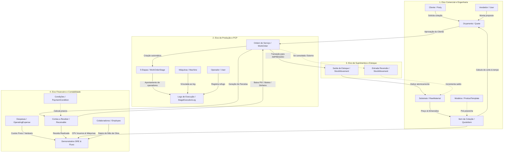

# 🏛️ 07. Diagrama Entidade-Relacionamento (DER) e Arquitetura de Dados

Este documento apresenta a **arquitetura completa, o modelo conceitual, lógico e físico do banco de dados** do **ERP Gráfica Modular**, acompanhado do **Diagrama Entidade-Relacionamento (DER)**, dicionário de dados detalhado, mapeamento de integridade referencial e o funcionamento prático de cada tabela nas operações da indústria gráfica.

---

## 📌 Sumário
1. [Visão Geral da Arquitetura do Banco de Dados](#-1-visão-geral-da-arquitetura-do-banco-de-dados)
2. [Diagrama Entidade-Relacionamento (DER Mermaid)](#-2-diagrama-entidade-relacionamento-der-mermaid)
3. [Mapa Conceitual de Fluxo de Dados entre Módulos](#-3-mapa-conceitual-de-fluxo-de-dados-entre-módulos)
4. [Dicionário de Dados Completo](#-4-dicionário-de-dados-completo)
   - [4.1 Módulo de Usuários e Acesso (`users`)](#41-módulo-de-usuários-e-acesso-users)
   - [4.2 Módulo de Parceiros Comerciais (`parties`)](#42-módulo-de-parceiros-comerciais-parties)
   - [4.3 Módulo de Matérias-Primas e Estoque (`raw_materials`, `stock_movements`)](#43-módulo-de-matérias-primas-e-estoque-raw_materials-stock_movements)
   - [4.4 Módulo de Máquinas e Equipamentos (`machines`)](#44-módulo-de-máquinas-e-equipamentos-machines)
   - [4.5 Módulo de Orçamentos e Engenharia Gráfica (`quotes`, `quote_items`)](#45-módulo-de-orçamentos-e-engenharia-gráfica-quotes-quote_items)
   - [4.6 Módulo de Chão de Fábrica e PCP (`work_orders`, `work_order_stages`, `stage_execution_logs`)](#46-módulo-de-chão-de-fábrica-e-pcp-work_orders-work_order_stages-stage_execution_logs)
   - [4.7 Módulo de Colaboradores e RH (`employees`)](#47-módulo-de-colaboradores-e-rh-employees)
   - [4.8 Módulo Financeiro e Contas a Pagar/Receber (`operating_expenses`, `receivables`)](#48-módulo-financeiro-e-contas-a-pagarreceber-operating_expenses-receivables)
   - [4.9 Módulo de Apoio e Padronização (`product_templates`, `payment_conditions`)](#49-módulo-de-apoio-e-padronização-product_templates-payment_conditions)
5. [Catálogo de Tipos Enumerados (Enums)](#-5-catálogo-de-tipos-enumerados-enums)
6. [Regras de Integridade, Transações Atômicas e Gatilhos](#-6-regras-de-integridade-transações-atômicas-e-gatilhos)
7. [Manutenção, Migrações e Rotinas de Backup/Restore](#-7-manutenção-migrações-e-rotinas-de-backuprestore)

---

## 🏗️ 1. Visão Geral da Arquitetura do Banco de Dados

O banco de dados do sistema foi projetado para suportar com extrema precisão os processos da indústria gráfica moderna — caracterizada por cálculos técnicos milimétricos (aproveitamento de folhas, sangrias e perdas), controle rígido de chão de fábrica (Kanban, etapas sequenciais e registro de perdas) e faturamento dinâmico (recebíveis, fluxo de caixa e DRE em tempo real).

### Stack Tecnológica:
- **SGBD Principal**: **PostgreSQL 15+** (Executável via container Docker ou servidor nativo/embarcado via `embedded-postgres`).
- **ORM / Abstração de Dados**: **Prisma ORM (v6.4+)** no pacote compartilhado `@erp/database`.
- **Precisão Numérica**: Tipos `Decimal(12, 2)` para valores monetários e `Decimal(12, 4)` para gramaturas, custos unitários de insumos e frações de matéria-prima, evitando desvios de arredondamento de ponto flutuante IEEE 754.
- **Tipagem Estrita**: 14 `Enums` nativos mapeados no banco para garantir integridade categórica em tempo de execução.
- **Integridade Transacional (ACID)**: Uso sistemático de Prisma Interactive Transactions (`prisma.$transaction`) em operações críticas como baixa/estorno de estoque, criação de OS rápida e liquidação de parcelas.

```
┌─────────────────────────────────────────────────────────────┐
│                 Camada de Aplicação (NestJS)                │
│       Controllers ──> Services ──> PrismaService           │
└──────────────────────────────┬──────────────────────────────┘
                               │ Prisma Client Typesafe
┌──────────────────────────────▼──────────────────────────────┐
│                    @erp/database (Prisma)                   │
│          schema.prisma ──> Migrations & Client Code         │
└──────────────────────────────┬──────────────────────────────┘
                               │ TCP / Port 5432
┌──────────────────────────────▼──────────────────────────────┐
│                    PostgreSQL Database                      │
│            15 Tabelas | 14 Enums | Índices B-Tree           │
└─────────────────────────────────────────────────────────────┘
```

---

## 📊 2. Diagrama Entidade-Relacionamento (DER Mermaid)

Abaixo está o diagrama formal completo com as 15 tabelas, seus atributos principais, chaves primárias (`PK`), chaves estrangeiras (`FK`), unicidade (`UK`) e a cardinalidade dos relacionamentos:

```mermaid
erDiagram
    %% ==========================================
    %% ENTIDADES E ATRIBUTOS
    %% ==========================================

    USER {
        string id PK "UUID"
        string name "Nome completo"
        string email UK "E-mail de acesso"
        string passwordHash "Hash Bcrypt"
        Role role "ADMIN | COMMERCIAL | FINANCIAL | OPERATOR | BOT_SERVICE"
        boolean isActive "Ativo no sistema"
        boolean isRoot "Usuário raiz master"
        boolean emailVerified "E-mail confirmado"
        string activationToken UK "Token de ativação"
        datetime activationTokenExpires
        string resetPasswordToken UK "Token de redefinição de senha"
        datetime resetPasswordExpires
        datetime createdAt
        datetime updatedAt
    }

    PARTY {
        string id PK "UUID"
        PartyType type "INDIVIDUAL (PF) | COMPANY (PJ)"
        string name "Razão Social ou Nome Completo"
        string tradeName "Nome Fantasia"
        string document UK "CPF ou CNPJ (apenas dígitos)"
        string email "Contato"
        string phone "Telefone / WhatsApp"
        string address "Endereço completo"
        string city "Cidade"
        string state "UF (ex: MG, SP)"
        boolean isCustomer "É cliente"
        boolean isSupplier "É fornecedor"
        datetime createdAt
        datetime updatedAt
    }

    RAW_MATERIAL {
        string id PK "UUID / Slug"
        string name "Nome do insumo"
        RawMaterialCategory category "PAPER | VINYL | INK | PLATE | FINISHING | CONSUMABLE"
        string unitOfMeasure "FL | M2 | KG | UN | ML"
        decimal costPerUnit "Custo base unitário"
        decimal currentStock "Estoque físico atual"
        decimal minStock "Estoque de segurança"
        int sheetWidthMm "Largura da folha (mm)"
        int sheetHeightMm "Altura da folha (mm)"
        int grammage "Gramatura (g/m²)"
        datetime createdAt
        datetime updatedAt
    }

    STOCK_MOVEMENT {
        string id PK "UUID"
        string rawMaterialId FK "Insumo movimentado"
        string workOrderId FK "OS vinculada (opcional)"
        decimal quantity "Positivo (Entrada) / Negativo (Saída)"
        string reason "CONSUMO_PRODUCAO | COMPRA | AJUSTE | ESTORNO"
        datetime createdAt
    }

    MACHINE {
        string id PK "UUID / Slug"
        string name "Nome da Máquina"
        decimal hourlyRate "Custo hora/máquina (R$/h)"
        int setupMinutes "Tempo médio de setup"
        int maxSheetsHour "Velocidade nominal (folhas/hora)"
        boolean isActive "Disponibilidade operacional"
    }

    QUOTE {
        string id PK "UUID"
        int code UK "Código sequencial (ex: 1001)"
        string partyId FK "Cliente sacado"
        string userId FK "Vendedor responsável"
        QuoteStatus status "DRAFT | SENT | APPROVED | REJECTED | EXPIRED"
        ChannelSource origin "WEB | WHATSAPP | BALCAO | API"
        decimal totalCost "Custo técnico apurado"
        decimal markupApplied "Fator de margem (ex: 0.35 para 35%)"
        decimal totalAmount "Preço final de venda"
        datetime validUntil "Data limite da proposta"
        string notes "Observações e especificações"
        datetime createdAt
        datetime updatedAt
    }

    QUOTE_ITEM {
        string id PK "UUID"
        string quoteId FK "Orçamento pai (Cascade)"
        string rawMaterialId FK "Papel/Substrato selecionado"
        string productName "Descrição do item gráfico"
        int quantity "Tiragem solicitada"
        int widthMm "Largura formato aberto (mm)"
        int heightMm "Altura formato aberto (mm)"
        int colorsFront "Cores frente (ex: 4)"
        int colorsBack "Cores verso (ex: 4 ou 0)"
        json finishingOptions "Array JSON de acabamentos"
        int sheetsRequired "Folhas brutas calculadas"
        int itemsPerSheet "Aproveitamento por folha"
        decimal paperCostCalculated "Custo total do papel"
        decimal finishingCostTotal "Custo total de acabamento"
        decimal machineCostTotal "Custo de tempo de máquina"
        decimal unitPrice "Preço unitário de venda"
        decimal itemTotalAmount "Total do item"
    }

    WORK_ORDER {
        string id PK "UUID"
        string orderNumber UK "Identificador (ex: OS-2026-00042)"
        string quoteId UK "Orçamento de origem (1:1)"
        string partyId FK "Cliente"
        string userId FK "Criador da OS"
        ChannelSource origin "Canal de entrada"
        WorkOrderStatus status "PENDING ... DELIVERED | CANCELLED"
        int priority "1: Baixa | 2: Normal | 3: Alta | 4: Urgente"
        datetime deliveryDate "Prazo final acordado"
        string fileUrl "Link da arte / PDF técnico"
        string barcode UK "Código de barras do chão de fábrica"
        decimal totalAmount "Valor total faturado"
        PaymentStatus paymentStatus "PENDING | PARTIALLY_PAID | PAID"
        datetime createdAt
        datetime updatedAt
    }

    WORK_ORDER_STAGE {
        string id PK "UUID"
        string workOrderId FK "OS pai (Cascade)"
        int stepOrder "Sequência (1..5)"
        string name "Pré-impressão | Impressão | Acabamento..."
        StageStatus status "PENDING | IN_PROGRESS | PAUSED | COMPLETED"
        datetime createdAt
        datetime updatedAt
    }

    STAGE_EXECUTION_LOG {
        string id PK "UUID"
        string stageId FK "Etapa correspondente"
        string operatorId FK "Operador (User)"
        string machineId FK "Máquina utilizada"
        datetime startedAt "Início do apontamento"
        datetime finishedAt "Fim do apontamento"
        int wasteQuantity "Aparas / Folhas perdidas no acerto"
        string notes "Observações do operador"
    }

    EMPLOYEE {
        string id PK "UUID"
        string name "Nome do colaborador"
        string document UK "CPF"
        string registration UK "Matrícula funcional"
        string role "Cargo (ex: Impressor Offset)"
        EmployeeDepartment department "PRE_PRESS | PRINTING | FINISHING..."
        WorkShift shift "MORNING | AFTERNOON | NIGHT | COMMERCIAL"
        EmployeeStatus status "ACTIVE | ON_LEAVE | INACTIVE"
        string email
        string phone "Contato direto"
        datetime hireDate "Data de admissão"
        decimal hourlyRate "Custo hora direta (R$/h)"
        decimal monthlySalary "Salário contratual"
        string notes "Habilitações e cursos"
        datetime createdAt
        datetime updatedAt
    }

    OPERATING_EXPENSE {
        string id PK "UUID"
        string description "Descrição da despesa"
        ExpenseCategory category "RENT | UTILITIES | LICENSES | MARKETING..."
        ExpenseType expenseType "FIXED | VARIABLE"
        decimal amount "Valor nominal"
        datetime dueDate "Data de vencimento"
        datetime paidAt "Data de efetivação do pagamento"
        PaymentStatus status "PENDING | PAID | OVERDUE | CANCELLED"
        PaymentMethod paymentMethod "BOLETO | PIX | TRANSFER | CARD..."
        datetime competenceDate "Mês de referência (DRE)"
        string supplierId FK "Fornecedor cadastrado (opcional)"
        string beneficiaryName "Nome do credor avulso"
        string barcode "Linha digitável / Código de barras"
        string documentNumber "Número da NF / Recibo"
        boolean isRecurring "Despesa recorrente"
        string recurrenceInterval "MONTHLY | YEARLY"
        datetime recurrenceEndDate
        string notes
        datetime createdAt
        datetime updatedAt
    }

    RECEIVABLE {
        string id PK "UUID"
        string workOrderId FK "OS de origem (SetNull on delete)"
        string partyId FK "Cliente sacado"
        string description "Descrição (ex: Parcela 1/3 OS-0042)"
        int installmentNumber "Número da parcela"
        int totalInstallments "Total de parcelas"
        decimal amount "Valor da parcela"
        datetime dueDate "Vencimento da fatura"
        datetime paidAt "Data da baixa / recebimento"
        PaymentStatus status "PENDING | PAID | OVERDUE | CANCELLED"
        PaymentMethod paymentMethod "PIX | BOLETO | CARTAO..."
        string barcode "Linha digitável / PIX Copia-e-Cola"
        string documentNumber "Duplicata / NF / Recibo"
        string notes "Descontos / Acréscimos anotados"
        datetime createdAt
        datetime updatedAt
    }

    PRODUCT_TEMPLATE {
        string id PK "UUID"
        string name "Nome do produto balcão"
        string category "Papelaria | Promocional..."
        string description
        int defaultWidthMm "Largura padrão (mm)"
        int defaultHeightMm "Altura padrão (mm)"
        int defaultColorsFront "Cores frente padrão"
        int defaultColorsBack "Cores verso padrão"
        json defaultFinishing "Acabamentos pré-selecionados"
        string defaultRawMaterialId FK "Papel sugerido"
        string defaultMachineId FK "Impressora sugerida"
        decimal defaultMarkupPercent "Markup padrão (ex: 35%)"
        json suggestedQuantities "Array [500, 1000, 2500...]"
        boolean isActive
        datetime createdAt
        datetime updatedAt
    }

    PAYMENT_CONDITION {
        string id PK "UUID"
        string name "Nome da condição comercial"
        string description
        int installmentsCount "Qtd de parcelas"
        decimal downPaymentPercent "Sinal / Entrada (%)"
        int intervalDays "Intervalo padrão em dias"
        json dayOffsets "Offsets customizados [0, 30, 60]"
        boolean isDefault "Condição padrão de balcão"
        boolean isActive
        datetime createdAt
        datetime updatedAt
    }

    %% ==========================================
    %% RELACIONAMENTOS (CARDINALIDADES)
    %% ==========================================

    %% Módulo Usuários & Vendas / Produção
    USER ||--o{ QUOTE : "emite"
    USER ||--o{ WORK_ORDER : "abre"
    USER ||--o{ STAGE_EXECUTION_LOG : "executa etapa"

    %% Módulo Parceiros
    PARTY ||--o{ QUOTE : "solicita"
    PARTY ||--o{ WORK_ORDER : "contrata"
    PARTY ||--o{ RECEIVABLE : "paga títulos"
    PARTY ||--o{ OPERATING_EXPENSE : "fornece / recebe"

    %% Módulo Orçamentos e Itens
    QUOTE ||--|{ QUOTE_ITEM : "contém (1:N)"
    QUOTE ||--o| WORK_ORDER : "gera (1:1)"
    RAW_MATERIAL ||--o{ QUOTE_ITEM : "especifica substrato"

    %% Módulo Produção / Chão de Fábrica
    WORK_ORDER ||--|{ WORK_ORDER_STAGE : "possui etapas (1:N)"
    WORK_ORDER ||--o{ STOCK_MOVEMENT : "origina consumo"
    WORK_ORDER ||--o{ RECEIVABLE : "fatura receitas"
    WORK_ORDER_STAGE ||--o{ STAGE_EXECUTION_LOG : "registra tempos (1:N)"
    MACHINE ||--o{ STAGE_EXECUTION_LOG : "opera em"

    %% Módulo Estoque
    RAW_MATERIAL ||--o{ STOCK_MOVEMENT : "registra movimentações"

    %% Módulo Modelos e Padronização
    RAW_MATERIAL ||--o{ PRODUCT_TEMPLATE : "material base"
    MACHINE ||--o{ PRODUCT_TEMPLATE : "equipamento base"
```



---

## 🔄 3. Mapa Conceitual de Fluxo de Dados entre Módulos

O fluxo operacional e o ciclo de gravação de dados transitam de forma harmônica entre os 4 grandes eixos da empresa gráfica:



---

## 📖 4. Dicionário de Dados Completo

### 4.1 Módulo de Usuários e Acesso (`users`)
Gerencia operadores, vendedores, analistas financeiros, administradores e bots de atendimento com autenticação por tokens JWT e suporte a senhas criptografadas via Bcrypt.

| Campo | Tipo | Nulo | Padrão | Descrição de Negócio e Comportamento |
| :--- | :--- | :---: | :---: | :--- |
| `id` | `VARCHAR(36)` | Não | UUID | Chave primária identificadora do usuário no sistema. |
| `name` | `VARCHAR` | Não | — | Nome completo para identificação em telas e logs. |
| `email` | `VARCHAR` | Não | — | E-mail corporativo único (`UNIQUE`), utilizado para login. |
| `passwordHash`| `VARCHAR` | Sim | NULL | Hash Bcrypt (custo 10). Pode ser nulo se o usuário ainda não tiver ativado a conta. |
| `role` | `Enum:Role` | Não | `OPERATOR` | Papel no controle de acesso RBAC (`ADMIN`, `COMMERCIAL`, `FINANCIAL`, `OPERATOR`, `BOT_SERVICE`). |
| `isActive` | `BOOLEAN` | Não | `true` | Bloqueia logins imediatos quando alternado para falso. |
| `isRoot` | `BOOLEAN` | Não | `false` | Superusuário protegido contra exclusão ou rebaixamento. |
| `emailVerified`| `BOOLEAN` | Não | `false` | Flag que indica se o usuário concluiu a confirmação de e-mail. |
| `activationToken` | `VARCHAR` | Sim | NULL | Token temporário único enviado por e-mail para primeiro cadastro. |
| `activationTokenExpires` | `TIMESTAMP` | Sim | NULL | Limite temporal de validade do token de ativação. |
| `resetPasswordToken` | `VARCHAR` | Sim | NULL | Token único de redefinição para recuperação de senha esquecida. |
| `resetPasswordExpires` | `TIMESTAMP` | Sim | NULL | Data limite de uso do token de recuperação. |
| `createdAt` | `TIMESTAMP` | Não | `NOW()` | Data/hora de inclusão no banco. |
| `updatedAt` | `TIMESTAMP` | Não | Auto | Data/hora da última alteração de cadastro. |

---

### 4.2 Módulo de Parceiros Comerciais (`parties`)
Unifica o cadastro de Clientes e Fornecedores sob a entidade `Party`, diferenciando-os por flags lógicas. Esse design permite que um fornecedor de chapas também seja cliente de serviços de impressão sem redundância de dados.

| Campo | Tipo | Nulo | Padrão | Descrição de Negócio e Comportamento |
| :--- | :--- | :---: | :---: | :--- |
| `id` | `VARCHAR(36)` | Não | UUID | Chave primária universal da pessoa ou empresa. |
| `type` | `Enum:PartyType` | Não | `INDIVIDUAL`| `INDIVIDUAL` para Pessoa Física (CPF) ou `COMPANY` para Pessoa Jurídica (CNPJ). |
| `name` | `VARCHAR` | Não | — | Razão Social (empresas) ou Nome Completo (indivíduos). |
| `tradeName` | `VARCHAR` | Sim | NULL | Nome Fantasia de fachada. |
| `document` | `VARCHAR` | Não | — | Documento oficial único (`UNIQUE`), limpo de pontuações (11 dígitos para CPF, 14 para CNPJ). |
| `email` | `VARCHAR` | Sim | NULL | Contato para envio automático de orçamentos e faturas. |
| `phone` | `VARCHAR` | Não | — | Telefone com DDD. Chave essencial de identificação para atendimentos automáticos via WhatsApp/Chatbot. |
| `address` | `VARCHAR` | Sim | NULL | Logradouro, número, complemento e bairro para entrega de impressos. |
| `city` | `VARCHAR` | Sim | NULL | Município de faturamento/entrega. |
| `state` | `VARCHAR` | Sim | NULL | Sigla da Unidade Federativa (ex: `MG`, `SP`). |
| `isCustomer` | `BOOLEAN` | Não | `true` | Identifica se a entidade realiza pedidos e orçamentos. |
| `isSupplier` | `BOOLEAN` | Não | `false` | Identifica se a entidade fornece matérias-primas ou serviços. |
| `createdAt` | `TIMESTAMP` | Não | `NOW()` | Registro de criação. |
| `updatedAt` | `TIMESTAMP` | Não | Auto | Registro de modificação. |

---

### 4.3 Módulo de Matérias-Primas e Estoque (`raw_materials`, `stock_movements`)
Controla o almoxarifado gráfico, parâmetros físicos de substratos (formato da folha inteira e gramatura) e histórico auditável de entradas e saídas.

#### Tabela `raw_materials`:
| Campo | Tipo | Nulo | Padrão | Descrição de Negócio e Comportamento |
| :--- | :--- | :---: | :---: | :--- |
| `id` | `VARCHAR(36)` | Não | UUID / Slug | Identificador único da matéria-prima. |
| `name` | `VARCHAR` | Não | — | Descrição comercial (ex: *Papel Couché Brilho 150g (660x960mm)*). |
| `category` | `Enum:RawMaterialCategory` | Não | — | `PAPER`, `VINYL`, `INK`, `PLATE`, `FINISHING`, `CONSUMABLE`. |
| `unitOfMeasure` | `VARCHAR` | Não | — | Unidade padrão de estocagem (`FL` para folha, `M2` para m², `KG`, `UN`, `ML`). |
| `costPerUnit` | `DECIMAL(12,4)` | Não | — | Custo de aquisição unitário (ex: R$ 0,8500 por folha). |
| `currentStock` | `DECIMAL(12,4)` | Não | `0.0000` | Quantidade real disponível no galpão. |
| `minStock` | `DECIMAL(12,4)` | Não | `0.0000` | Limite de alerta no dashboard para reposição de compras. |
| `sheetWidthMm` | `INTEGER` | Sim | NULL | Largura física da folha padrão (ex: 660 mm). Vital para o algoritmo de encaixe. |
| `sheetHeightMm`| `INTEGER` | Sim | NULL | Altura física da folha padrão (ex: 960 mm). |
| `grammage` | `INTEGER` | Sim | NULL | Gramatura do substrato em g/m² (ex: 90, 150, 300). |
| `createdAt` / `updatedAt` | `TIMESTAMP` | Não | — | Metadados temporais. |

#### Tabela `stock_movements`:
| Campo | Tipo | Nulo | Padrão | Descrição de Negócio e Comportamento |
| :--- | :--- | :---: | :---: | :--- |
| `id` | `VARCHAR(36)` | Não | UUID | Identificador do movimento de kardex. |
| `rawMaterialId`| `VARCHAR(36)` | Não | — | FK -> `raw_materials(id)`. |
| `workOrderId` | `VARCHAR(36)` | Sim | NULL | FK -> `work_orders(id)`. Preenchido se a movimentação tiver relação com uma OS. |
| `quantity` | `DECIMAL(12,4)` | Não | — | Quantidade da movimentação. **Valores negativos** indicam consumo/saída; **valores positivos** indicam compra/ajuste/estorno. |
| `reason` | `VARCHAR` | Não | — | Justificativa rastreável: `CONSUMO_PRODUCAO`, `COMPRA`, `PERDA_PRODUCAO`, `AJUSTE`, `ESTORNO_CANCELAMENTO`. |
| `createdAt` | `TIMESTAMP` | Não | `NOW()` | Data exata da movimentação no estoque. |

---

### 4.4 Módulo de Máquinas e Equipamentos (`machines`)
Armazena a capacidade instalada, taxas horárias e velocidades de impressão e acabamento da planta fabril.

| Campo | Tipo | Nulo | Padrão | Descrição de Negócio e Comportamento |
| :--- | :--- | :---: | :---: | :--- |
| `id` | `VARCHAR(36)` | Não | UUID / Slug | Identificador da máquina (ex: `m-heidelberg-speedmaster`). |
| `name` | `VARCHAR` | Não | — | Modelo do equipamento (ex: *Heidelberg Speedmaster SM 74 (Offset)*). |
| `hourlyRate` | `DECIMAL(10,2)`| Não | — | Custo hora-máquina (R$/h) utilizado na formação de preços. |
| `setupMinutes` | `INTEGER` | Não | `15` | Tempo médio de acerto de máquina para lavagem/troca de matriz. |
| `maxSheetsHour`| `INTEGER` | Sim | NULL | Velocidade nominal de tiro por hora (ex: 8.000 folhas/h). |
| `isActive` | `BOOLEAN` | Não | `true` | Disponibilidade física (caso passe por manutenção preventiva). |

---

### 4.5 Módulo de Orçamentos e Engenharia Gráfica (`quotes`, `quote_items`)
O motor que converte as necessidades do cliente em parâmetros matemáticos de corte, consumo de insumos, horas de produção e margem de contribuição.

#### Tabela `quotes`:
| Campo | Tipo | Nulo | Padrão | Descrição de Negócio e Comportamento |
| :--- | :--- | :---: | :---: | :--- |
| `id` | `VARCHAR(36)` | Não | UUID | Identificador global do orçamento. |
| `code` | `SERIAL / INT` | Não | Autoincrement | Código numérico sequencial amigável para o cliente (ex: 1001, 1002...). |
| `partyId` | `VARCHAR(36)` | Não | — | FK -> `parties(id)` (Cliente da proposta). |
| `userId` | `VARCHAR(36)` | Não | — | FK -> `users(id)` (Vendedor ou bot emissor). |
| `status` | `Enum:QuoteStatus` | Não | `DRAFT` | `DRAFT`, `SENT`, `APPROVED`, `REJECTED`, `EXPIRED`. |
| `origin` | `Enum:ChannelSource` | Não | `WEB` | Origem da cotação: `WEB`, `DESKTOP`, `MOBILE`, `WHATSAPP`, `TELEGRAM`, `API_INTEGRATION`. |
| `totalCost` | `DECIMAL(12,2)`| Não | — | Somatório dos custos de papel, chapas, tintas, acabamentos e máquinas. |
| `markupApplied`| `DECIMAL(6,3)` | Não | — | Coeficiente multiplicador sobre o custo (ex: `0.350` para 35% de margem). |
| `totalAmount` | `DECIMAL(12,2)`| Não | — | Preço final de venda apresentado ao cliente. |
| `validUntil` | `TIMESTAMP` | Não | — | Data limite da proposta comercial. |
| `notes` | `TEXT` | Sim | NULL | Condições de pagamento acordadas, prazos especiais ou detalhes da arte. |
| `createdAt` / `updatedAt` | `TIMESTAMP` | Não | — | Metadados temporais. |

#### Tabela `quote_items`:
| Campo | Tipo | Nulo | Padrão | Descrição de Negócio e Comportamento |
| :--- | :--- | :---: | :---: | :--- |
| `id` | `VARCHAR(36)` | Não | UUID | Identificador do item orçado. |
| `quoteId` | `VARCHAR(36)` | Não | — | FK -> `quotes(id)` com regra `ON DELETE CASCADE`. |
| `rawMaterialId`| `VARCHAR(36)` | Sim | NULL | FK -> `raw_materials(id)`. Substrato principal escolhido. |
| `productName` | `VARCHAR` | Não | — | Nome do impresso (ex: *Cartão de Visita 4x4 Couchê 300g*). |
| `quantity` | `INTEGER` | Não | — | Tiragem solicitada (ex: 1000 unidades). |
| `widthMm` | `INTEGER` | Não | — | Largura aberta do impresso em milímetros (ex: 90 mm). |
| `heightMm` | `INTEGER` | Não | — | Altura aberta do impresso em milímetros (ex: 50 mm). |
| `colorsFront` | `INTEGER` | Não | — | Quantidade de tintas de impressão na frente (ex: 4 para CMYK). |
| `colorsBack` | `INTEGER` | Não | — | Quantidade de tintas no verso (0 para branco, 4 para 4x4). |
| `finishingOptions` | `JSONB` | Não | `[]` | Lista JSON de acabamentos (ex: `["LAMINACAO_FOSCA", "CORTE_VINCO"]`). |
| `sheetsRequired` | `INTEGER` | Não | — | Folhas inteiras brutas necessárias (incluindo margem técnica de acerto/perda). |
| `itemsPerSheet` | `INTEGER` | Não | — | Quantidade de poses do impresso que cabem em uma folha inteira de papel. |
| `paperCostCalculated` | `DECIMAL(10,2)` | Não | — | Custo total do papel consumido no item. |
| `finishingCostTotal` | `DECIMAL(10,2)` | Não | — | Custo consolidado dos acabamentos aplicados. |
| `machineCostTotal` | `DECIMAL(10,2)` | Não | — | Custo consolidado de tempo de máquina e setup. |
| `unitPrice` | `DECIMAL(10,4)` | Não | — | Preço unitário final da peça impressa. |
| `itemTotalAmount` | `DECIMAL(12,2)` | Não | — | Total monetário do item (`quantity * unitPrice`). |

---

### 4.6 Módulo de Chão de Fábrica e PCP (`work_orders`, `work_order_stages`, `stage_execution_logs`)
Controla o ciclo de vida físico da ordem de produção através de uma máquina de estados finitos, geração de código de barras para chão de fábrica e apontamento de tempos de execução.

#### Tabela `work_orders`:
| Campo | Tipo | Nulo | Padrão | Descrição de Negócio e Comportamento |
| :--- | :--- | :---: | :---: | :--- |
| `id` | `VARCHAR(36)` | Não | UUID | Identificador universal da OS. |
| `orderNumber` | `VARCHAR` | Não | — | Identificador comercial único (`UNIQUE`, ex: `OS-2026-00042`). |
| `quoteId` | `VARCHAR(36)` | Não | — | FK -> `quotes(id)` único (`UNIQUE`, relação 1:1). |
| `partyId` | `VARCHAR(36)` | Não | — | FK -> `parties(id)` (Cliente contratante). |
| `userId` | `VARCHAR(36)` | Não | — | FK -> `users(id)` (Operador ou vendedor criador). |
| `origin` | `Enum:ChannelSource` | Não | `WEB` | Canal de captação do pedido. |
| `status` | `Enum:WorkOrderStatus` | Não | `PENDING` | Status do Kanban (`PENDING`, `PRE_PRESS`, `PRINTING`, `FINISHING`, `QUALITY_CONTROL`, `READY_FOR_PICKUP`, `DISPATCHED`, `DELIVERED`, `CANCELLED`). |
| `priority` | `INTEGER` | Não | `1` | Nível de urgência: `1` (Baixa), `2` (Normal), `3` (Alta), `4` (Urgente). |
| `deliveryDate` | `TIMESTAMP` | Não | — | Data e hora prometidas para entrega/retirada. |
| `fileUrl` | `VARCHAR` | Sim | NULL | URL do PDF de produção validado para RIP. |
| `barcode` | `VARCHAR` | Não | — | Código legível único (`UNIQUE`) para bipagem com leitor óptico nas ilhas fabris. |
| `totalAmount` | `DECIMAL(12,2)`| Não | — | Valor total da OS faturada. |
| `paymentStatus`| `Enum:PaymentStatus` | Não | `PENDING`| Situação financeira: `PENDING`, `PARTIALLY_PAID`, `PAID`, `OVERDUE`, `CANCELLED`. |
| `createdAt` / `updatedAt` | `TIMESTAMP` | Não | — | Metadados temporais. |

#### Tabela `work_order_stages`:
| Campo | Tipo | Nulo | Padrão | Descrição de Negócio e Comportamento |
| :--- | :--- | :---: | :---: | :--- |
| `id` | `VARCHAR(36)` | Não | UUID | Identificador da etapa da OS. |
| `workOrderId` | `VARCHAR(36)` | Não | — | FK -> `work_orders(id)` (`ON DELETE CASCADE`). |
| `stepOrder` | `INTEGER` | Não | — | Posição sequencial na esteira (1: Pré-impressão, 2: Impressão, 3: Acabamento, etc.). Chave única composta com `workOrderId`. |
| `name` | `VARCHAR` | Não | — | Nome da etapa operacional. |
| `status` | `Enum:StageStatus` | Não | `PENDING` | `PENDING`, `IN_PROGRESS`, `PAUSED`, `COMPLETED`. |
| `createdAt` / `updatedAt` | `TIMESTAMP` | Não | — | Metadados temporais. |

#### Tabela `stage_execution_logs`:
| Campo | Tipo | Nulo | Padrão | Descrição de Negócio e Comportamento |
| :--- | :--- | :---: | :---: | :--- |
| `id` | `VARCHAR(36)` | Não | UUID | Identificador do apontamento de produção. |
| `stageId` | `VARCHAR(36)` | Não | — | FK -> `work_order_stages(id)`. |
| `operatorId` | `VARCHAR(36)` | Não | — | FK -> `users(id)` (Operador que executou a ação). |
| `machineId` | `VARCHAR(36)` | Sim | NULL | FK -> `machines(id)` (Máquina onde foi executado). |
| `startedAt` | `TIMESTAMP` | Não | `NOW()` | Timestamp de acionamento do botão "Iniciar". |
| `finishedAt` | `TIMESTAMP` | Sim | NULL | Timestamp de encerramento da etapa. |
| `wasteQuantity`| `INTEGER` | Não | `0` | Folhas ou peças perdidas durante o acerto e rodagem. |
| `notes` | `TEXT` | Sim | NULL | Justificativas de paradas ou defeitos na tiragem. |

---

### 4.7 Módulo de Colaboradores e RH (`employees`)
Gerencia a folha operacional, turnos e custo homem-hora para alimentar a composição de custos de mão de obra direta (MOD) no DRE.

| Campo | Tipo | Nulo | Padrão | Descrição de Negócio e Comportamento |
| :--- | :--- | :---: | :---: | :--- |
| `id` | `VARCHAR(36)` | Não | UUID | Identificador do colaborador. |
| `name` | `VARCHAR` | Não | — | Nome completo do funcionário. |
| `document` | `VARCHAR` | Não | — | CPF único (`UNIQUE`) cadastrado. |
| `registration` | `VARCHAR` | Sim | NULL | Matrícula interna da gráfica única (`UNIQUE`, ex: `OP-012`). |
| `role` | `VARCHAR` | Não | — | Título do cargo (ex: *Operador Offset Plana*, *Guilhotineiro*). |
| `department` | `Enum:EmployeeDepartment`| Não | `PRINTING`| Setor de alocação (`PRE_PRESS`, `PRINTING`, `FINISHING`, `QUALITY`, `EXPEDITION`, `COMMERCIAL`, `ADMINISTRATIVE`, `MAINTENANCE`). |
| `shift` | `Enum:WorkShift` | Não | `COMMERCIAL_HOURS` | Turno de trabalho (`MORNING`, `AFTERNOON`, `NIGHT`, `COMMERCIAL_HOURS`). |
| `status` | `Enum:EmployeeStatus` | Não | `ACTIVE` | Estado no quadro da empresa (`ACTIVE`, `ON_LEAVE`, `INACTIVE`). |
| `email` | `VARCHAR` | Sim | NULL | E-mail de contato corporativo/pessoal. |
| `phone` | `VARCHAR` | Não | — | Contato telefônico direto. |
| `hireDate` | `TIMESTAMP` | Não | `NOW()` | Data formal de contratação. |
| `hourlyRate` | `DECIMAL(10,2)`| Sim | NULL | Custo da hora direta (R$/h) para custeio industrial. |
| `monthlySalary`| `DECIMAL(10,2)`| Sim | NULL | Salário nominal bruto mensal. |
| `notes` | `TEXT` | Sim | NULL | Habilitações em equipamentos e histórico de treinamentos. |
| `createdAt` / `updatedAt` | `TIMESTAMP` | Não | — | Metadados temporais. |

---

### 4.8 Módulo Financeiro e Contas a Pagar/Receber (`operating_expenses`, `receivables`)
Centraliza as operações de tesouraria, fluxo de caixa e contabilidade de custos.

#### Tabela `operating_expenses` (Contas a Pagar / OPEX):
| Campo | Tipo | Nulo | Padrão | Descrição de Negócio e Comportamento |
| :--- | :--- | :---: | :---: | :--- |
| `id` | `VARCHAR(36)` | Não | UUID | Identificador do lançamento de despesa. |
| `description` | `VARCHAR` | Não | — | Histórico legível (ex: *Aluguel do Galpão*, *Fatura de Energia Elétrica*). |
| `category` | `Enum:ExpenseCategory` | Não | — | Classificação contábil (`RENT_FACILITIES`, `UTILITIES`, `SOFTWARE_LICENSES`, `OFFICE_ADMINISTRATIVE`, `COMMERCIAL_MARKETING`, `MAINTENANCE_PREDIAL`, `FINANCIAL_TAXES`, `OTHER`). |
| `expenseType` | `Enum:ExpenseType` | Não | `FIXED` | Classificação econômica: `FIXED` (custo estrutural) ou `VARIABLE` (oscila com volume). |
| `amount` | `DECIMAL(12,2)`| Não | — | Valor financeiro a liquidar. |
| `dueDate` | `TIMESTAMP` | Não | — | Data limite de pagamento sem juros. |
| `paidAt` | `TIMESTAMP` | Sim | NULL | Data da efetiva compensação bancária. |
| `status` | `Enum:PaymentStatus` | Não | `PENDING` | Situação da despesa (`PENDING`, `PAID`, `OVERDUE`, `CANCELLED`). |
| `paymentMethod`| `Enum:PaymentMethod` | Sim | NULL | Canal de liquidação (`BOLETO`, `PIX`, `BANK_TRANSFER`, `CREDIT_CARD`, `DEBIT_CARD`, `CASH`, `AUTO_DEBIT`). |
| `competenceDate`| `TIMESTAMP` | Não | — | Mês contábil de apuração para DRE (regime de competência). |
| `supplierId` | `VARCHAR(36)` | Sim | NULL | FK -> `parties(id)` (Fornecedor cadastrado). |
| `beneficiaryName`| `VARCHAR` | Sim | NULL | Favorecido avulso (ex: Concessionária de Luz). |
| `barcode` | `VARCHAR` | Sim | NULL | Linha digitável de boleto ou payload do QR Code PIX. |
| `documentNumber`| `VARCHAR` | Sim | NULL | Número do documento fiscal / boleto. |
| `isRecurring` | `BOOLEAN` | Não | `false` | Se for marcada como recorrente, pode ser replicada para meses seguintes. |
| `recurrenceInterval`| `VARCHAR` | Sim | `MONTHLY`| Ciclo da recorrência (`MONTHLY`, `YEARLY`). |
| `recurrenceEndDate` | `TIMESTAMP` | Sim | NULL | Data de encerramento do contrato de recorrência. |
| `notes` | `TEXT` | Sim | NULL | Observações fiscais ou bancárias. |

#### Tabela `receivables` (Contas a Receber / Faturamento):
| Campo | Tipo | Nulo | Padrão | Descrição de Negócio e Comportamento |
| :--- | :--- | :---: | :---: | :--- |
| `id` | `VARCHAR(36)` | Não | UUID | Identificador do título a receber. |
| `workOrderId` | `VARCHAR(36)` | Sim | NULL | FK -> `work_orders(id)` (`ON DELETE SET NULL`). Vínculo com a OS faturada. |
| `partyId` | `VARCHAR(36)` | Não | — | FK -> `parties(id)` (Cliente devedor). |
| `description` | `VARCHAR` | Não | — | Identificação do título (ex: *Parcela 1/2 - Sinal 50% - OS-2026-00042*). |
| `installmentNumber` | `INTEGER` | Não | `1` | Número da parcela (ex: 1). |
| `totalInstallments` | `INTEGER` | Não | `1` | Total de parcelas do plano (ex: 3). |
| `amount` | `DECIMAL(12,2)`| Não | — | Valor nominal do título. |
| `dueDate` | `TIMESTAMP` | Não | — | Data de vencimento do título. |
| `paidAt` | `TIMESTAMP` | Sim | NULL | Data da confirmação do recebimento. |
| `status` | `Enum:PaymentStatus` | Não | `PENDING` | `PENDING`, `PAID`, `OVERDUE`, `CANCELLED`. |
| `paymentMethod`| `Enum:PaymentMethod` | Sim | NULL | Método de recebimento. |
| `barcode` | `VARCHAR` | Sim | NULL | Linha digitável do boleto ou chave PIX associada. |
| `documentNumber`| `VARCHAR` | Sim | NULL | Número de recibo ou duplicata. |
| `notes` | `TEXT` | Sim | NULL | Registros de descontos concedidos ou multas aplicadas no ato da liquidação. |

---

### 4.9 Módulo de Apoio e Padronização (`product_templates`, `payment_conditions`)
Tabelas de agilidade comercial para orçamentos e parcelamentos imediatos no balcão.

#### Tabela `product_templates`:
| Campo | Tipo | Nulo | Padrão | Descrição de Negócio e Comportamento |
| :--- | :--- | :---: | :---: | :--- |
| `id` | `VARCHAR(36)` | Não | UUID | Identificador do modelo de produto. |
| `name` | `VARCHAR` | Não | — | Nome comercial (ex: *Cartão de Visita 4x4 Couchê 300g*). |
| `category` | `VARCHAR` | Não | `Papelaria` | Categoria de agrupamento (*Papelaria*, *Promocional*, *Comunicação Visual*). |
| `defaultWidthMm` | `INTEGER` | Não | — | Largura aberta pré-configurada. |
| `defaultHeightMm`| `INTEGER` | Não | — | Altura aberta pré-configurada. |
| `defaultColorsFront` | `INTEGER` | Não | `4` | Cores frente pré-configuradas. |
| `defaultColorsBack` | `INTEGER` | Não | `4` | Cores verso pré-configuradas. |
| `defaultFinishing` | `JSONB` | Não | `[]` | Lista JSON de acabamentos pré-marcados. |
| `defaultRawMaterialId`| `VARCHAR(36)` | Sim | NULL | FK -> `raw_materials(id)` (Papel padrão vinculado). |
| `defaultMachineId` | `VARCHAR(36)` | Sim | NULL | FK -> `machines(id)` (Equipamento preferencial). |
| `defaultMarkupPercent`| `DECIMAL(5,2)` | Não | `35.00` | Percentual de margem padrão de balcão. |
| `suggestedQuantities`| `JSONB` | Não | `[500,1000,2500,5000]`| Tiragens pré-calculadas para cotação em 1 clique. |
| `isActive` | `BOOLEAN` | Não | `true` | Disponível na tela de novo orçamento rápido. |

#### Tabela `payment_conditions`:
| Campo | Tipo | Nulo | Padrão | Descrição de Negócio e Comportamento |
| :--- | :--- | :---: | :---: | :--- |
| `id` | `VARCHAR(36)` | Não | UUID | Identificador da condição comercial. |
| `name` | `VARCHAR` | Não | — | Título (ex: *Sinal 50% + 50% na Retirada*, *3x Sem Juros 30/60/90d*). |
| `installmentsCount` | `INTEGER` | Não | `1` | Número total de parcelas. |
| `downPaymentPercent`| `DECIMAL(5,2)` | Não | `0.00` | Percentual exigido à vista como sinal de entrada. |
| `intervalDays` | `INTEGER` | Não | `30` | Intervalo uniforme padrão entre as parcelas subsequentes. |
| `dayOffsets` | `JSONB` | Não | `[]` | Array de prazos customizados em dias (ex: `[0, 30, 60]`). |
| `isDefault` | `BOOLEAN` | Não | `false` | Se é o plano padrão sugerido na finalização da OS. |
| `isActive` | `BOOLEAN` | Não | `true` | Habilitado para uso comercial. |

#### Tabela `quick_service_presets`:
| Campo | Tipo | Nulo | Padrão | Descrição de Negócio e Comportamento |
| :--- | :--- | :---: | :---: | :--- |
| `id` | `VARCHAR(36)` | Não | UUID | Identificador do modelo de serviço rápido. |
| `name` | `VARCHAR` | Não | — | Nome do serviço (ex: *Xerox P&B A4*, *Plastificação Polaseal A4*). |
| `category` | `VARCHAR` | Não | `Outros` | Categoria de agrupamento (*Xerox*, *Impressão*, *Acabamento*, *Foto & Scan*, *Outros*). |
| `defaultPrice` | `DECIMAL(10,2)` | Não | `0.00` | Preço de venda padrão praticado no balcão rápido. |
| `rawMaterialId` | `VARCHAR(36)` | Sim | NULL | FK -> `raw_materials(id)` (`ON DELETE SET NULL`). Insumo/papel consumido do estoque. |
| `materialConsumeQty` | `DECIMAL(10,4)` | Não | `1.0000` | Quantidade de matéria-prima gasta por unidade de serviço (ex: 1 folha). |
| `isActive` | `BOOLEAN` | Não | `true` | Se o modelo está ativo para seleção no balcão rápido. |
| `createdAt` / `updatedAt` | `TIMESTAMP` | Não | `NOW()` | Metadados temporais. |

---

## 🏷️ 5. Catálogo de Tipos Enumerados (Enums)

Os tipos enumerados garantem rigidez lógica e previnem inserção de strings arbitrárias:

| Enum | Valores Permitidos | Significado no Negócio Gráfico |
| :--- | :--- | :--- |
| `Role` | `ADMIN`, `COMMERCIAL`, `FINANCIAL`, `OPERATOR`, `BOT_SERVICE` | Papel hierárquico do usuário na autenticação. |
| `ChannelSource` | `WEB`, `DESKTOP`, `MOBILE`, `WHATSAPP`, `TELEGRAM`, `API_INTEGRATION` | Canal de entrada pelo qual o pedido foi captado. |
| `PartyType` | `INDIVIDUAL`, `COMPANY` | Pessoa Física (CPF) ou Jurídica (CNPJ). |
| `RawMaterialCategory` | `PAPER`, `VINYL`, `INK`, `PLATE`, `FINISHING`, `CONSUMABLE` | Classificação do insumo para compras e PCP. |
| `QuoteStatus` | `DRAFT`, `SENT`, `APPROVED`, `REJECTED`, `EXPIRED` | Ciclo da proposta comercial antes de virar produção. |
| `WorkOrderStatus` | `PENDING`, `PRE_PRESS`, `PRINTING`, `FINISHING`, `QUALITY_CONTROL`, `READY_FOR_PICKUP`, `DISPATCHED`, `DELIVERED`, `CANCELLED` | Etapas canônicas do Kanban da fábrica. |
| `StageStatus` | `PENDING`, `IN_PROGRESS`, `PAUSED`, `COMPLETED` | Estado da microetapa no apontamento fabril. |
| `PaymentStatus` | `PENDING`, `PARTIALLY_PAID`, `PAID`, `OVERDUE`, `CANCELLED` | Status do título monetário no contas a pagar/receber. |
| `EmployeeDepartment` | `PRE_PRESS`, `PRINTING`, `FINISHING`, `QUALITY`, `EXPEDITION`, `COMMERCIAL`, `ADMINISTRATIVE`, `MAINTENANCE` | Setor da indústria gráfica. |
| `EmployeeStatus` | `ACTIVE`, `ON_LEAVE`, `INACTIVE` | Situação trabalhista do operador/colaborador. |
| `WorkShift` | `MORNING`, `AFTERNOON`, `NIGHT`, `COMMERCIAL_HOURS` | Turno de trabalho na fábrica. |
| `ExpenseCategory` | `RENT_FACILITIES`, `UTILITIES`, `SOFTWARE_LICENSES`, `OFFICE_ADMINISTRATIVE`, `COMMERCIAL_MARKETING`, `MAINTENANCE_PREDIAL`, `FINANCIAL_TAXES`, `OTHER` | Classificação para apropriação no DRE. |
| `ExpenseType` | `FIXED`, `VARIABLE` | Natureza de custo fixo ou custo variável. |
| `PaymentMethod` | `BOLETO`, `PIX`, `BANK_TRANSFER`, `CREDIT_CARD`, `DEBIT_CARD`, `CASH`, `AUTO_DEBIT` | Modalidade financeira de recebimento ou quitação. |

---

## ⚙️ 6. Regras de Integridade, Transações Atômicas e Gatilhos

O sistema opera com regras estritas de integridade transacional garantidas via Prisma e PostgreSQL:

### 6.1 Conversão de Orçamento em Ordem de Serviço
Quando um orçamento é aprovado ou uma OS Direta de Balcão é emitida, o sistema executa uma **Prisma Interactive Transaction** (`prisma.$transaction`):
1. Cria a `WorkOrder` com numeração `OS-YYYY-XXXXX` e código de barras correspondente.
2. Gera automaticamente 5 registros na tabela `work_order_stages` (1: Pré-impressão, 2: Impressão, 3: Acabamento, 4: Controle de Qualidade, 5: Expedição/Retirada).
3. Se a OS tiver recebimento à vista na abertura, gera o respectivo `receivable` com status `PAID`.
4. Emite evento em tempo real via WebSockets para atualização instantânea dos painéis Kanban da fábrica.

### 6.2 Baixa e Estorno Atômico de Estoque
A reserva e dedução física das matérias-primas ocorre no momento exato em que a OS avança para `PRINTING` (Impressão):
- O sistema consulta se já existe um `stock_movements` com motivo `CONSUMO_PRODUCAO` atrelado àquela OS.
- Se não houver, calcula as folhas inteiras (`sheetsRequired`) de cada item do orçamento, insere o registro negativo no kardex e decrementa atomicamente o saldo de `raw_materials.currentStock`.
- **Se a OS for cancelada (`CANCELLED`)**: O sistema localiza todos os consumos negativos daquela OS, calcula o valor absoluto e gera registros reversos com motivo `ESTORNO_CANCELAMENTO`, incrementando o saldo do material no estoque.

### 6.3 Sincronização Automática do Status Financeiro
Ao quitar um título em `receivables` (`pay`), o serviço recalcula a somatória de todos os títulos pertencentes àquela OS:
- Se a soma dos títulos `PAID` for igual ao valor total da OS -> `work_orders.paymentStatus = PAID`.
- Se houver pagamento parcial registrado -> `work_orders.paymentStatus = PARTIALLY_PAID`.
- Se nenhum estiver pago -> `work_orders.paymentStatus = PENDING`.

---

## 🛠️ 7. Manutenção, Migrações e Rotinas de Backup/Restore

### Comandos de Manutenção (Prisma CLI):
```bash
# Gerar o cliente Typescript após alterar o schema.prisma
pnpm --filter @erp/database db:generate

# Aplicar migrações pendentes no ambiente de desenvolvimento
pnpm --filter @erp/database db:migrate

# Aplicar migrações em produção
pnpm --filter @erp/database db:deploy

# Abrir o Prisma Studio (GUI no navegador para visualizar todas as tabelas)
pnpm --filter @erp/database db:studio
```

### Rotinas de Backup e Restore (Snapshots JSON):
O sistema possui scripts nativos no pacote `@erp/database` para exportar e restaurar a base completa:
- **Exportar base para snapshot**:
  ```bash
  npx tsx packages/database/prisma/dump.ts
  ```
  Gera o arquivo `packages/database/prisma/seed-data.json` com todas as 15 tabelas serializadas.

- **Restaurar base a partir do snapshot**:
  ```bash
  npx tsx packages/database/prisma/restore.ts
  ```
  Efetua o `upsert` ordenado de todas as entidades respeitando a ordem de precedência de chaves estrangeiras.

---

> [!TIP]
> **Dica para Desenvolvedores e Administradores**: Para testar consultas ou visualizar registros em tempo real sem instalar clientes externos (como DBeaver ou pgAdmin), execute `pnpm --filter @erp/database db:studio`. O Prisma abrirá uma interface web completa na porta `5555`.
