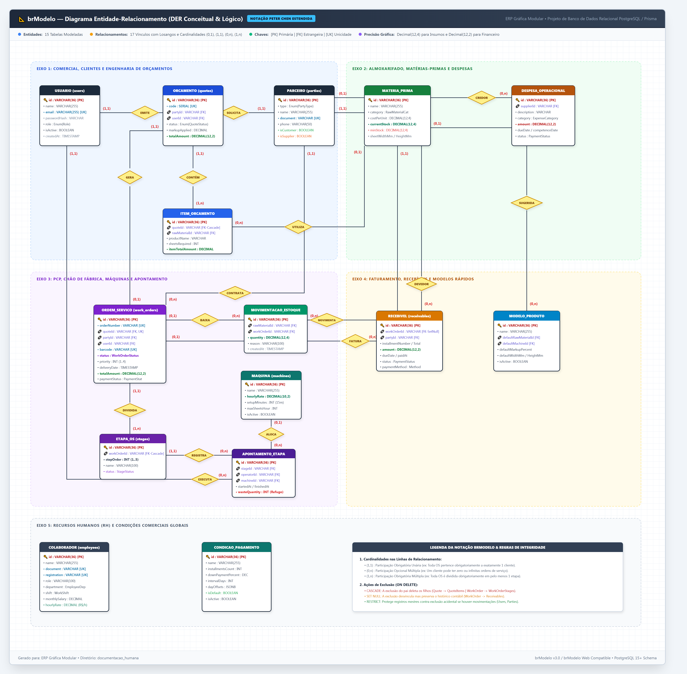

# 📐 08. Guia de Modelagem no brModelo e Importação do DER

Este manual apresenta o **Diagrama Entidade-Relacionamento (DER)** modelado rigorosamente sob a notação e estética do **brModelo** (notação Peter Chen estendida com suporte a modelo conceitual e lógico), acompanhado de todos os arquivos de exportação e instruções práticas para abertura e importação.

---

## 🖼️ 1. Diagrama Entidade-Relacionamento (Estilo brModelo)

Abaixo está a renderização em alta definição do modelo completo com as 15 tabelas, seus atributos, chaves primárias (`PK`), estrangeiras (`FK`), losangos de relacionamento e cardinalidades explícitas:

> [!TIP]
> **Arquivo em Alta Resolução (Full HD / 4K)**: A imagem original encontra-se salva no disco em:  
> [`documentacao_humana/brmodelo_diagrama_er.png`](file:///c:/Users/Micro/Documents/Projetos/ERP_GRAFICA/documentacao_humana/brmodelo_diagrama_er.png)

---

## 📁 2. Arquivos Gerados na Pasta `documentacao_humana`

Para garantir total interoperabilidade tanto no **brModelo (Desktop e Web)** quanto em qualquer outra ferramenta CASE de banco de dados do mercado, foram gerados 4 arquivos complementares:

| Arquivo | Finalidade | Compatibilidade |
| :--- | :--- | :--- |
| 🖼️ [**`brmodelo_diagrama_er.png`**](brmodelo_diagrama_er.png) | Imagem vetorial de alta fidelidade visual estilo brModelo. | Visualização direta, apresentações e documentação técnica. |
| 📜 [**`esquema_banco_brmodelo.sql`**](esquema_banco_brmodelo.sql) | Script DDL ANSI / PostgreSQL com todas as tabelas, tipos `ENUM`, `PRIMARY KEY`, `FOREIGN KEY` e índices. | **Padrão ouro universal**: brModelo, DBeaver, MySQL Workbench, pgAdmin, SqlDBM, ERDPlus. |
| 📑 [**`brmodelo_erp_grafica.brm`**](brmodelo_erp_grafica.brm) | Arquivo de especificação conceitual textual em sintaxe canônica do brModelo. | brModelo Desktop (2.0 / 3.0), analisadores semânticos de DER. |
| 🗄️ [**`brmodelo_web_modelo.json`**](brmodelo_web_modelo.json) | Grafo serializado de entidades, atributos, cardinalidades e posições geométricas. | brModelo Web (brmodeloweb.com), JointJS, editores web modernos. |

---

## 🚀 3. Como Importar e Utilizar nas Ferramentas

### Opção A: Importação Universal via Script SQL (`esquema_banco_brmodelo.sql`)
A forma mais robusta e utilizada na indústria para gerar diagramas relacionais automáticos é a **Engenharia Reversa a partir do Script DDL**:

1. **No DBeaver**:
   - Conecte ao seu banco PostgreSQL do ERP Gráfica.
   - Clique com o botão direito sobre o schema `public` -> **Visualizar Diagrama ER** (ou abra o arquivo `esquema_banco_brmodelo.sql` no editor SQL e execute `Ctrl+Enter`). O DBeaver desenhará automaticamente todas as 15 tabelas interligadas.
2. **No MySQL Workbench**:
   - Vá no menu **Database** -> **Reverse Engineer** (ou **File** -> **Import** -> **Reverse Engineer MySQL Create Script**).
   - Selecione o arquivo [`documentacao_humana/esquema_banco_brmodelo.sql`](file:///c:/Users/Micro/Documents/Projetos/ERP_GRAFICA/documentacao_humana/esquema_banco_brmodelo.sql).
   - O Workbench gerará o diagrama lógico com todos os relacionamentos 1:N e 1:1 posicionados.
3. **No pgAdmin 4**:
   - Abra a ferramenta **ERD Tool** em *Tools -> ERD Tool* e carregue o banco ou execute o script DDL.
4. **Em Ferramentas Web (SqlDBM / ERDPlus / Draw.io)**:
   - Selecione a opção **Import DDL / SQL**, cole o conteúdo de `esquema_banco_brmodelo.sql` e clique em *Generate Diagram*.

---

### Opção B: Uso no brModelo Desktop (v3.0 / v3.3)
O software **brModelo Desktop** opera tradicionalmente no fluxo conceitual:

1. Abra o software **brModelo**.
2. Para carregar o modelo conceitual estruturado, utilize o arquivo [`documentacao_humana/brmodelo_erp_grafica.brm`](file:///c:/Users/Micro/Documents/Projetos/ERP_GRAFICA/documentacao_humana/brmodelo_erp_grafica.brm) via menu *Arquivo -> Abrir / Importar*.
3. Todas as 15 entidades, atributos com identificadores sublinhados (`PK`), losangos de relacionamento e cardinalidades `(0,n)`, `(1,1)`, `(1,n)` e `(0,1)` estarão mapeadas conforme a convenção brasileira.
4. Para gerar o esquema físico a partir dele dentro do brModelo, clique com o botão direito na área livre do diagrama e selecione **"Gerar Esquema Lógico"** e, em seguida, **"Gerar Esquema Físico (SQL)"**.

---

### Opção C: Uso no brModelo Web (`brmodeloweb.com`)
O brModelo Web utiliza a biblioteca gráfica **JointJS**:

1. Acesse o [brModelo Web](https://www.brmodeloweb.com).
2. O arquivo [`documentacao_humana/brmodelo_web_modelo.json`](file:///c:/Users/Micro/Documents/Projetos/ERP_GRAFICA/documentacao_humana/brmodelo_web_modelo.json) contém o payload das células e nós.
3. Você pode importar ou sincronizar o modelo com base no schema JSON estruturado que criamos, contendo as coordenadas `(x, y)` calculadas para evitar cruzamentos e sobreposições de linhas.

---

## 🧩 4. Notação brModelo e Regras do Sistema Gráfico

### 1. Entidades (Retângulos)
Representam as tabelas e conjuntos de dados da gráfica:
- **`USUARIO` (`users`)**: Operadores, vendedores, administradores e bots de atendimento.
- **`PARCEIRO` (`parties`)**: Clientes e fornecedores unificados sob a mesma entidade com flags booleanas.
- **`ORCAMENTO` (`quotes`)**: Propostas comerciais com numeração sequencial (`code`), margens e validade.
- **`ITEM_ORCAMENTO` (`quote_items`)**: Itens técnicos com tiragem, dimensões abertas em mm e folhas necessárias calculadas.
- **`MATERIA_PRIMA` (`raw_materials`)**: Substratos de papel, lonas, tintas e matrizes com dimensões de folha inteira.
- **`MOVIMENTACAO_ESTOQUE` (`stock_movements`)**: Kardex de entradas (compras/estornos) e saídas (consumo da produção).
- **`ORDEM_SERVICO` (`work_orders`)**: Ordem de fabricação no chão de fábrica com código de barras Code-128 único.
- **`ETAPA_OS` (`work_order_stages`)**: As 5 fases sequenciais (Pré-impressão, Impressão, Acabamento, CQ, Expedição).
- **`APONTAMENTO_ETAPA` (`stage_execution_logs`)**: Tempos de início/término de operadores, máquinas utilizadas e refugo de acerto.
- **`MAQUINA` (`machines`)**: Impressoras offset, digitais e guilhotinas com taxas horárias e setup.
- **`DESPESA_OPERACIONAL` (`operating_expenses`)**: Contas a pagar (OPEX) para apuração do DRE gerencial.
- **`RECEBIVEL` (`receivables`)**: Títulos a receber e duplicatas de faturamento da OS.
- **`COLABORADOR` (`employees`)**: Quadro de funcionários com salários e custo da hora direta (MOD).
- **`MODELO_PRODUTO` (`product_templates`)**: Produtos de balcão pré-configurados para orçamentos em 1 clique.
- **`CONDICAO_PAGAMENTO` (`payment_conditions`)**: Regras comerciais de parcelamento (ex: *50% Sinal + 50% Retirada*).

### 2. Relacionamentos (Losangos Amarelos)
- `USUARIO` ---(1,1)--- **[EMITE]** ---(0,n)--- `ORCAMENTO`
- `PARCEIRO` ---(1,1)--- **[SOLICITA]** ---(0,n)--- `ORCAMENTO`
- `ORCAMENTO` ---(1,1)--- **[CONTÉM]** ---(1,n)--- `ITEM_ORCAMENTO`
- `MATERIA_PRIMA` ---(0,1)--- **[UTILIZA]** ---(0,n)--- `ITEM_ORCAMENTO`
- `ORCAMENTO` ---(1,1)--- **[GERA]** ---(0,1)--- `ORDEM_SERVICO`
- `PARCEIRO` ---(1,1)--- **[CONTRATA]** ---(0,n)--- `ORDEM_SERVICO`
- `ORDEM_SERVICO` ---(1,1)--- **[DIVIDIDA]** ---(1,n)--- `ETAPA_OS`
- `ETAPA_OS` ---(1,1)--- **[REGISTRA]** ---(0,n)--- `APONTAMENTO_ETAPA`
- `USUARIO` ---(1,1)--- **[EXECUTA]** ---(0,n)--- `APONTAMENTO_ETAPA`
- `MAQUINA` ---(0,1)--- **[ALOCA]** ---(0,n)--- `APONTAMENTO_ETAPA`
- `ORDEM_SERVICO` ---(0,1)--- **[BAIXA]** ---(0,n)--- `MOVIMENTACAO_ESTOQUE`
- `MATERIA_PRIMA` ---(1,1)--- **[MOVIMENTA]** ---(0,n)--- `MOVIMENTACAO_ESTOQUE`
- `ORDEM_SERVICO` ---(0,1)--- **[FATURA]** ---(0,n)--- `RECEBIVEL`
- `PARCEIRO` ---(1,1)--- **[DEVEDOR]** ---(0,n)--- `RECEBIVEL`
- `PARCEIRO` ---(0,1)--- **[CREDOR]** ---(0,n)--- `DESPESA_OPERACIONAL`
- `MATERIA_PRIMA` ---(0,1)--- **[SUGERIDA]** ---(0,n)--- `MODELO_PRODUTO`

### 3. Cardinalidades (Notação brModelo)
- **`(1,1)`**: Um e apenas um (Obrigatório). Toda Ordem de Serviço pertence a exatamente um cliente.
- **`(0,n)`**: Zero a muitos (Opcional). Um cliente pode ter zero ou múltiplos orçamentos e pedidos.
- **`(1,n)`**: Um a muitos (Obrigatório). Todo orçamento possui no mínimo um item técnico; toda OS possui no mínimo uma etapa.
- **`(0,1)`**: Zero ou um. Uma despesa avulsa pode não ter fornecedor cadastrado; um item de serviço pode não ter papel vinculado.

---

> [!NOTE]
> Todos os arquivos estão sincronizados com a versão mais recente do código e do schema Prisma em `@erp/database`.
